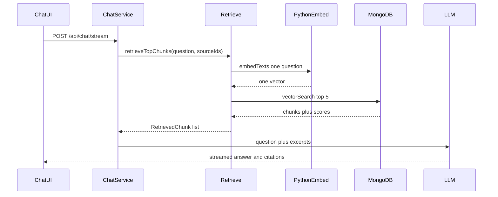

# US-041 RAG Uses Vector Retrieval

## 1. Scenario summary

- **Actor** — team member chatting against one indexed document or the whole library.
- **Goal** — answers grounded in chunks that match the meaning of the question, including paraphrases that do not share the source wording.
- **Success criteria**
  - `POST /api/chat` and `POST /api/chat/stream` select chunks with vector search, not keyword overlap.
  - Each question produces one embedding via the existing Python `POST /embed` path (`embedTexts`).
  - Retrieval returns at most `RAG_TOP_K` (5) chunks and never loads the corpus with `findBySourceIds`.
  - Citations still point at those retrieved chunks (source title, chunk index, excerpt text).
  - A paraphrased question (for example “time off for staff” against text that says “annual leave policy”) cites the matching chunk.

## 2. Current state

Already in place and reused as-is:

- Chat orchestration in [`apps/api/src/services/chat.service.ts`](apps/api/src/services/chat.service.ts) calls `retrieveTopChunks`, injects excerpts into the LLM prompt, and maps results through `toCitationDto`. Both the JSON and stream handlers share `prepareChatTurn`.
- Scope is already resolved: library chat passes every indexed source id; single-document chat passes one id. Vector search already filters on `sourceId`.
- Semantic search (US-040) embeds one query and calls [`chunksRepository.vectorSearch`](apps/api/src/repositories/chunks.repository.ts) (`$vectorSearch` on `chunks_vector_index`, cosine, 768 dimensions, `sourceId` filter, projection excludes `embedding`).
- Ingestion already writes chunk embeddings. The chat UI already renders citations and API error messages.

Gap: [`retrieve-chunks.service.ts`](apps/api/src/services/rag/retrieve-chunks.service.ts) still tokenizes the question, loads every chunk for the selected sources with `findBySourceIds`, and ranks by substring overlap. If nothing matches, it falls back to the first chunks in sort order. That is the Week 3 path this scenario replaces.

```54:69:apps/api/src/services/rag/retrieve-chunks.service.ts
export async function retrieveTopChunks(input: {
  question: string;
  sourceIds: string[];
  sourceTitles: Record<string, string>;
  limit?: number;
}): Promise<RetrievedChunk[]> {
  const limit = input.limit ?? RAG_TOP_K;
  const questionTerms = tokenizeQuestion(input.question);
  const chunks = await chunksRepository.findBySourceIds(input.sourceIds);
  // ... score in memory, then slice to limit
```

## 3. End-to-end flow

1. User asks a question in Chat (one document or the library).
2. `chatService.prepareChatTurn` resolves indexed source ids and titles, then calls `retrieveTopChunks`.
3. Retrieval embeds only the question (`embedTexts([question])`) — one 768-d vector.
4. `chunksRepository.vectorSearch` returns up to 5 chunks for those source ids, with text and score. The bucket is not read.
5. Existing prompt assembly sends those excerpts to the LLM. Citations are built from the same hits.
6. The chat page shows the answer and the cited chunks.



No new endpoint, collection, job, or React screen. Phase 1 stays file-upload sources only.

## 4. Implementation breakdown

- **React (`apps/web`)** — no code change. Chat already posts the question and renders citations from the stream `citations` event. A 503 from embedding or the vector index already surfaces as the chat error message.
- **Node API — retrieval service** — rewrite [`apps/api/src/services/rag/retrieve-chunks.service.ts`](apps/api/src/services/rag/retrieve-chunks.service.ts). Keep the `retrieveTopChunks` input so [`chat.service.ts`](apps/api/src/services/chat.service.ts) does not change. Inside the function: embed the question, call `vectorSearch` with `sourceIds` and `limit` (default `RAG_TOP_K` = 5), attach `sourceTitle` from the caller’s map. Narrow `RetrievedChunk` to `{ id, sourceId, index, text, score, sourceTitle }` — that is what prompt assembly and `toCitationDto` use. Vector hits do not include `tokenCount` or `createdAt`.
- **Node API — errors** — mirror [`search.service.ts`](apps/api/src/services/search.service.ts): wrong or missing embedding becomes `AppError('EMBEDDING_UNAVAILABLE', ..., 503)`; a failed `$vectorSearch` becomes `AppError('VECTOR_SEARCH_UNAVAILABLE', ..., 503)`. Do not fall back to keyword scan. Empty `sourceIds` returns `[]` without calling embed (same short-circuit as search when nothing is indexed). Chat already turns an empty list into “No excerpts were retrieved.”
- **Node API — cleanup** — remove `tokenizeQuestion`, in-memory scoring, and the “no term match, return first chunks” fallback from the retrieval service. Remove `RAG_STOP_WORDS` from [`rag.constants.ts`](apps/api/src/constants/rag.constants.ts). Leave `RAG_TOP_K` at 5 (inside the 5–10 acceptance range). Leave `findBySourceIds` on the repository; other reads still use it.
- **Python worker** — none. Reuse `embedTexts` → `POST /embed`.
- **Data** — none. `chunks.embedding` and `chunks_vector_index` already exist from US-040.
- **Shared packages** — none.

Keep the retrieval log, but log chunk id, source id, index, score, and title. Drop `questionTerms` and `retrievalFallback`.

## 5. API and data contract

Unchanged HTTP contract:

- `POST /api/chat` and `POST /api/chat/stream` still accept `{ question, scope, sourceId? }`.
- Citations stay `{ chunkId, sourceId, sourceTitle, chunkIndex, text }`. Scores stay server-side for the log; the chat UI does not show them.

Failure behavior that callers will see:

- Python worker down or a vector that is not 768 dimensions: `503 EMBEDDING_UNAVAILABLE`.
- Atlas vector index missing or `$vectorSearch` rejected: `503 VECTOR_SEARCH_UNAVAILABLE`.
- Indexed sources with no embedding hits: empty retrieval, then the existing “I do not know” prompt path. This replaces the Week 3 behavior that stuffed the first chunks into the prompt when keywords missed.

## 6. Suggested build order

1. Rewrite `retrieveTopChunks` to embed one question and call `chunksRepository.vectorSearch`. Map hits to `RetrievedChunk` with titles from the input map.
2. Map embed and vector-index failures to the same `AppError` codes search uses. Return `[]` when `sourceIds` is empty, before embedding.
3. Delete keyword helpers and `RAG_STOP_WORDS`.
4. Replace [`retrieve-chunks.service.test.ts`](apps/api/src/services/rag/retrieve-chunks.service.test.ts): mock `embedTexts` and `vectorSearch`; assert one embed call, the source-id filter, the limit, title attachment, empty source ids, embed failure, and vector-index failure. Chat service tests already mock `retrieveTopChunks` and can stay as they are.
5. Manually ask a paraphrased chat question against an indexed document and confirm the citation is the semantic match.

## 7. Testing and verification

Unit tests (Vitest, retrieval service only):

- One `embedTexts([question])` call, then `vectorSearch({ vector, sourceIds, limit: 5 })`.
- Results keep Atlas order and gain `sourceTitle` from the input map. Unknown source id uses `Unknown source`.
- Empty `sourceIds` does not call embed or vector search.
- Embed rejection → `EMBEDDING_UNAVAILABLE` / 503, and vector search is not called.
- Vector search rejection → `VECTOR_SEARCH_UNAVAILABLE` / 503.

Manual, with API, web, Python worker, and Atlas local already running (same stack as US-040):

- Index at least two documents whose wording differs.
- In Chat, ask a paraphrase that does not appear verbatim. The answer should cite the matching document’s chunk, not an unrelated one.
- Repeat on library scope and on a single-document scope. Single-document scope must not cite another document.
- Stop the Python worker and send a question. Chat should show the embedding-unavailable error, not a keyword-based answer.
- API log for `[rag] retrieval` should list at most 5 chunks and must not mention `questionTerms`.

## 8. Roadmap fit

Week 4 (`week-04-semantic-search`), requirement FR-06 retrieval upgraded with the FR-08 vector index. This is the remaining Week 4 deliverable: “Upgrade RAG retrieval from keyword to vector search.”

Ship now: the retrieval swap and tests. Defer: hybrid keyword plus vector ranking, showing similarity scores in the chat UI, LangChain RAG (Week 8), and any change to ingestion or the search page.
