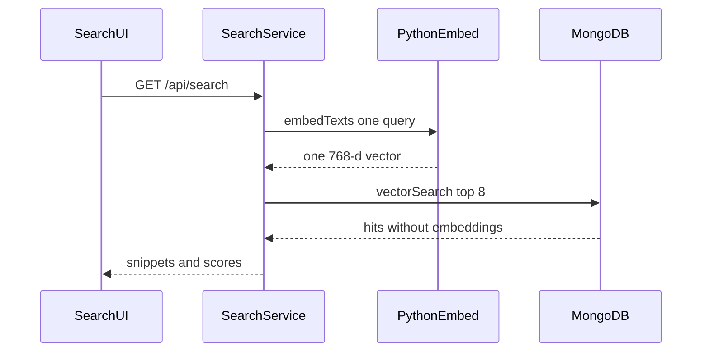

# US-042 Search Performance at Scale

## 1. Scenario summary

- **Actor** — team member searching an indexed library.
- **Goal** — semantic search stays responsive once the library has 50 or more chunks, and ingestion embeds those chunks in batches instead of one call per chunk or one call for the whole library.
- **Success criteria**
  - After ingestion, each chunk document has a 768-dimension `embedding`.
  - Ingestion calls Python `POST /embed` with at most 50 texts, and a source with 51 or more chunks produces a full batch of 50 before the remainder.
  - `GET /api/search` returns in under 2 seconds for a library of 50 or more chunks.
  - The query path embeds only the search string and reads top hits from `chunks_vector_index`. It does not read the bucket and does not load every chunk into the API process.

## 2. Current state

The behavior this scenario asks for is already in the Week 4 stack. Do not add a new search endpoint, collection, or page.

Already in place:

- Ingestion in [`apps/api/src/services/ingestion/ingest-source.service.ts`](apps/api/src/services/ingestion/ingest-source.service.ts) writes chunks, then [`embedChunksInBatches`](apps/api/src/services/ingestion/embed-chunks.ts) calls `embedTexts` in slices of `EMBED_BATCH_SIZE` (50) and persists each slice with `chunksRepository.setEmbeddings` before the next slice. A failed batch does not embed the following slice. Unit coverage is in [`embed-chunks.test.ts`](apps/api/src/services/ingestion/embed-chunks.test.ts).
- Python [`EmbedService`](services/python-worker/app/services/embed.py) rejects batches outside 1–50 (`BATCH_SIZE_INVALID`). [`GeminiEmbeddingClient`](services/python-worker/app/clients/gemini_embedding.py) sends the accepted list in one `batchEmbedContents` request. Single-text search queries stay valid because the floor is 1, not 10.
- [`searchLibrary`](apps/api/src/services/search.service.ts) embeds the query once, then [`chunksRepository.vectorSearch`](apps/api/src/repositories/chunks.repository.ts) runs `$vectorSearch` on `chunks_vector_index` (cosine, 768 dimensions, `sourceId` filter). The projection returns `text`, `sourceId`, `index`, and score only — not `embedding`. Limit defaults to `SEARCH_TOP_K` (8). Title lookup uses only the hit source ids.
- `findBySourceIds` has no service callers. Search does not touch the bucket. The vector index is created at API startup via `ensureVectorSearchIndex`.
- The Search page already submits `q` and renders ranked snippets. Timing can be read from the browser network entry for `GET /api/search`.

Gaps versus the scenario:

- Nothing records how long embed versus vector search took, so the 2-second check is only visible in the browser.
- Nothing logs the ingestion batch size, so a demo cannot show the 10–50 window from the API log.
- Batching is per source. Ten short documents can total 50 chunks while each `POST /embed` stays under 10 texts. The scale check needs at least one source that itself produces 10 or more chunks (a source of 51 or more chunks shows the 50-then-remainder split the unit test already locks in).

## 3. End-to-end flow

1. User uploads 10 or more files. At least one file is long enough to chunk into 10–50 pieces (about 100KB of text at the 500-token minimum). The library ends at 50 or more chunks.
2. The ingestion worker handles one source at a time: extract text, replace that source’s chunks, embed in batches of up to 50, write each batch’s vectors, then mark the source `indexed`.
3. User opens Search and submits a natural-language query.
4. `GET /api/search` embeds that one string through Python, runs Atlas `$vectorSearch` for the indexed source ids, and returns at most 8 snippets.
5. The browser network time for that request, and the new API timing log, are both under 2000 ms. A second query on a warm worker is the measurement that counts; the first call can include Gemini cold start.

No new job type. Phase 1 stays file upload only.

## 4. Implementation breakdown

- **React (`apps/web`)** — no change. Keep measuring with the network entry for `GET /api/search`. Do not add a latency label on the page.
- **Node API — ingestion log** — in [`embed-chunks.ts`](apps/api/src/services/ingestion/embed-chunks.ts), after a batch is accepted by `embedTexts` and before `onBatch`, log `console.info('[ingestion] embed batch', { size })`. `size` is `batch.length` (1–50). This is the only ingestion change.
- **Node API — search timing** — in [`search.service.ts`](apps/api/src/services/search.service.ts), record `embedMs`, `vectorMs`, and `totalMs` around the existing embed and `vectorSearch` calls. Log `console.info('[search] query', { totalMs, embedMs, vectorMs, hits })` on the success path only. Do not change the JSON body.
- **Node API — regression guard** — in [`search.service.test.ts`](apps/api/src/services/search.service.test.ts), assert the success path calls `vectorSearch` once with `limit` defaulting to 8 and does not call `findBySourceIds`. The repository mock needs `findBySourceIds: vi.fn()` for that assertion to be real.
- **Python worker** — no change. Keep `MAX_BATCH_SIZE = 50` and the single `batchEmbedContents` call.
- **Data** — no change. `chunks.embedding` and `chunks_vector_index` stay as they are. Reads continue to omit `embedding`.
- **Shared packages** — no change.

Leave `EMBED_BATCH_SIZE` at 50. A tail shorter than 10 is required so the last chunks of a source are still embedded. Do not buffer chunks across sources to force a minimum of 10.

## 5. API and data contract

Unchanged:

- `GET /api/search?q=&limit=` still returns `{ data: [{ chunkId, sourceId, sourceTitle, snippet, score, index }] }`.
- `POST /embed` still accepts `{ text }` or `{ texts }` with 1–50 items and returns 768-d vectors.
- Chunk documents still gain `embedding` only after `setEmbeddings`. A source stays `indexing` until every batch is stored, then becomes `indexed`.

New log lines (not part of the HTTP contract):

- `[ingestion] embed batch` with `{ size }`.
- `[search] query` with `{ totalMs, embedMs, vectorMs, hits }`.

## 6. Suggested build order

1. Add the `[ingestion] embed batch` log in `embedChunksInBatches`. Existing batch tests should still pass; they do not assert on console output.
2. Add `embedMs`, `vectorMs`, and `totalMs` plus the `[search] query` log in `searchLibrary`.
3. Extend the search service success test so `findBySourceIds` is not called and `vectorSearch` receives the default limit of 8.
4. Run the API unit tests for embed-chunks and search.
5. Manually index a 50-plus-chunk library and measure search from the network tab and the API log.

## 7. Testing and verification

Automated (existing plus the one guard):

- `embedChunksInBatches` on 51 chunks calls `embedTexts` with 50 texts, persists that batch, then embeds and persists the last text. A failure on the second call does not persist it.
- Python tests already reject 51 texts and accept a batch of 10 in one client call.
- Search success path: one `embedTexts([query])`, one `vectorSearch`, no `findBySourceIds`.

Manual, with API, web, Python worker, and Atlas local (`mongodb/mongodb-atlas-local` in [`docker-compose.yml`](docker-compose.yml)):

- Upload 10 or more files that together produce 50 or more chunks. Include one file long enough for at least 10 chunks so the ingestion log shows `size` between 10 and 50. A file that produces 51 or more chunks should log `size: 50` and then a smaller tail.
- In MongoDB, confirm those chunks have `embedding` arrays of length 768 and that `knowledge_sources.status` is `indexed`.
- On Search, run several queries, including a paraphrase that does not copy the source wording. The network time for `GET /api/search` on a warm worker is under 2 seconds. The API log `totalMs` matches that order of magnitude, `hits` is at most 8, and results come from more than one document when the query applies to more than one.
- API logs for that request must not show a chunk-list read. Bucket access logs, if any, must stay idle during search.
- Stop the Python worker and search again. The UI shows the existing embedding-unavailable error. Restarting search after the worker is back still uses vector search.

If a warm query is still over 2 seconds, treat that as Gemini latency on the single query embedding. Do not switch search back to loading chunks. The vector query itself should stay well under the budget at this library size (`numCandidates` is `min(limit * 10, 200)`).

## 8. Roadmap fit

Week 4 (`week-04-semantic-search`), the ROADMAP line “Search responds in under 2 seconds for a library of 50+ chunks” and “Python worker processes embeddings in batches (10–50 chunks)”, covering FR-07 and FR-08.

Ship now: the two logs, the corpus-scan guard, and the manual scale check.

Defer: a latency number in the Search UI, caching query embeddings, a local embedding model, cross-source batching, hybrid keyword plus vector ranking, and any change to chunk size or `SEARCH_TOP_K`.
