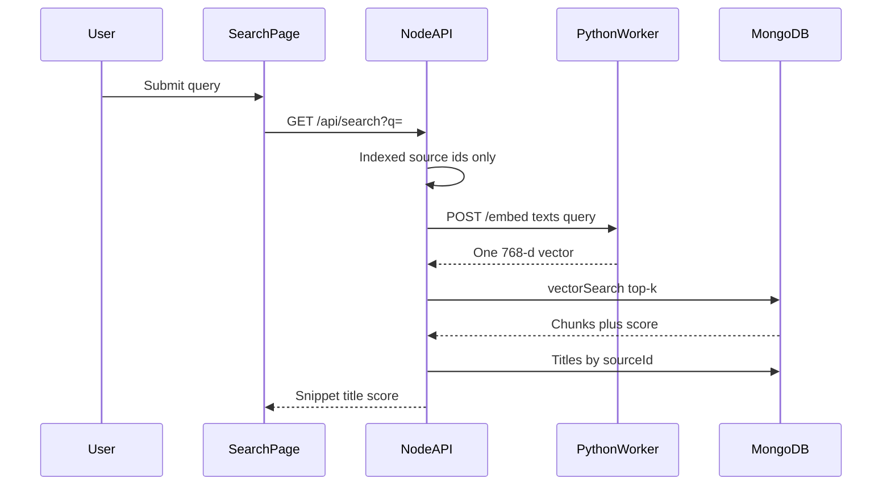

# US-040 Semantic Search Across the Library

## 1. Scenario summary

- **Actor** — team member with documents already indexed and embedded (Week 4 ingestion).
- **Goal** — search the whole library in natural language and see ranked snippets even when the query does not use the document’s exact words.
- **Success criteria**
  - `GET /api/search` embeds the query with one call to Python `POST /embed` and returns top-k chunks from MongoDB vector search.
  - Each result includes snippet text, source title, and a relevance score. Embeddings are not returned.
  - A paraphrased query (for example “employee vacation rules” against text that says “annual leave policy”) still ranks the right chunks above unrelated documents.
  - Search reads only the top-k chunks from MongoDB. It never reads the bucket or loads the full corpus.
  - The `/search` page replaces the Week 4 placeholder and handles idle, loading, empty, error, and results states.

## 2. Current state

Already in place and reused as-is:

- Search nav and route exist, but [`apps/web/src/features/search/SearchPage.tsx`](apps/web/src/features/search/SearchPage.tsx) renders `ComingSoonPage`. [`navConfig.ts`](apps/web/src/routes/navConfig.ts) marks Search `implemented: false`.
- Ingestion embeds chunks in batches of 50 via [`embedTexts`](apps/api/src/clients/python-worker.client.ts) → Python `POST /embed`, then stores 768-d vectors on `chunks.embedding` ([`embed-chunks.ts`](apps/api/src/services/ingestion/embed-chunks.ts), [`setEmbeddings`](apps/api/src/repositories/chunks.repository.ts)). This is the US-043 dependency; do not rebuild it.
- Chunk reads project text only and omit `embedding` ([`chunkReadOptions`](apps/api/src/repositories/chunks.repository.ts)).
- Chat retrieval is still keyword overlap in [`retrieve-chunks.service.ts`](apps/api/src/services/rag/retrieve-chunks.service.ts). That stays unchanged (US-041).
- Local Mongo is `mongo:7` in [`docker-compose.yml`](docker-compose.yml). That image cannot run `$vectorSearch`.

Gaps:

- No search route, controller, service, or vector aggregation.
- No Atlas vector index on `chunks.embedding`.
- No search UI beyond the placeholder.

## 3. End-to-end flow

1. User opens Search, types a query, and submits.
2. React calls `GET /api/search?q=...` (query also stored in the page URL).
3. Node validates `q`, loads ids of `knowledge_sources` with `status: indexed`, and returns `[]` immediately when none exist (no embed call).
4. Node calls existing `embedTexts([query])` — one vector, same model and 768 dimensions as stored chunk embeddings.
5. `chunksRepository.vectorSearch` runs `$vectorSearch` on index `chunks_vector_index`, filtered to those source ids, `limit` 8 (max 10).
6. Service joins titles with `knowledgeSourcesRepository.findByIds`, truncates each chunk to a snippet, and returns `{ data: results }`.
7. UI lists ranked snippets with title and score.



## 4. Implementation breakdown

- **React (`apps/web`)** — Replace the placeholder with a search form and result list. `useQuery` keyed by the submitted query; put `q` in the URL. Mark Search implemented in nav. Files: [`SearchPage.tsx`](apps/web/src/features/search/SearchPage.tsx), new `search.api.ts`, `useSearch.ts`, `SearchForm.tsx`, `SearchResultList.tsx`, `SearchPage.module.css`, [`navConfig.ts`](apps/web/src/routes/navConfig.ts).
- **Node API (`apps/api`)** — New search resource following routes → validate → controller → service → repository. Mount `searchRouter` at `/api/search` in [`index.ts`](apps/api/src/index.ts). Reuse `embedTexts`; map worker and index failures to `AppError` 503. Do not change chat retrieval.
- **Python worker** — No new endpoint. Query embedding uses the existing single-text batch (`texts: [query]`).
- **Data** — Same `chunks` collection. Add an Atlas vector search index (not a regular B-tree index): name `chunks_vector_index`, path `embedding`, 768 dimensions, cosine similarity, plus a filter field on `sourceId`. Create it at API startup via `createSearchIndex` when missing. Switch local Docker from `mongo:7` to `mongodb/mongodb-atlas-local` so `$vectorSearch` works without a cloud cluster. Use a new named volume; the existing `mongo:7` volume is not compatible.
- **Shared (`packages/`)** — No shared package. Keep the DTO in `apps/api` and a matching type in `apps/web`.

## 5. API and data contract

`GET /api/search`

- Query: `q` string, trimmed, 1–500 characters. Optional `limit` integer, default 8, max 10 (inside the 5–10 top-k rule in ARCHITECTURE / NFR-02).
- `200` body:

```json
{
  "data": [
    {
      "chunkId": "…",
      "sourceId": "…",
      "sourceTitle": "Employee Handbook",
      "snippet": "Annual leave must be requested…",
      "score": 0.86,
      "index": 2
    }
  ]
}
```

- Snippet is chunk text cut to about 320 characters. `score` is Atlas `vectorSearchScore`. No `embedding` field.
- Empty indexed library or no matches: `200` with `{ "data": [] }`.
- Invalid `q`: existing Zod validation error (`400`).
- Python worker down or bad vector: `503` `EMBEDDING_UNAVAILABLE`.
- Vector index missing or `$vectorSearch` unsupported: `503` `VECTOR_SEARCH_UNAVAILABLE`. Do not fall back to loading every chunk and computing cosine in the API (that violates NFR-02 and the repository skill).

Vector index definition:

- `type: vectorSearch`
- vector field `embedding`, `numDimensions: 768` ([`EMBEDDING_DIMENSIONS`](apps/api/src/constants/ingestion.constants.ts)), `similarity: cosine`
- filter field `sourceId` so the query can restrict to indexed sources

Repository method shape (service passes the vector and string source ids; repository converts ids and owns the pipeline), matching [shared examples](.cursor/skills/nodejs-api-shared/examples.md):

- `numCandidates`: `min(limit * 10, 200)`
- `limit`: caller limit
- `filter`: `{ sourceId: { $in: objectIds } }`
- project `text`, `sourceId`, `index`, and `score: { $meta: "vectorSearchScore" }`

Startup: if `createSearchIndex` fails because the server is still `mongo:7`, log a warning and keep the API up. Search then returns `503` until Atlas or atlas-local is used.

## 6. Suggested build order

1. Point Docker Mongo at `mongodb/mongodb-atlas-local` with a new volume, and add `chunksRepository.ensureVectorSearchIndex()` called from startup next to `ensureIndexes()`.
2. Add `vectorSearch` on [`chunks.repository.ts`](apps/api/src/repositories/chunks.repository.ts) and a small `findIdsByStatus` (or equivalent) on the knowledge-sources repository for `indexed` ids.
3. Add `search.schema.ts`, `search.service.ts` (embed one query, skip embed when no indexed sources, join titles, snippet truncation, map 503s), thin controller, and route. Mount `/api/search`.
4. Unit-test the service with mocked `embedTexts`, `vectorSearch`, and source lookup: ranking passthrough, title join, empty library skips embed, worker failure becomes `EMBEDDING_UNAVAILABLE`.
5. Build the Search page (URL `q`, form, result list, idle/loading/empty/error) and set `implemented: true` on the Search nav item.
6. Manually search across two indexed documents, including a paraphrased query.

## 7. Testing and verification

Manual:

- Index at least two documents whose wording differs (for example a leave policy and an unrelated spec). Confirm chunks have `embedding` length 768.
- Search “employee vacation rules” (or a paraphrase that does not appear verbatim). The leave-policy snippet ranks above the unrelated doc, with title and score visible.
- Empty query cannot be submitted; a query against a library with no indexed sources returns an empty state, not an error.
- Stop the Python worker and confirm the page shows the unavailable error.
- Network tab: one `GET /api/search`, no bucket or document-download calls. With a warm embed, the response should be well under 2 seconds for a small library; the 50+ chunk timing check stays in US-042.

Automated:

- `search.service` tests above. Do not add a browser test. Repository aggregation can stay untested if there is no Atlas test container; the service tests lock the orchestration.

## 8. Roadmap fit

- **Week 4 / FR-08**, tag `week-04-semantic-search`. Primary learning scenario for the search page.
- **Ship now:** library-wide semantic search API and UI, vector index, atlas-local for local `$vectorSearch`.
- **Depends on:** US-043 embedding pipeline already in the working tree (`/embed`, `chunks.embedding`). Search assumes those vectors exist.
- **Defer:** US-041 (switch chat RAG from keyword overlap to this `vectorSearch` method), US-042 (50+ chunk latency proof and batch-embedding acceptance), hybrid keyword search, document detail or “view original” from a hit, auth, and any connector-specific search path. Later connectors are covered automatically because search is by `chunks.sourceId`, not by upload.

## Risks

- `$vectorSearch` does nothing on `mongo:7`. Local dev must use atlas-local or an Atlas URI before the page can succeed.
- A new Docker volume means existing local documents must be uploaded and re-indexed so embeddings exist in the new server.
- The vector index is queryable only after Atlas reports it ready. Searches during build return `503`, not a silent empty list.
- Query vectors must use the same model and 768 dimensions as ingestion. Reuse `embedTexts`; do not add a second embedding client.
