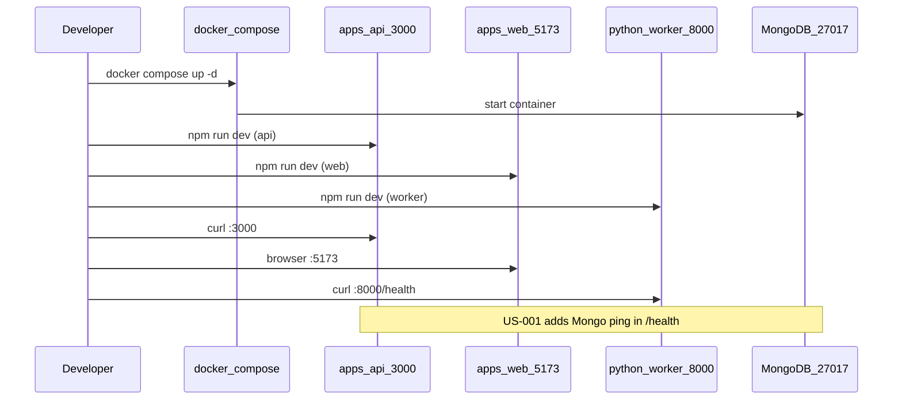

# US-000: Initialize Project and Local Development Environment

## 1. Scenario summary

- **Actor** — Developer cloning the repo for the first time
- **Goal** — Bootstrap the monorepo and run the full local dev stack (MongoDB + three app processes) so later weekly features can be built incrementally
- **Success criteria**
  - `docker compose up` starts MongoDB without errors
  - Node API listens on **3000** and returns a basic HTTP response
  - React/Vite dev server listens on **5173** and loads in the browser
  - Python FastAPI worker listens on **8000** and responds to `GET /health`
  - [`.env.example`](.env.example) documents all required variables (no secrets); [README.md](README.md) has copy-paste setup steps

**Scope boundary:** US-000 is **infrastructure scaffolding only**. Do not implement US-001 (`GET /health` with MongoDB status) or US-002 (app shell, navigation, feature routes) in this pass — only minimal stubs that prove each process starts on the correct port.

---

## 2. Current state

### What exists

| Area | Status |
|------|--------|
| Product/architecture docs | [ARCHITECTURE.md](ARCHITECTURE.md), [REQUIREMENTS.md](REQUIREMENTS.md), [ROADMAP.md](ROADMAP.md) |
| Week 0 scenarios | [US-000](user-scenarios/US-000-project-initialization.md), [US-001](user-scenarios/US-001-database-and-api-bootstrap.md), [US-002](user-scenarios/US-002-web-app-shell-and-navigation.md) |
| Implementation conventions | [.cursor/rules/nodejs-api.mdc](.cursor/rules/nodejs-api.mdc), [react-web.mdc](.cursor/rules/react-web.mdc), [python-worker.mdc](.cursor/rules/python-worker.mdc) |

### Gaps (everything US-000 must create)

- No `apps/`, `packages/`, or `services/` directories
- No root `package.json`, lockfile, or workspace config
- No `docker-compose.yml`, `.env.example`, or `.gitignore`
- No runnable API, web, or Python entrypoints
- [README.md](README.md) states *"Application code not yet started"* — no setup instructions

---

## 3. End-to-end flow

Developer bootstrap sequence:

1. Clone repo → install Node deps at root (workspaces pull in `apps/*` and `packages/*`)
2. Copy `.env.example` → `.env`; set `GEMINI_API_KEY` and `MONGODB_URI` (Atlas or local compose URI)
3. `docker compose up -d` → MongoDB on `27017` (Redis on `6379`, started but unused until queue weeks)
4. `npm run dev` (root script) → concurrently starts API :3000, web :5173, Python :8000
5. Verify: `curl localhost:3000`, open `http://localhost:5173`, `curl localhost:8000/health`



---

## 4. Implementation breakdown

| Layer | Changes | Key files / modules |
|-------|---------|---------------------|
| **Root monorepo** | npm workspaces; shared dev scripts; repo hygiene | `package.json`, `.gitignore`, `.nvmrc` (24), optional `Makefile` aliases |
| **Docker** | MongoDB 7 + Redis 7 for local dev | `docker-compose.yml` |
| **Env** | Single root `.env.example`; apps load via `dotenv` / Vite / pydantic-settings | `.env.example`, `.env` (gitignored) |
| **React (`apps/web`)** | Vite + React 19 + TS strict; placeholder home page; `VITE_API_URL` | `apps/web/package.json`, `vite.config.ts`, `src/main.tsx`, `src/App.tsx` |
| **Node API (`apps/api`)** | Express + TS; listen :3000; `GET /` or minimal `GET /health` returning `{ status: "ok" }` **without** DB check | `apps/api/src/index.ts`, `src/config.ts`, `tsconfig.json` |
| **Python worker (`services/python-worker`)** | FastAPI + Uvicorn; `GET /health` → `{ "data": { "status": "ok" } }` | `app/main.py`, `pyproject.toml` or `requirements.txt`, `app/config.py` |
| **Shared (`packages/prompts`)** | Empty TS package wired into workspace (Week 1 content lands in US-010+) | `packages/prompts/package.json`, `src/index.ts` (export stub) |
| **Data** | MongoDB container only — no collections, indexes, or app connection yet | `docker-compose.yml` service `mongodb` |
| **Docs** | Local setup section in README | [README.md](README.md) |

### Monorepo layout (target)

```
knowflow/
├── apps/
│   ├── api/                 # Express, port 3000
│   └── web/                 # Vite React, port 5173
├── services/
│   └── python-worker/       # FastAPI, port 8000
├── packages/
│   └── prompts/             # TS workspace package (stub)
├── docker-compose.yml
├── .env.example
├── package.json             # workspaces + dev scripts
└── README.md                # setup instructions
```

### Tooling choices (recommended)

- **npm workspaces** (not Turborepo yet) — simplest for Week 0; add Turbo later if build orchestration grows
- **Express** (default per rules) with `tsx watch` for dev
- **concurrently** at root to run api + web + python in one `npm run dev`
- **Python**: `uv` or `venv` + `pip install -r requirements.txt`; document both in README

### US-000 vs sibling scenarios

| Concern | US-000 (this plan) | Deferred |
|---------|-------------------|----------|
| API `GET /health` with `db: "connected"` | Stub only (`status: "ok"`) | [US-001](user-scenarios/US-001-database-and-api-bootstrap.md) |
| Mongoose/pooling/graceful shutdown | Not yet | US-001 |
| App shell, nav, feature routes | Placeholder page only | [US-002](user-scenarios/US-002-web-app-shell-and-navigation.md) |
| `packages/prompts` patterns | Empty package | Week 1 / US-010 |
| `/embed`, `/parse` endpoints | Not yet | Week 4 / US-043 |
| Bucket upload, BullMQ | Env vars documented only | Week 2–3 |

---

## 5. API and data contract

### New endpoints (minimal stubs for US-000)

| Method | Path | Service | Response (US-000) |
|--------|------|---------|-------------------|
| `GET` | `/` or `/health` | API :3000 | `{ "data": { "status": "ok" } }` — no DB field yet |
| `GET` | `/health` | Python :8000 | `{ "data": { "status": "ok" } }` per [python-worker.mdc](.cursor/rules/python-worker.mdc) |

### Environment variables (`.env.example`)

Document at **repo root**; all apps read from root `.env` in dev:

| Variable | Required in US-000 | Used by | Notes |
|----------|-------------------|---------|-------|
| `MONGODB_URI` | Yes (for compose default) | API (US-001), worker (later) | `mongodb://localhost:27017/knowflow` for local compose |
| `GEMINI_API_KEY` | Yes (precondition) | API/worker (later) | Placeholder; not called in US-000 |
| `PORT` | Optional | API | Default `3000` |
| `VITE_API_URL` | Yes | Web | `http://localhost:3000` |
| `PYTHON_WORKER_URL` | Optional | API (later) | `http://localhost:8000` |
| `REDIS_URL` | Optional | API (Week 9 queue) | `redis://localhost:6379` |
| `BUCKET_PROVIDER` | Optional | API (Week 2) | e.g. `s3` — commented with sub-keys `BUCKET_*` |
| `BUCKET_REGION`, `BUCKET_NAME`, `BUCKET_ACCESS_KEY`, `BUCKET_SECRET_KEY` | Optional | API (Week 2) | Documented, not required to start |

### Docker services

| Service | Image | Port | Purpose |
|---------|-------|------|---------|
| `mongodb` | `mongo:7` | 27017 | Primary DB |
| `redis` | `redis:7-alpine` | 6379 | BullMQ backend (Week 9+); start now, connect later |

No MongoDB collections or indexes in US-000.

---

## 6. Suggested build order

1. **Root workspace** — `package.json` workspaces, `.gitignore`, `.nvmrc`, root `npm run dev` / `docker:up` scripts
2. **`docker-compose.yml`** — MongoDB + Redis with named volume and healthcheck
3. **`.env.example`** — all variables above with comments; copy instructions
4. **`apps/api` scaffold** — Express + TS + config module; listen 3000; minimal health route
5. **`apps/web` scaffold** — Vite React 19 + TS; read `VITE_API_URL`; show "KnowFlow — Week 0 bootstrap" page
6. **`packages/prompts` stub** — workspace package with `src/index.ts` exporting empty object or placeholder type
7. **`services/python-worker` scaffold** — FastAPI app, pydantic-settings config, `GET /health`
8. **Wire root `npm run dev`** — `concurrently` for api, web, and python (`uvicorn` or documented shell wrapper)
9. **README setup section** — prerequisites (Node 24+, Python 3.11+, Docker), clone/install/env/compose/dev/verify steps
10. **Smoke verification** — manual checklist against acceptance criteria

---

## 7. Testing and verification

### Manual test steps

```bash
# Prerequisites: Node 24+, Python 3.11+, Docker
git clone <repo> && cd knowflow
cp .env.example .env   # fill GEMINI_API_KEY, confirm MONGODB_URI
npm install
docker compose up -d
npm run dev
```

| Check | Command / action | Expected |
|-------|------------------|----------|
| MongoDB up | `docker compose ps` | `mongodb` healthy |
| API | `curl -s http://localhost:3000/health` | HTTP 200, JSON with `status: "ok"` |
| Web | Open `http://localhost:5173` | Page loads, no console errors |
| Python | `curl -s http://localhost:8000/health` | HTTP 200, `{ "data": { "status": "ok" } }` |
| Env docs | Read `.env.example` + README | All keys listed, no secret values |

### Automated tests (optional, low priority for US-000)

- Skip unless trivial: a single API integration test for `GET /health` can wait for US-001 when MongoDB wiring is real
- Python: optional `pytest` for `/health` in a follow-up if CI is added later

### Edge cases

- **Port conflicts** — document how to override `PORT` / Vite port in README
- **MongoDB not running** — US-000 API should still start; US-001 will add graceful DB-down behavior
- **Missing `.env`** — config module should fail fast with a clear message listing missing keys (`GEMINI_API_KEY`, `MONGODB_URI`)
- **Python venv** — README should show `python -m venv .venv && source .venv/bin/activate` before `pip install`

---

## 8. Roadmap fit

| Item | Timing |
|------|--------|
| **Week 0 / pre-requisite** | US-000 blocks all FR-* work; implement before Week 1 |
| **Week 1 (`week-01-prompts`)** | Depends on US-000 + US-001 (MongoDB) + US-002 (web shell for picker UI) |
| **Ship now** | Monorepo layout, compose, env template, three dev servers, README setup |
| **Defer** | Full README with architecture diagram and weekly tags → [US-122](user-scenarios/US-122-access-deployed-application.md) / Week 12 capstone |
| **Phase 2** | MCP connectors, bucket storage, Redis queue consumers — out of scope |

### Risks

- **Node 24** is specified in rules but uncommon; `.nvmrc` + README note avoids version drift
- **Atlas vs local MongoDB** — `.env.example` should show both URI patterns; US-000 compose targets local only
- **Scope creep** — resist building US-001/US-002 features during US-000; only port-verification stubs

### Open questions (non-blocking)

- **Package manager**: npm workspaces assumed; switch to pnpm only if team prefers (update README accordingly)
- **Styling for web stub**: pick one approach (Tailwind or CSS modules) in US-002 when shell is built; US-000 can use minimal inline/CSS file
