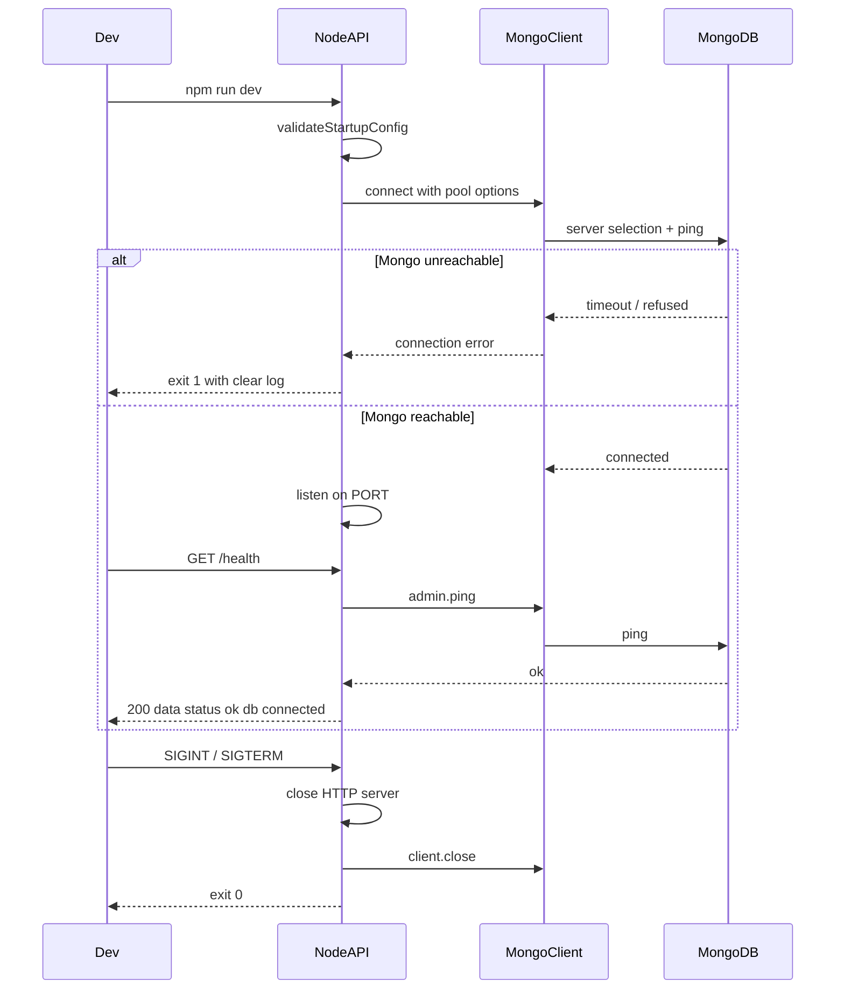

# US-001: Connect MongoDB and Bootstrap API

## 1. Scenario summary

- **Actor** — Developer running the local KnowFlow stack
- **Goal** — Connect `apps/api` to MongoDB and expose a health endpoint that reports database connectivity so Week 1+ features can persist data
- **Success criteria**
  - `GET /health` returns **200** with `{ data: { status: "ok", db: "connected" } }` when MongoDB is reachable (per project envelope; you confirmed this over the flat US-001 AC shape)
  - API exits with a **clear, actionable error** when MongoDB is unreachable at startup
  - `GET /health` returns **503** with `db: "disconnected"` if MongoDB becomes unreachable while the process is running
  - Connection uses pooling and **graceful shutdown** on `SIGINT`/`SIGTERM`
  - Connection survives API restart (stop/start with MongoDB still up)
  - No LLM, collections, or seed data in this scenario

---

## 2. Current state

### Already in place (US-000)

| Area | Location | Notes |
|------|----------|-------|
| Docker MongoDB | [`docker-compose.yml`](docker-compose.yml) | `mongo:7` on `27017`, volume + healthcheck |
| Env config | [`.env.example`](.env.example), [`apps/api/src/config.ts`](apps/api/src/config.ts) | `MONGODB_URI` defined but unused |
| Express stub | [`apps/api/src/index.ts`](apps/api/src/index.ts) | JSON middleware, mounts `/health` |
| Health route stub | [`apps/api/src/routes/health.routes.ts`](apps/api/src/routes/health.routes.ts), [`apps/api/src/controllers/health.controller.ts`](apps/api/src/controllers/health.controller.ts) | Returns `{ data: { status: "ok" } }` — no DB check |
| Dev scripts | Root `package.json` | `docker:up`, `npm run dev` |

### Gaps vs US-001

- No MongoDB driver in [`apps/api/package.json`](apps/api/package.json)
- No connection module, startup connect, or shutdown close
- `validateStartupConfig()` only checks `PORT` — not `MONGODB_URI`
- No `services/`, `clients/`, `middleware/`, or `errors/` directories
- No global error handler or `asyncHandler`
- README still documents health without `db` field ([`README.md`](README.md) line 71)

**Explicitly out of scope for US-001:** collections (`prompt_templates`, etc.), indexes, migrations, seed scripts, Python worker MongoDB wiring, React changes, LLM integration.

---

## 3. End-to-end flow



**Numbered steps**

1. Developer runs `npm run docker:up` then `npm run dev`
2. API loads config from root `.env`, validates `PORT` and `MONGODB_URI`
3. API connects to MongoDB via a shared `MongoClient` (pooling enabled by driver defaults; tune `maxPoolSize` / `serverSelectionTimeoutMS` in config)
4. On success, HTTP server listens on `:3000`
5. `GET /health` runs `admin().ping()` and maps result to HTTP status + JSON envelope
6. On shutdown signal, API drains HTTP connections and closes the Mongo client

---

## 4. Implementation breakdown

| Layer | Changes | Key files / modules |
|-------|---------|---------------------|
| **React (`apps/web`)** | None | — |
| **Node API (`apps/api`)** | Add MongoDB client, bootstrap lifecycle, health service, minimal error stack | See below |
| **Python worker** | None (deferred to Week 4) | — |
| **Data (MongoDB)** | No collections yet — connection + ping only | Existing `docker-compose` service |
| **Shared (`packages/`)** | None | — |

### Node API file plan

| File | Purpose |
|------|---------|
| `src/clients/mongodb.client.ts` | Singleton `MongoClient`: `connectMongo()`, `getDb()`, `pingMongo()`, `closeMongo()` |
| `src/services/health.service.ts` | `getHealthStatus()` — calls `pingMongo()`, returns `{ status, db }` domain DTO |
| `src/controllers/health.controller.ts` | Async handler: map service result → `200` or `503` + `{ data }` envelope |
| `src/middleware/asyncHandler.ts` | Wrap async controllers (from [conventions examples](.cursor/skills/nodejs-api-shared/examples.md)) |
| `src/errors/AppError.ts` | Minimal domain error class (foundation for Week 1+) |
| `src/middleware/errorHandler.ts` | Map `AppError` and unknown errors to `{ error: { code, message } }` |
| `src/config.ts` | Add `mongodbUri` validation; optional pool/timeout tunables |
| `src/index.ts` | `await connectMongo()` before `listen`; register `errorHandler`; graceful shutdown |
| `src/routes/health.routes.ts` | Bind `asyncHandler(healthController.getHealth)` |

**Driver choice:** Use the official [`mongodb`](https://www.npmjs.com/package/mongodb) native driver (not Mongoose) for US-001 — connection and ping only. Week 1 `prompt_templates` CRUD can introduce Mongoose models in repositories without changing the connection module, or migrate to `mongoose.connect()` then if preferred.

**Layer boundaries** (per [nodejs-api-shared conventions](.cursor/skills/nodejs-api-shared/conventions.md)):
- Client owns SDK connection lifecycle
- Service owns health business logic (ping interpretation)
- Controller owns HTTP status mapping only

---

## 5. API and data contract

### `GET /health`

| Condition | Status | Body |
|-----------|--------|------|
| MongoDB ping succeeds | `200` | `{ "data": { "status": "ok", "db": "connected" } }` |
| MongoDB ping fails (runtime) | `503` | `{ "data": { "status": "degraded", "db": "disconnected" } }` |
| Unhandled controller error | `500` | `{ "error": { "code": "INTERNAL_ERROR", "message": "..." } }` |

### Startup behavior (MongoDB down)

- Log a clear message including `MONGODB_URI` host (not credentials) and hint: `npm run docker:up`
- `process.exit(1)` — fail fast so developers do not assume persistence works

### Config

| Variable | Required | Default | Notes |
|----------|----------|---------|-------|
| `MONGODB_URI` | Yes | `mongodb://localhost:27017/knowflow` | Matches compose |
| `PORT` | No | `3000` | Already validated |

Optional client options (hardcode sensible defaults, no new env vars unless needed):

```typescript
{
  maxPoolSize: 10,
  serverSelectionTimeoutMS: 5000,
}
```

### Data

No new collections, indexes, or documents for US-001.

---

## 6. Suggested build order

1. **Add dependency** — `mongodb` (+ `@types` if needed) in `apps/api`
2. **MongoDB client module** — `connectMongo`, `pingMongo`, `closeMongo` with typed exports
3. **Config validation** — reject empty `MONGODB_URI`; keep existing `PORT` check
4. **Health service + controller** — ping logic in service; controller maps to 200/503 envelope
5. **Async + error middleware** — `asyncHandler`, `AppError`, `errorHandler` (minimal, no logger dependency — use `console.error` for unhandled errors until Week 9 logging)
6. **Bootstrap lifecycle in `index.ts`** — connect → listen → shutdown handlers (`server.close()` then `closeMongo()`)
7. **README update** — health expected response includes `db: "connected"`; add troubleshooting note for Mongo down
8. **Manual verification** — run full test matrix below

Each step is one focused session; steps 2–6 can be a single PR.

---

## 7. Testing and verification

### Manual test steps

```bash
# Baseline: Mongo up
npm run docker:up
npm run dev
curl -s http://localhost:3000/health
# Expect: {"data":{"status":"ok","db":"connected"}}

# Restart survival
# Ctrl+C API, npm run dev again, curl /health again → same 200

# Mongo down at startup
docker compose stop mongodb
npm run dev
# Expect: process exits with clear connection error (not a silent hang)

# Mongo down at runtime (optional)
# Start with mongo up, then: docker compose stop mongodb && curl /health
# Expect: 503 with db disconnected

# Restore
docker compose start mongodb && curl /health
# Expect: 200 again after mongo recovers
```

### Automated tests (optional, low priority)

- One integration test hitting `GET /health` with a test `MongoClient` mock — worthwhile only if a test runner is added; skip for US-001 unless trivial to wire with `vitest`/`supertest`

---

## 8. Roadmap fit

| Item | Timing |
|------|--------|
| **Week 0 / US-001** | This scenario — prerequisite infrastructure |
| **Week 1** | First consumer: `prompt_templates` CRUD uses the same Mongo connection |
| **Deferred** | Collections/indexes (Week 1+), Redis queue (Week 2–3), Python worker DB (Week 4), Atlas Vector Search (Week 4) |

**Ship now:** connection module, health with DB status, graceful shutdown, README alignment.

**Defer:** Mongoose schemas, migrations, seed scripts, structured logger, rate limiting, auth middleware.

---

## Risks and edge cases

| Risk | Mitigation |
|------|------------|
| US-001 AC flat JSON vs envelope | Use envelope (confirmed); update [`user-scenarios/US-001-database-and-api-bootstrap.md`](user-scenarios/US-001-database-and-api-bootstrap.md) AC line to match |
| Atlas vs local URI | Default compose URI works locally; `.env.example` already documents Atlas comment |
| Race: API starts before compose healthcheck passes | `serverSelectionTimeoutMS: 5000` + fail-fast message; document `docker compose ps` check in README |
| Double `connectMongo` on hot reload (`tsx watch`) | Guard with a module-level connection promise; `closeMongo` on shutdown prevents leaked connections on restart |

## Open questions

None blocking — health envelope shape resolved.
