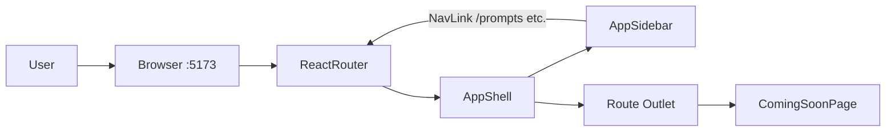

# US-002: Launch Web App Shell and Navigation

## 1. Scenario summary

- **Actor** — Team member using KnowFlow in the browser
- **Goal** — Open KnowFlow and navigate between feature areas (prompts, documents, chat, search, agents, cost) as they are built week-by-week
- **Success criteria**
  - App loads at `http://localhost:5173` with **no console errors**
  - Consistent shell: header, sidebar navigation, scrollable content area
  - Routes exist for all primary roadmap UI areas; unimplemented sections show **"Coming in Week N"**
  - API base URL read from `VITE_API_URL` (never hardcoded in components)
  - Layout is **responsive and usable on desktop** (sidebar + content; collapses gracefully on narrow viewports)

---

## 2. Current state

### Already in place (US-000 / US-001)

| Area | Location | Notes |
|------|----------|-------|
| Vite + React 19 + TS strict | [`apps/web/package.json`](apps/web/package.json) | No router or layout libs yet |
| Env loading | [`apps/web/vite.config.ts`](apps/web/vite.config.ts) | `envDir` points to repo root; `VITE_API_URL` in [`.env.example`](.env.example) |
| Env typing | [`apps/web/src/vite-env.d.ts`](apps/web/src/vite-env.d.ts) | `VITE_API_URL` declared |
| Bootstrap page | [`apps/web/src/App.tsx`](apps/web/src/App.tsx) | Single-page dev metadata; reads `import.meta.env.VITE_API_URL` |
| Global styles | [`apps/web/src/index.css`](apps/web/src/index.css), [`App.css`](apps/web/src/App.css) | Minimal system-ui styling |
| API health | [`apps/api`](apps/api) | `GET /health` with DB status (US-001) — optional for shell smoke test |

### Gaps vs US-002

- No **React Router** — navigation is impossible
- No **app shell** (header / sidebar / `<Outlet />`)
- No **feature routes** or placeholder pages
- No **`@/` path alias** (required by [`.cursor/rules/react-web.mdc`](.cursor/rules/react-web.mdc))
- No **`src/lib/api.ts`** client stub for future API calls
- No folder structure (`components/`, `features/`, `routes/`, `lib/`)
- README still describes a "Bootstrap page" at `:5173`

**Explicitly out of scope:** feature logic (prompt CRUD, upload, chat streaming), TanStack Query, API route changes, MongoDB, Python worker, auth, mobile-native layout polish.

---

## 3. End-to-end flow

Pure client-side navigation — no backend calls required for acceptance (optional health ping for dev feedback only).



**User steps**

1. Open `http://localhost:5173` → redirect to `/prompts` (first roadmap feature).
2. See **KnowFlow** header, left sidebar with six nav items, main content area.
3. Click a nav item → URL updates, active item highlighted, content shows placeholder with feature title and target week.
4. Direct URL (e.g. `/chat`) works on refresh (client-side routing via `BrowserRouter`).
5. Unknown paths → 404 page with link back to home route.

---

## 4. Implementation breakdown

| Layer | Changes | Key files / modules |
|-------|---------|---------------------|
| **React (`apps/web`)** | Add `react-router-dom`; `@/` alias; app shell layout; route table; placeholder pages; API client stub | See file tree below |
| **Node API (`apps/api`)** | None | — |
| **Python worker** | None | — |
| **Data (MongoDB, bucket, queue)** | None | — |
| **Shared (`packages/`)** | None | — |
| **Docs** | Update README verify row; optional US-002 AC note | [`README.md`](README.md) |

### Target file structure

```
apps/web/src/
├── main.tsx                          # wrap with BrowserRouter
├── App.tsx                           # mount route tree
├── routes/
│   ├── router.tsx                    # createBrowserRouter or Routes/Route
│   └── navConfig.ts                  # single source of truth for nav + weeks
├── components/layout/
│   ├── AppShell.tsx                  # header + sidebar + <Outlet />
│   ├── AppHeader.tsx
│   ├── AppSidebar.tsx                # maps navConfig → NavLink
│   └── AppShell.module.css
├── components/ui/
│   ├── ComingSoonPage.tsx            # reusable placeholder
│   └── NotFoundPage.tsx
├── features/                         # thin route pages (replace in later weeks)
│   ├── prompts/PromptsPage.tsx
│   ├── documents/DocumentsPage.tsx
│   ├── chat/ChatPage.tsx
│   ├── search/SearchPage.tsx
│   ├── agents/AgentsPage.tsx
│   └── cost/CostDashboardPage.tsx
└── lib/
    ├── api.ts                        # getApiBaseUrl(), fetchJson stub
    └── env.ts                        # assert VITE_API_URL in dev (console warn if missing)
```

### Navigation config (covers 12-week set)

Centralize in [`navConfig.ts`](apps/web/src/routes/navConfig.ts) so Week 1+ only flip `implemented: true` or swap the page component — no sidebar edits.

| Label | Path | Roadmap week | FR reference |
|-------|------|--------------|--------------|
| Prompt Templates | `/prompts` | 1 | FR-01, FR-02 |
| Documents | `/documents` | 2 | FR-03, FR-17 |
| Chat | `/chat` | 2 | FR-04 |
| Search | `/search` | 4 | FR-08 |
| Agents | `/agents` | 5–7 | FR-09–FR-11 |
| Cost Dashboard | `/cost` | 10 | FR-14 |

**How this accommodates all 12 weeks without six more nav items:**

- Weeks **3, 9, 11, 12** are cross-cutting (RAG pipeline, reliability, security demo, capstone polish) — they enhance existing surfaces rather than new top-level nav.
- Week **8** (LangChain compare) can reserve nested route `/agents/compare` in the router file (no sidebar link until Week 8) — documents extensibility without cluttering the shell now.

### Layout and styling decisions

- **Sidebar layout** (not tabs) — scales to six items and matches [`ARCHITECTURE.md`](ARCHITECTURE.md) frontend diagram.
- **CSS Modules** for shell components — consistent with existing plain CSS bootstrap; avoids adding Tailwind in this scenario ([`us-000` plan note](.cursor/plans/us-000_project_init_bea4cd09.plan.md)).
- **Desktop-first responsive:** fixed sidebar ~240px; content flex-grows; below ~768px sidebar collapses behind a menu button (hamburger) — satisfies "usable on desktop" without mobile-native scope.
- **Accessibility:** `<nav>` landmark, `aria-current="page"` on active `NavLink`, keyboard-focusable nav links, skip-to-content link in header.

### Dependencies to add

```json
"react-router-dom": "^7.x"
```

No TanStack Query yet — no server data in this scenario; add with Week 1 feature work.

### Config updates

- [`apps/web/vite.config.ts`](apps/web/vite.config.ts) — addToastresolve.alias: { '@': resolve(__dirname, 'src') }`
- [`apps/web/tsconfig.json`](apps/web/tsconfig.json) — `"paths": { "@/*": ["./src/*"] }`

---

## 5. API and data contract

**No new or changed API endpoints.**

### Client-side env contract (unchanged)

| Variable | Consumer | Default (`.env.example`) |
|----------|----------|--------------------------|
| `VITE_API_URL` | `lib/env.ts`, `lib/api.ts` | `http://localhost:3000` |

### `lib/api.ts` stub (foundation for Week 1+)

```ts
export function getApiBaseUrl(): string {
  return import.meta.env.VITE_API_URL ?? '';
}

export async function fetchJson<T>(path: string, init?: RequestInit): Promise<T> {
  const res = await fetch(`${getApiBaseUrl()}${path}`, init);
  // Week 1+: parse { data } / { error } envelope
  ...
}
```

Optional dev-only: call `GET /healthcare` from a small footer badge or home widget to confirm API reachability — **not required** for US-002 AC.

---

## 6. Suggested build order

1. **Dependencies and aliases** — install `react-router-dom`; add `@/` to Vite + tsconfig.
2. **`navConfig.ts`** — define nav items with `label`, `path`, `week`, `description`.
3. **Layout components** — `AppShell`, `AppHeader`, `AppSidebar` + CSS module (grid/flex shell).
4. **`ComingSoonPage` + `NotFoundPage`** — shared UI for placeholders and unknown routes.
5. **Feature placeholder pages** — one thin page per nav item under `src/features/*/`.
6. **Router wiring** — nested routes: layout route wraps all feature paths; `/` → redirect `/prompts`; `*` → 404.
7. **`lib/env.ts` + `lib/api.ts`** — env guard + fetch stub; remove hardcoded URLs from any remaining bootstrap code.
8. **Replace bootstrap `App.tsx`** — remove Week 0 metadata page; mount router only.
9. **README update** — React verify row: "App shell with sidebar navigation; placeholders for Week 1+ features."
10. **Manual verification** — run checklist in section 7.

Each step is one focused session; steps 2–6 can be a single PR.

---

## 7. Testing and verification

### Manual test steps

```bash
npm run docker:up          # optional — only if testing API badge
npm run dev
# Open http://localhost:5173
```

| Check | Expected |
|-------|----------|
| Initial load | Redirects to `/prompts`; no red errors in browser console |
| Sidebar | Six items visible; active item styled on `/prompts` |
| Navigation | Click each item → URL changes, placeholder shows correct title + week |
| Deep link | Paste `/chat` in address bar → shell + Chat placeholder loads |
| 404 | Visit `/unknown` → Not Found page with link home |
| Env | DevTools → no hardcoded `localhost:3000` in component source; value comes from env |
| Responsive | Resize to ~1200px and ~768px — content readable; sidebar collapses on narrow |
| Build | `npm run build -w @knowflow/web` succeeds with zero TS errors |

### Automated tests

Skip for US-002 — no meaningful behavior beyond routing; add React Testing Library route tests when Week 1 ships real pages.

---

## 8. Roadmap fit

| Item | Detail |
|------|--------|
| **Week / phase** | Week 0 prerequisite ([`US-002` metadata](user-scenarios/US-002-web-app-shell-and-navigation.md)); blocks **Week 1** prompt template UI |
| **Ship now** | Shell, routing, nav config, placeholders, env-based API client stub |
| **Defer** | TanStack Query, real feature pages, streaming chat, upload UI, cost charts, ESLint setup, Week 8 `/agents/compare` nav link |

### Downstream consumers

- **Week 1** replaces `features/prompts/PromptsPage.tsx` with template picker; keeps shell unchanged.
- **Week 2** replaces `documents/` and `chat/` pages.
- **Week 4** replaces `search/` page.
- **Weeks 5–7** replace `agents/` page.
- **Week 10** replaces `cost/` page.

---

## Risks and edge cases

- **Missing `VITE_API_URL`:** Vite exposes `undefined` if unset — `lib/env.ts` should log a clear dev warning (not throw) so the shell still loads.
- **Refresh on nested routes in production:** Vite preview and future deploy need SPA fallback (`historyApiFallback` / `try_files`) — document in README for Week 12 deploy; dev server handles this automatically.
- **Scope creep:** Do not implement prompt CRUD, health polling dashboards, or auth — shell only.
