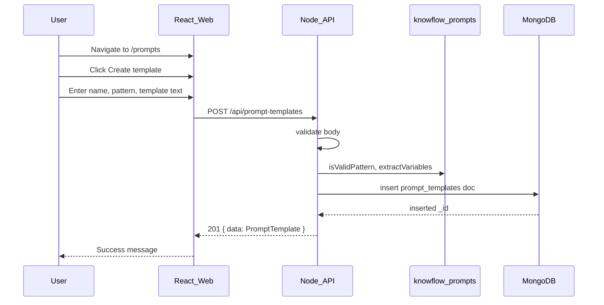

# US-010: Create a Prompt Template

## 1. Scenario summary

- **Actor** — Team member using the KnowFlow web app
- **Goal** — Create a reusable prompt template by choosing one of five prompt-engineering patterns, writing template text with `{{variable}}` placeholders, and saving it for later use
- **Success criteria**
  - User can navigate to Prompt Templates, open a create form, enter name/pattern/template text, and save
  - `POST /api/prompt-templates` persists a document in MongoDB `prompt_templates` with `name`, `pattern`, `template`, `variables`, `createdAt`, `updatedAt`
  - All five patterns (`zero-shot`, `few-shot`, `chain-of-thought`, `role-based`, `structured-json`) are accepted
  - `variables` is derived server-side from `{{variable}}` syntax in `template` (not trusted from client)
  - Data survives API restart; no LLM or external AI calls

## 2. Current state

**Already in place (US-001, US-002):**

- Express API bootstrap with MongoDB connection ([`apps/api/src/index.ts`](apps/api/src/index.ts), [`apps/api/src/clients/mongodb.client.ts`](apps/api/src/clients/mongodb.client.ts))
- Health check pattern: route → controller → service, `{ data }` / `{ error }` envelopes
- React shell with `/prompts` route and sidebar nav ([`apps/web/src/routes/router.tsx`](apps/web/src/routes/router.tsx), [`apps/web/src/routes/navConfig.ts`](apps/web/src/routes/navConfig.ts))
- `fetchJson` API client ([`apps/web/src/lib/api.ts`](apps/web/src/lib/api.ts)) wired to `VITE_API_URL`

**Gaps vs US-010:**

| Area | Status |
|------|--------|
| [`packages/prompts`](packages/prompts/src/index.ts) | Stub only — no patterns, types, or variable helpers |
| API `prompt-templates` layers | Missing (routes, controller, service, repository, validation) |
| MongoDB `prompt_templates` | Documented in [ARCHITECTURE.md](ARCHITECTURE.md) but no code/index |
| `/prompts` UI | `ComingSoonPage` placeholder ([`apps/web/src/features/prompts/PromptsPage.tsx`](apps/web/src/features/prompts/PromptsPage.tsx)) |
| CORS | Not configured — browser calls from `:5173` → `:3000` will fail without it |
| Validation lib | No `validate()` middleware or Zod dependency yet |

**Related Week 1 scenarios (defer UI/API surface, but structure for them):**

- US-011 — list (`GET /api/prompt-templates`)
- US-012 — edit (`PUT /api/prompt-templates/:id`)
- US-013 — delete (`DELETE /api/prompt-templates/:id`)
- US-014 — preview with substitution (client-side via `@knowflow/prompts`)

US-010 should implement **create only** but use file/layer naming that US-011–013 can extend without renames.

## 3. End-to-end flow



**Numbered user steps:**

1. User opens `/prompts` (sidebar → Prompt Templates).
2. User clicks **Create template** (inline form or `/prompts/new` sub-route).
3. User enters `name` (e.g. `summarize-policy`), selects `pattern` (e.g. `zero-shot`), writes `template` with placeholders (e.g. `Summarize the following:\n\n{{text}}`).
4. User clicks **Save**.
5. Web `POST`s `{ name, pattern, template }` to API.
6. API validates pattern, extracts `variables` from template text, inserts MongoDB document with timestamps.
7. Web shows success (and optionally clears form or navigates back); template is durable across restart.

## 4. Implementation breakdown

| Layer | Changes | Key files / modules |
|-------|---------|---------------------|
| **Shared (`packages/prompts`)** | Define `PromptPattern` union (5 values), pattern metadata (label + short helper text for UI), `PROMPT_PATTERNS` constant, `extractVariables(template)`, `isValidPattern(value)`, optional `substituteVariables` (for US-014) | [`packages/prompts/src/patterns.ts`](packages/prompts/src/patterns.ts), [`packages/prompts/src/variables.ts`](packages/prompts/src/variables.ts), [`packages/prompts/src/index.ts`](packages/prompts/src/index.ts) |
| **React (`apps/web`)** | Replace placeholder with create flow; pattern select from `@knowflow/prompts`; controlled form; submit via `fetchJson`; handle loading/error/success; set `implemented: true` in navConfig | [`apps/web/src/features/prompts/PromptsPage.tsx`](apps/web/src/features/prompts/PromptsPage.tsx), `CreatePromptTemplateForm.tsx`, `promptTemplates.api.ts`, optional `useCreatePromptTemplate.ts` |
| **Node API — routes** | `POST /api/prompt-templates` with `validate(createSchema)` + `asyncHandler` | [`apps/api/src/routes/prompt-templates.routes.ts`](apps/api/src/routes/prompt-templates.routes.ts) |
| **Node API — controller** | Parse validated body, call service, `201` + `{ data }` | [`apps/api/src/controllers/prompt-templates.controller.ts`](apps/api/src/controllers/prompt-templates.controller.ts) |
| **Node API — service** | Validate pattern via `@knowflow/prompts`; extract variables; optional duplicate-name check (`409`); map to DTO | [`apps/api/src/services/prompt-templates.service.ts`](apps/api/src/services/prompt-templates.service.ts) |
| **Node API — repository** | `getDb().collection('prompt_templates').insertOne()`; map `_id` → `id` string in DTO | [`apps/api/src/repositories/prompt-templates.repository.ts`](apps/api/src/repositories/prompt-templates.repository.ts) |
| **Node API — infra** | Mount router at `/api/prompt-templates`; add CORS for local dev; add Zod + `validate` middleware | [`apps/api/src/index.ts`](apps/api/src/index.ts), `middleware/validate.ts`, `schemas/prompt-templates.schema.ts` |
| **Data (MongoDB)** | Collection `prompt_templates`; unique index on `name` (created on startup or first write) | via repository `ensureIndexes()` |
| **Python worker** | None | — |
| **Queue** | None | — |

**Pattern library content (learning deliverable):** Each pattern exports at least one example template string with one `{{variable}}` placeholder — used as optional “starter text” when user selects a pattern in the form (not persisted until user saves).

Example starter templates:

- `zero-shot`: `Summarize the following text:\n\n{{text}}`
- `few-shot`: `Example input: {{example_input}}\nExample output: {{example_output}}\n\nNow process:\n{{text}}`
- `chain-of-thought`: `Think step by step, then answer.\n\nQuestion: {{question}}`
- `role-based`: `You are a {{role}}. Respond to:\n\n{{request}}`
- `structured-json`: `Return JSON matching this schema for:\n\n{{input}}`

## 5. API and data contract

### `POST /api/prompt-templates`

**Request:**

```json
{
  "name": "summarize-policy",
  "pattern": "zero-shot",
  "template": "Summarize the following:\n\n{{text}}"
}
```

**Validation rules:**

- `name`: non-empty string, trimmed, max length (e.g. 100), slug-friendly (`/^[a-z0-9][a-z0-9-_]*$/i` or similar)
- `pattern`: one of the five `PromptPattern` values
- `template`: non-empty string, max length (e.g. 10_000)
- `variables`: **not accepted from client** — computed server-side

**Success `201`:**

```json
{
  "data": {
    "id": "674a1b2c3d4e5f6789012345",
    "name": "summarize-policy",
    "pattern": "zero-shot",
    "template": "Summarize the following:\n\n{{text}}",
    "variables": ["text"],
    "createdAt": "2026-07-03T06:47:00.000Z",
    "updatedAt": "2026-07-03T06:47:00.000Z"
  }
}
```

**Errors:**

- `400` — validation failure (`{ error: { code: "VALIDATION_ERROR", message, details } }`)
- `409` — duplicate `name` (`DUPLICATE_TEMPLATE_NAME`)
- `500` — unexpected (error middleware)

### MongoDB document shape

Matches [ARCHITECTURE.md](ARCHITECTURE.md):

```json
{
  "_id": "ObjectId",
  "name": "summarize-policy",
  "pattern": "zero-shot",
  "template": "...",
  "variables": ["text"],
  "createdAt": "ISODate",
  "updatedAt": "ISODate"
}
```

**Variable extraction:** Regex `\{\{([a-zA-Z_][a-zA-Z0-9_]*)\}\}` — dedupe preserving first-seen order; reject empty names. Shared in `@knowflow/prompts` so API and future preview (US-014) stay consistent.

**Index:** `{ name: 1 }` unique — supports US-011 lookup and prevents accidental duplicates.

## 6. Suggested build order

1. **`@knowflow/prompts`** — types, five patterns, `extractVariables`, example starters; add workspace dep to `apps/api` and `apps/web`
2. **API validation plumbing** — add `zod`, `validate` middleware, `AppError` codes for validation/duplicate
3. **Repository + index** — `prompt_templates` insert + `ensureIndexes()` on API startup
4. **Service + controller + route** — `POST` only; mount at `/api/prompt-templates`
5. **CORS** — `cors` package, allow `http://localhost:5173` in dev (from env)
6. **Web API module** — `createPromptTemplate()` wrapping `fetchJson<{ data: PromptTemplate }>`
7. **Create form UI** — replace `ComingSoonPage`; pattern dropdown, textarea, submit, error display
8. **Manual verification** — curl + browser create flow; restart API and confirm document remains

**Out of scope for US-010 (ship in sibling scenarios):**

- List/edit/delete endpoints and list UI (US-011–013)
- Live preview / substitution UI (US-014, FR-02)
- TanStack Query (optional for create-only; add when US-011 list caching is built)
- Auth, rate limiting, LLM integration

## 7. Testing and verification

**Manual — API:**

```bash
# Mongo up
npm run docker:up

# Create
curl -s -X POST http://localhost:3000/api/prompt-templates \
  -H 'Content-Type: application/json' \
  -d '{"name":"summarize-policy","pattern":"zero-shot","template":"Summarize:\n\n{{text}}"}'

# Expect 201 with variables: ["text"]

# Restart API, repeat GET via mongo shell or future US-011 list
```

**Manual — Web:**

1. `npm run dev` (or `dev:api` + `dev:web`)
2. Open `http://localhost:5173/prompts`
3. Create template with each pattern type once
4. Confirm success feedback; verify in MongoDB Compass or `mongosh`
5. Restart API; confirm data still present

**Edge cases to verify:**

- Template with multiple/repeated placeholders → `variables` deduped
- Invalid pattern → `400`
- Duplicate name → `409`
- Empty name or template → `400`

**Automated tests (optional, meaningful):**

- Unit tests for `extractVariables` in `packages/prompts` (pure function, high value)
- API integration test for `POST` happy path + validation errors (if test harness exists; none today)

## 8. Roadmap fit

- **Week / phase:** Week 1 — Prompt Engineering Patterns (`week-01-prompts` tag)
- **Requirement:** FR-01 (CRUD for reusable prompt templates) — US-010 delivers the **C** in CRUD
- **Ship now:** `packages/prompts` foundation, `POST` endpoint, create form, MongoDB persistence, variable extraction
- **Defer:** GET/PUT/DELETE (US-011–013), preview picker (US-014 / FR-02), LLM usage (Week 2+), auth (not in v1 scope)

## Risks and decisions

| Item | Recommendation |
|------|----------------|
| **CORS missing** | Add `cors` middleware before US-010 web testing — required for local cross-origin fetch |
| **No validation lib** | Add Zod + thin `validate` middleware per [conventions](.cursor/skills/nodejs-api-shared/conventions.md) |
| **TanStack Query** | Skip for US-010 create mutation; use `useState` + `fetchJson`. Add `@tanstack/react-query` when implementing US-011 list |
| **Unique names** | Enforce via MongoDB unique index + `409` — aligns with repository skill guidance |
| **API path prefix** | Use `/api/prompt-templates` per user scenarios (not `/api/v1`) until a global versioning decision is made |
