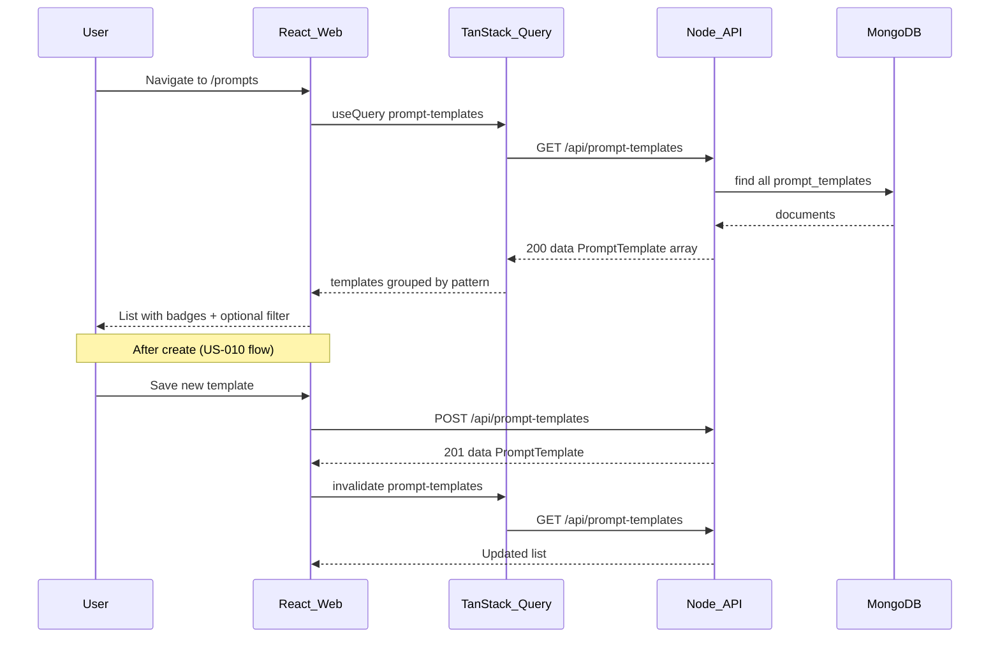

# US-011: List Prompt Templates

## 1. Scenario summary

- **Actor** — Team member using the KnowFlow web app
- **Goal** — Browse all saved prompt templates grouped by pattern so they can pick a proven prompt instead of writing from scratch
- **Success criteria**
  - `GET /api/prompt-templates` returns every persisted template as `{ data: PromptTemplate[] }`
  - `/prompts` displays each template with **name**, **pattern badge**, and **variable count** (`variables.length`)
  - Templates are **grouped by pattern** (section per pattern, ordered per `PROMPT_PATTERNS`)
  - **Empty state** when the collection has no documents
  - Optional **pattern filter** narrows the visible list (client-side is sufficient for Week 1)

**Precondition:** US-010 is complete ([`apps/api` POST](apps/api/src/routes/prompt-templates.routes.ts), [`PromptsPage` create form](apps/web/src/features/prompts/PromptsPage.tsx), [`@knowflow/prompts`](packages/prompts/src/patterns.ts)).

---

## 2. Current state

**Already in place (US-010):**

| Area | Status |
|------|--------|
| MongoDB `prompt_templates` + unique `name` index | [`prompt-templates.repository.ts`](apps/api/src/repositories/prompt-templates.repository.ts) — `insert`, `ensureIndexes` |
| `POST /api/prompt-templates` | Route → controller → service → repository |
| Shared types | [`PromptTemplate`](apps/api/src/types/prompt-template.types.ts), web mirror in [`apps/web/src/types/prompt-template.types.ts`](apps/web/src/types/prompt-template.types.ts) |
| Pattern metadata for badges | [`PROMPT_PATTERNS`](packages/prompts/src/patterns.ts) — `id`, `label`, `helperText` |
| `/prompts` page shell + create form | [`PromptsPage.tsx`](apps/web/src/features/prompts/PromptsPage.tsx), [`CreatePromptTemplateForm.tsx`](apps/web/src/features/prompts/CreatePromptTemplateForm.tsx) |
| API client | [`createPromptTemplate()`](apps/web/src/features/prompts/promptTemplates.api.ts) only |

**Gaps vs US-011:**

| Requirement | Gap |
|-------------|-----|
| `GET /api/prompt-templates` | No route, controller handler, service method, or repository `findAll` |
| List UI | Page only renders create form |
| Pattern badges / grouping | No list component |
| Empty state | Not implemented |
| List refresh after create | Create form shows inline success only; no shared list state |
| TanStack Query | Not installed ([`apps/web/package.json`](apps/web/package.json)); required by [react-web.mdc](.cursor/rules/react-web.mdc) for server lists |

**Note:** US-011 scenario text references patterns like `zero-shot` / `role-based`; the implemented pattern IDs are `role-based-prompting`, `few-shot`, `chain-of-thought`, `structured-output`, `prompt-chaining`. Use the code values everywhere — no schema change needed.

**Out of scope:** `GET /:id`, `PUT`, `DELETE` (US-012/013), variable preview (US-014), Python worker, queues, auth.

---

## 3. End-to-end flow



**Numbered user steps:**

1. User opens **Prompt Templates** in the sidebar (`/prompts`).
2. Web fetches `GET /api/prompt-templates` via TanStack Query.
3. UI renders templates in sections — one per pattern from `PROMPT_PATTERNS`, hiding empty sections.
4. Each row shows **name**, **pattern badge** (pattern `label`), and **N variables**.
5. User optionally selects a pattern in a filter dropdown; list re-filters client-side.
6. If no templates exist, show empty state (“No templates yet — create one below”).
7. User can still create via the existing form; on success, query invalidation refreshes the list.

---

## 4. Implementation breakdown

| Layer | Changes | Key files / modules |
|-------|---------|---------------------|
| **React (`apps/web`)** | Add TanStack Query provider; `listPromptTemplates()` API client; `usePromptTemplates` hook; `PromptTemplateList` (grouped list, filter, badges, empty/loading/error); wire into `PromptsPage` above create form; refactor create form to `useMutation` + invalidate `['prompt-templates']` | [`main.tsx`](apps/web/src/main.tsx) or [`App.tsx`](apps/web/src/App.tsx), [`promptTemplates.api.ts`](apps/web/src/features/prompts/promptTemplates.api.ts), `usePromptTemplates.ts`, `PromptTemplateList.tsx`, [`PromptsPage.tsx`](apps/web/src/features/prompts/PromptsPage.tsx), [`CreatePromptTemplateForm.tsx`](apps/web/src/features/prompts/CreatePromptTemplateForm.tsx), [`PromptsPage.module.css`](apps/web/src/features/prompts/PromptsPage.module.css) |
| **Node API — routes** | `GET /` before `POST /` (or same router, order does not matter for `/` vs `/`) with optional `validate(listPromptTemplatesSchema)` for query | [`prompt-templates.routes.ts`](apps/api/src/routes/prompt-templates.routes.ts) |
| **Node API — controller** | `listPromptTemplates` — read optional `req.query.pattern`, call service, `200` + `{ data }` | [`prompt-templates.controller.ts`](apps/api/src/controllers/prompt-templates.controller.ts) |
| **Node API — service** | `list({ pattern? })` — pass filter to repository; no business rules beyond optional pattern validation (already done in middleware) | [`prompt-templates.service.ts`](apps/api/src/services/prompt-templates.service.ts) |
| **Node API — repository** | `findAll({ pattern? })` — `find(filter).sort({ name: 1 })`, map via existing `toDomain` | [`prompt-templates.repository.ts`](apps/api/src/repositories/prompt-templates.repository.ts) |
| **Node API — validation** | `listPromptTemplatesSchema` with optional `query.pattern: z.enum(PROMPT_PATTERN_VALUES).optional()` | [`prompt-templates.schema.ts`](apps/api/src/schemas/prompt-templates.schema.ts) |
| **Shared (`packages/prompts`)** | No changes — reuse `PROMPT_PATTERNS` for labels and section order | [`patterns.ts`](packages/prompts/src/patterns.ts) |
| **Python worker** | None | — |
| **Data (MongoDB)** | No new collection or indexes; read-only `find` on `prompt_templates` | existing collection |

---

## 5. API and data contract

### `GET /api/prompt-templates`

**Query (optional, for API completeness — UI can filter client-side instead):**

| Param | Type | Description |
|-------|------|-------------|
| `pattern` | `PromptPattern` | If present, return only templates with that pattern |

**Success `200`:**

```json
{
  "data": [
    {
      "id": "674a1b2c3d4e5f6789012345",
      "name": "summarize-policy",
      "pattern": "few-shot",
      "template": "Example input: {{example_input}}\n...",
      "variables": ["example_input", "example_output", "text"],
      "createdAt": "2026-07-03T06:47:00.000Z",
      "updatedAt": "2026-07-03T06:47:00.000Z"
    }
  ]
}
```

**Errors:**

- `400` — invalid `pattern` query value
- `500` — unexpected

**Repository query sketch** (extend existing [`toDomain`](apps/api/src/repositories/prompt-templates.repository.ts)):

```typescript
async findAll(filter: { pattern?: PromptPattern } = {}): Promise<PromptTemplate[]> {
  const query = filter.pattern ? { pattern: filter.pattern } : {};
  const docs = await getDb()
    .collection<PromptTemplateDoc>(COLLECTION)
    .find(query)
    .sort({ name: 1 })
    .toArray();
  return docs.map(toDomain);
}
```

**No document shape changes** — same fields as US-010 create response.

---

## 6. Suggested build order

1. **Repository** — add `findAll({ pattern? })` reusing `toDomain`
2. **Service** — add `list({ pattern? })` delegating to repository
3. **Schema** — `listPromptTemplatesSchema` for optional `query.pattern`
4. **Controller + route** — `GET /` with `validate` + `asyncHandler`; smoke-test with `curl`
5. **Web dependency** — add `@tanstack/react-query`; wrap app in `QueryClientProvider`
6. **API client** — `listPromptTemplates(pattern?: PromptPattern)` in `promptTemplates.api.ts`
7. **Hook** — `usePromptTemplates()` with `queryKey: ['prompt-templates']`
8. **List component** — `PromptTemplateList`: loading spinner/text, `ApiError` alert, empty state, pattern filter `<select>`, grouped sections, row metadata
9. **Page integration** — render list above `CreatePromptTemplateForm` on `PromptsPage`
10. **Create refresh** — convert create form to `useMutation`; on success `queryClient.invalidateQueries({ queryKey: ['prompt-templates'] })`
11. **Manual verification** — empty DB, create 2–3 templates across patterns, confirm grouping, filter, and persistence after API restart

---

## 7. Testing and verification

**Manual (local):**

1. Start API + MongoDB; open `http://localhost:5173/prompts`
2. With empty DB → empty state visible; create form still works
3. `curl http://localhost:3000/api/prompt-templates` → `{ "data": [] }`
4. Create templates via UI (at least two different patterns)
5. List shows both; grouped under correct pattern headings; variable counts match `{{var}}` placeholders
6. Pattern filter shows only matching rows; “All patterns” restores full list
7. Restart API → list still populated
8. `curl 'http://localhost:3000/api/prompt-templates?pattern=few-shot'` → filtered subset (if server filter implemented)

**Automated (optional, low priority for Week 1):**

- API integration test: seed `prompt_templates`, assert `GET` returns sorted array and respects `?pattern=`
- Only add if the repo already has an API test harness; otherwise defer

---

## 8. Roadmap fit

| Item | Detail |
|------|--------|
| **Week / phase** | Week 1 — Prompt Engineering Patterns (`week-01-prompts`) |
| **Requirement** | FR-01 (CRUD — this is the **read/list** portion) |
| **Ship now** | `GET` list endpoint, grouped list UI, empty state, optional filter, query invalidation on create |
| **Defer** | Edit/delete (US-012/013), single-template `GET /:id`, variable preview (US-014), pagination, server-side search — unnecessary for a small Week 1 library |

**Dependencies:** US-010 (done). No vector search, bucket, or Python worker.

**Risks / edge cases:**

- **Stale list after create** — mitigated by TanStack Query invalidation (not manual `useState` refetch)
- **Pattern docs vs code IDs** — UI must use `PROMPT_PATTERNS[].label` for badges, not hardcoded scenario names
- **Large template bodies in list response** — acceptable for Week 1; US-012+ could add a list DTO omitting `template` if needed later

**Open questions:** None blocking — optional server `?pattern=` vs client-only filter is an implementation choice; client-side filter satisfies the scenario with less API surface, while server filter is a one-line extension if preferred for REST consistency.
