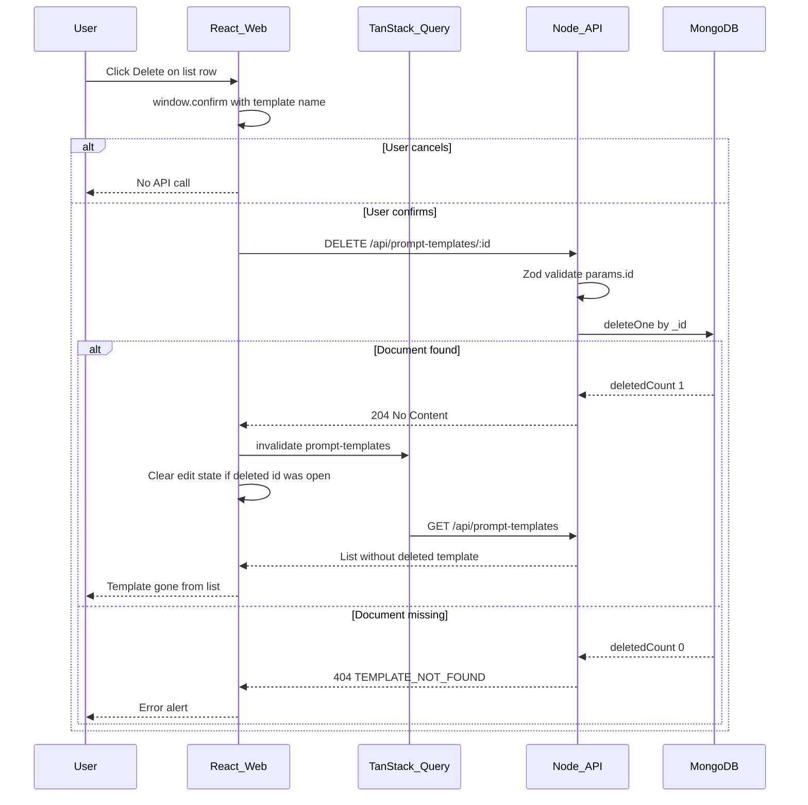

# US-013: Delete a Prompt Template

## 1. Scenario summary

- **Actor** — Knowledge owner using the KnowFlow web app
- **Goal** — Remove obsolete prompt templates so the library stays clean and relevant
- **Success criteria**
  - `DELETE /api/prompt-templates/:id` permanently removes the document from `prompt_templates`
  - Deleted template is not returned by `GET /api/prompt-templates`
  - UI requires explicit confirmation before calling the API
  - Deleting a non-existent or already-deleted id returns `404` with the standard error envelope
  - List view updates immediately after successful deletion (TanStack Query invalidation)

**Preconditions:** US-010 (create), US-011 (list), and US-012 (edit) are implemented — see [`prompt-templates.routes.ts`](apps/api/src/routes/prompt-templates.routes.ts), [`PromptTemplateList.tsx`](apps/web/src/features/prompts/PromptTemplateList.tsx), [`PromptTemplateForm.tsx`](apps/web/src/features/prompts/PromptTemplateForm.tsx).

---

## 2. Current state

**Already in place:**

| Area | Status |
|------|--------|
| MongoDB `prompt_templates` collection + unique `name` index | [`prompt-templates.repository.ts`](apps/api/src/repositories/prompt-templates.repository.ts) — `findAll`, `insert`, `updateById` |
| `GET` / `POST` / `PUT /api/prompt-templates` | Full route → controller → service → repository chain |
| `404` pattern for missing template | Service already throws `AppError('TEMPLATE_NOT_FOUND', …, 404)` on update — reuse same code/message for delete |
| ObjectId param validation | `objectIdParamSchema` in [`prompt-templates.schema.ts`](apps/api/src/schemas/prompt-templates.schema.ts) |
| List UI with Edit affordance | [`PromptTemplateList.tsx`](apps/web/src/features/prompts/PromptTemplateList.tsx) — `onEdit` callback; edit state lifted in [`PromptsPage.tsx`](apps/web/src/features/prompts/PromptsPage.tsx) |
| Query cache invalidation pattern | `promptTemplatesQueryKey` + `invalidateQueries` in [`PromptTemplateForm.tsx`](apps/web/src/features/prompts/PromptTemplateForm.tsx) |
| API client + error mapping | [`promptTemplates.api.ts`](apps/web/src/features/prompts/promptTemplates.api.ts), [`fetchJson`](apps/web/src/lib/api.ts) / `ApiError` |

**Gaps vs US-013:**

| Requirement | Gap |
|-------------|-----|
| `DELETE /api/prompt-templates/:id` | No route, controller handler, service method, or repository delete |
| Confirm before delete | No delete button or confirmation step in UI |
| List refresh after delete | No delete mutation or invalidation path |
| 404 on missing id | Not implemented for delete |

**Out of scope:** Soft delete / tombstones, auth, `GET /:id`, variable preview (US-014), Python worker, queues, shared modal component (none exists in `apps/web` today).

---

## 3. End-to-end flow



**Numbered user steps:**

1. User opens `/prompts` — list loads via existing `usePromptTemplates`.
2. User clicks **Delete** on a template row.
3. Browser confirmation dialog appears (e.g. “Delete template ‘summarize-policy’? This cannot be undone.”).
4. On confirm → `DELETE /api/prompt-templates/:id`.
5. API validates id format, deletes from MongoDB, returns `204` on success or `404` if not found.
6. Web invalidates `['prompt-templates']`; list re-fetches and the row disappears.
7. If that template was open in edit mode, clear `editingTemplate` in `PromptsPage` so the edit form closes.

---

## 4. Implementation breakdown

| Layer | Changes | Key files / modules |
|-------|---------|---------------------|
| React (`apps/web`) | Add **Delete** button per list row; `window.confirm` gate; `useMutation` calling delete API; invalidate `promptTemplatesQueryKey`; clear edit state when deleted id matches `editingTemplate`; style delete as destructive secondary action | [`PromptTemplateList.tsx`](apps/web/src/features/prompts/PromptTemplateList.tsx), [`PromptTemplateList.module.css`](apps/web/src/features/prompts/PromptTemplateList.module.css), [`PromptsPage.tsx`](apps/web/src/features/prompts/PromptsPage.tsx), [`promptTemplates.api.ts`](apps/web/src/features/prompts/promptTemplates.api.ts) |
| Node API — routes | Register `DELETE /:id` with `validate(deletePromptTemplateSchema)` + `asyncHandler` | [`prompt-templates.routes.ts`](apps/api/src/routes/prompt-templates.routes.ts) |
| Node API — controller | Thin handler: read `req.params.id`, call service, `res.sendStatus(204)` | [`prompt-templates.controller.ts`](apps/api/src/controllers/prompt-templates.controller.ts) |
| Node API — service | `delete(id)`: delegate to repository; throw `AppError('TEMPLATE_NOT_FOUND', …, 404)` when nothing deleted | [`prompt-templates.service.ts`](apps/api/src/services/prompt-templates.service.ts) |
| Node API — repository | `deleteById(id)`: `deleteOne({ _id: new ObjectId(id) })`, return `boolean` (true if `deletedCount === 1`) | [`prompt-templates.repository.ts`](apps/api/src/repositories/prompt-templates.repository.ts) |
| Node API — schema | `deletePromptTemplateSchema` with `params: { id: objectIdParamSchema }` — reuse existing `objectIdParamSchema` | [`prompt-templates.schema.ts`](apps/api/src/schemas/prompt-templates.schema.ts) |
| Python worker | None | — |
| Data (MongoDB) | Hard delete via `deleteOne`; no schema/index changes | `prompt_templates` collection |
| Shared (`packages/`) | None | — |

**API layer pattern to mirror** (from existing update flow):

```typescript
// service — same 404 code as update
if (!deleted) {
  throw new AppError('TEMPLATE_NOT_FOUND', 'Prompt template not found', 404);
}

// controller — 204 per shared conventions
await promptTemplatesService.delete(id);
res.sendStatus(204);
```

**Web client note:** [`fetchJson`](apps/web/src/lib/api.ts) always calls `response.json()`, which fails on `204` empty bodies. Implement `deletePromptTemplate` with a small dedicated fetch helper (check `response.ok`, parse JSON only on error) rather than reusing `fetchJson` unchanged.

**UI confirmation:** Use native `window.confirm` for Week 1 — no shared confirm/modal component exists yet. Message should include the template **name** so the user knows what they are removing.

**Edit-mode edge case:** Pass `editingTemplateId` (or an `onDeleted` callback) from [`PromptsPage.tsx`](apps/web/src/features/prompts/PromptsPage.tsx) into the list so deleting the template currently being edited closes the form and avoids stale state.

---

## 5. API and data contract

**New endpoint**

| Method | Path | Request | Success | Errors |
|--------|------|---------|---------|--------|
| `DELETE` | `/api/prompt-templates/:id` | Path param `id` (24-char hex ObjectId) | `204 No Content` (empty body) | `400` invalid id (Zod); `404` `{ error: { code: 'TEMPLATE_NOT_FOUND', message: 'Prompt template not found' } }` |

**No document shape changes** — record is removed entirely; `GET /api/prompt-templates` simply omits it.

**Invalid ObjectId:** Zod on params returns `400` before hitting MongoDB (consistent with `PUT /:id`).

---

## 6. Suggested build order

1. **Schema** — Add `deletePromptTemplateSchema` + exported param type in [`prompt-templates.schema.ts`](apps/api/src/schemas/prompt-templates.schema.ts).
2. **Repository** — Add `deleteById(id): Promise<boolean>` using `deleteOne`.
3. **Service** — Add `delete(id)` with `404` when repository returns false.
4. **Controller + route** — Wire `DELETE /:id` → `sendStatus(204)`.
5. **Web API client** — Add `deletePromptTemplate(id): Promise<void>` with empty-body-safe fetch.
6. **List UI** — Delete button, confirm dialog, `useMutation`, query invalidation, inline error on failure.
7. **Page coordination** — Clear `editingTemplate` when deleted id matches; add `.deleteButton` styles (destructive color, adjacent to Edit).
8. **Manual verification** — Run through acceptance criteria below.

Each step is a small, reviewable diff following the same layer order as US-012.

---

## 7. Testing and verification

**Manual test steps (local):**

1. Create two templates via `/prompts`.
2. Delete one → confirm dialog appears; cancel → template remains.
3. Delete again → confirm → row disappears immediately; refresh page → still gone.
4. Restart API → `GET /api/prompt-templates` does not include deleted template.
5. `DELETE /api/prompt-templates/<deleted-id>` → `404 TEMPLATE_NOT_FOUND`.
6. `DELETE /api/prompt-templates/not-an-object-id` → `400`.
7. Open template in edit mode → delete it from list → edit form closes; create form shows again.
8. Delete last remaining template → empty state message appears.

**Automated tests:** None in repo today for prompt templates; skip unless adding a broader API test harness — manual checks are sufficient for Week 1.

**Quick curl checks:**

```bash
curl -i -X DELETE http://localhost:3000/api/prompt-templates/<valid-id>
curl -i -X DELETE http://localhost:3000/api/prompt-templates/000000000000000000000000
curl -i -X DELETE http://localhost:3000/api/prompt-templates/not-valid
```

---

## 8. Roadmap fit

- **Week / phase:** Week 1 — Prompt Engineering Patterns (`week-01-prompts` tag per [ROADMAP.md](ROADMAP.md))
- **Requirement:** FR-01 — CRUD for reusable prompt templates; US-013 completes the **D** in CRUD after create (US-010), list (US-011), and update (US-012)
- **Ship now:** Full delete API + confirmed list UI action
- **Defer:** Soft delete, audit log, auth-scoped ownership, reusable confirm modal component, automated integration tests

**Risks / edge cases (minimal):**

- Deleting while edit form is open — handled by clearing `editingTemplate` on success
- Double-click Delete — disable button while `isPending` on the mutation
- No cascade concerns — templates are standalone Week 1 records with no foreign-key references yet
