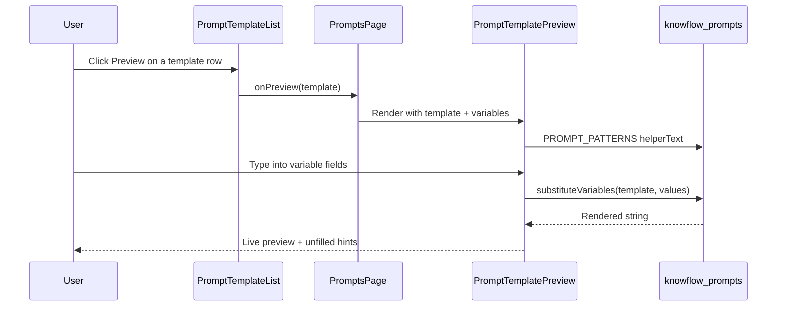

# US-014: Preview Prompt with Variable Substitution

## 1. Scenario summary

- **Actor** — Team member using the Prompt Templates page
- **Goal** — Select a saved template, fill in `{{variable}}` placeholders, and verify the assembled prompt string before it is used by downstream AI features (Week 2+)
- **Success criteria**
  - Selecting a template and filling variables produces a preview with all `{{variable}}` placeholders replaced by entered values
  - The preview panel shows pattern-specific helper text from [`PROMPT_PATTERNS`](packages/prompts/src/patterns.ts)
  - Preview updates live as the user types (no round-trip to the API)
  - Unfilled variables remain as `{{name}}` in the preview and trigger a visible validation hint
  - Works for templates across all five patterns (each pattern’s example starters already include placeholders)

## 2. Current state

**Already exists**

| Area | Status |
|------|--------|
| [`substituteVariables`](packages/prompts/src/variables.ts) | Implemented — replaces known keys; leaves `{{name}}` when value is missing/empty |
| [`PROMPT_PATTERNS`](packages/prompts/src/patterns.ts) | Five patterns with `label`, `helperText`, and `exampleStarter` (each has ≥1 placeholder) |
| `GET /api/prompt-templates` | Returns full documents including `template` and `variables` — sufficient to drive preview without `GET /:id` |
| [`PromptTemplateList`](apps/web/src/features/prompts/PromptTemplateList.tsx) | Grouped list with Edit/Delete actions |
| [`PromptsPage`](apps/web/src/features/prompts/PromptsPage.tsx) | List + create/edit form toggle via `editingTemplate` state |
| Nav copy | [`navConfig.ts`](apps/web/src/routes/navConfig.ts) already describes “select pattern → fill variables → preview” |

**Gaps**

- No “Preview” entry point on list rows
- No variable input form or rendered preview panel
- `substituteVariables` is exported but unused in the web app
- No unfilled-variable detection/helper beyond leaving placeholders in the string
- Page layout is list + create/edit only — preview is a third interaction mode

**Out of scope** (explicitly deferred in prior plans)

- New API route (e.g. `POST /preview`) — substitution is pure string logic; keep it client-side for Week 1 learning demo
- Python worker, queues, MongoDB schema changes, LLM calls
- Auth, copy-to-clipboard, export, or wiring preview into chat (Week 2+)

## 3. End-to-end flow

Purely client-side — no API call during preview.



**Numbered user steps**

1. User opens `/prompts` — list loads via existing TanStack Query (`usePromptTemplates`).
2. User clicks **Preview** on a template row (e.g. chain-of-thought summarizer).
3. Page enters preview mode: create/edit form is hidden; [`PromptTemplatePreview`](apps/web/src/features/prompts/PromptTemplatePreview.tsx) appears below the list.
4. Preview shows template name, pattern badge, and `PROMPT_PATTERNS` helper text for that template’s `pattern`.
5. For each entry in `template.variables` (server-derived order), render a labeled text input (e.g. `text` → “Text”, `example_input` → “Example input”).
6. As the user types, call `substituteVariables(template.template, values)` and display the result in a monospace `<pre>` block.
7. Unfilled variables: any key in `template.variables` with empty/whitespace-only input is listed in a hint (“Fill in: text, audience”) and corresponding `{{placeholders}}` remain visible in the preview (existing `substituteVariables` behavior).
8. User clicks **Close** (or **Back to list**) to exit preview mode and return to create form.

**Note on “Click Preview” vs live update:** The scenario step 4 is satisfied by the Preview button as the mode entry; acceptance criterion “updates live” is satisfied by deriving preview from React state on every keystroke (no separate submit for preview).

## 4. Implementation breakdown

| Layer | Changes | Key files / modules |
|-------|---------|---------------------|
| **React (`apps/web`)** | Add preview mode state on page; **Preview** button on list rows; new `PromptTemplatePreview` component (variable form + live `<pre>` output + unfilled hints + pattern helper text); CSS module for preview layout | [`PromptsPage.tsx`](apps/web/src/features/prompts/PromptsPage.tsx), [`PromptTemplateList.tsx`](apps/web/src/features/prompts/PromptTemplateList.tsx), **new** `PromptTemplatePreview.tsx`, **new** `PromptTemplatePreview.module.css` |
| **Node API (`apps/api`)** | None | — |
| **Python worker** | None | — |
| **Data (MongoDB, bucket, queue)** | None | Existing `prompt_templates` documents already store `template` + `variables` |
| **Shared (`packages/prompts`)** | Optional small helpers + unit tests; core `substituteVariables` already sufficient | [`variables.ts`](packages/prompts/src/variables.ts), [`index.ts`](packages/prompts/src/index.ts) |

### React design details

**Page state** — extend [`PromptsPage`](apps/web/src/features/prompts/PromptsPage.tsx) with mutually exclusive modes:

```tsx
const [previewingTemplate, setPreviewingTemplate] = useState<PromptTemplate | null>(null);
const [editingTemplate, setEditingTemplate] = useState<PromptTemplate | null>(null);
```

- Starting preview clears edit mode; starting edit clears preview (mirror existing `onDeleted` cleanup).
- Render order: `PromptTemplateList` → if `previewingTemplate` then `PromptTemplatePreview` else create/edit `PromptTemplateForm`.

**List actions** — add `onPreview` prop and a **Preview** button beside Edit/Delete in [`PromptTemplateList`](apps/web/src/features/prompts/PromptTemplateList.tsx). Reuse existing `.editButton` styling pattern; add a distinct class if needed.

**`PromptTemplatePreview` component** (new)

- **Props:** `template: PromptTemplate`, `onClose: () => void`
- **State:** `values: Record<string, string>` initialized to `{}` (or `''` per key in `template.variables`)
- **Derived (no `useEffect`):**
  - `rendered = substituteVariables(template.template, values)`
  - `unfilled = template.variables.filter((v) => !values[v]?.trim())`
- **UI sections:**
  1. Header: “Preview: {name}” + pattern badge + Close button
  2. Pattern helper: `PROMPT_PATTERNS.find(p => p.id === template.pattern).helperText`
  3. Variable fields: one `<input>` per `template.variables` entry; `id`/`htmlFor` tied to variable name; `autoComplete="off"`
  4. Validation hint (when `unfilled.length > 0`): e.g. “Unfilled variables will appear as placeholders in the preview: text, audience”
  5. Preview output: `<pre aria-live="polite">` with `rendered` (monospace, `white-space: pre-wrap`, matching form textarea styling from [`PromptsPage.module.css`](apps/web/src/features/prompts/PromptsPage.module.css))

**Variable label helper** — colocate a tiny `formatVariableLabel(name: string)` in the preview file: split on `_`, capitalize words (`example_input` → “Example input”). No new shared package export unless reused elsewhere.

**Empty variables edge case** — if `template.variables.length === 0`, show the template text as-is in the preview with a note: “This template has no variables.”

**Accessibility** — `aria-labelledby` on preview section; `aria-live="polite"` on preview output; labels on all inputs; keyboard-focusable Close.

### Shared package (optional but recommended)

Add to [`packages/prompts/src/variables.ts`](packages/prompts/src/variables.ts):

```ts
export function getUnfilledVariables(
  variableNames: string[],
  values: Record<string, string>,
): string[] {
  return variableNames.filter((name) => !values[name]?.trim());
}
```

Export from [`index.ts`](packages/prompts/src/index.ts). Keeps preview component thin and is easy to unit-test.

Add **unit tests** for `substituteVariables` and `getUnfilledVariables` (first tests in this package — high value, pure functions). Use the repo’s existing test runner if configured; otherwise add minimal vitest config scoped to `packages/prompts` only if the monorepo already uses vitest elsewhere.

## 5. API and data contract

**No new or changed endpoints.**

Preview consumes existing list response shape:

```json
{
  "data": [
    {
      "id": "...",
      "name": "summarize-policy",
      "pattern": "chain-of-thought",
      "template": "Think step by step...\n\n{{question}}",
      "variables": ["question"],
      "createdAt": "...",
      "updatedAt": "..."
    }
  ]
}
```

Substitution contract (client-only):

- **Input:** `template: string`, `values: Record<string, string>`
- **Output:** string with `{{var}}` replaced by `values[var]` when non-empty; otherwise placeholder preserved

## 6. Suggested build order

1. **(Optional) `packages/prompts`** — add `getUnfilledVariables`; add unit tests for `substituteVariables` + `getUnfilledVariables`
2. **`PromptTemplatePreview`** — component + CSS module with live substitution and unfilled hints
3. **`PromptTemplateList`** — add Preview button + `onPreview` prop
4. **`PromptsPage`** — wire preview mode; ensure mutual exclusion with edit/create
5. **Polish** — empty-variables message; verify all five pattern example templates preview correctly after create
6. **Manual verification** — walk through acceptance criteria below

## 7. Testing and verification

**Manual — web**

1. `npm run dev`; open `http://localhost:5173/prompts`
2. Create one template per pattern (or use existing seeded data)
3. Click **Preview** on a few-shot template with `{{example_input}}`, `{{example_output}}`, `{{text}}`
4. Confirm pattern helper text appears under the header
5. Type into one field — preview updates immediately without clicking anything else
6. Leave a field empty — preview shows `{{name}}` for that slot; unfilled hint lists the missing names
7. Fill all fields — preview shows exact final string with no `{{...}}` remaining
8. Click Close — preview closes; create form returns
9. Start Edit on a template — preview mode is not active
10. Delete a template while previewing it — preview closes (same pattern as `onDeleted` for edit)

**Edge cases**

- Template with repeated `{{text}}` in body → all occurrences replaced (regex `replace` behavior)
- Whitespace-only input → treat as unfilled (trim check)
- Template with zero variables → static preview text

**Automated (meaningful)**

- Unit tests in `packages/prompts` for substitution and unfilled detection
- No API or E2E tests required for Week 1 learning scope

## 8. Roadmap fit

- **Week / phase:** Week 1 — Prompt Engineering Patterns (`week-01-prompts` tag)
- **Requirement:** **FR-02** — React UI to select a template, fill variables, and preview the final prompt
- **Dependencies:** US-010 (create), US-011 (list) — done; US-012/013 (edit/delete) — compatible; preview only reads list data
- **Ship now:** Client-side preview picker, live substitution, pattern helper text, unfilled-variable hints
- **Defer:** Server-side preview endpoint, LLM execution of preview, chat integration (Week 2+ FR-04), auth, copy/export actions

## Risks and decisions

| Item | Recommendation |
|------|----------------|
| Preview vs Edit UX overlap | Keep Preview separate from Edit — preview is read-only consumption; edit keeps existing form |
| `GET /:id` | Not needed — list already returns `template` text |
| Live vs button-triggered preview | Live derivation on state change; Preview button only enters the mode |
| Highlighting unfilled placeholders in `<pre>` | Phase 1: hint list + raw `{{name}}` in output; optional later enhancement with styled spans — avoid scope creep |
