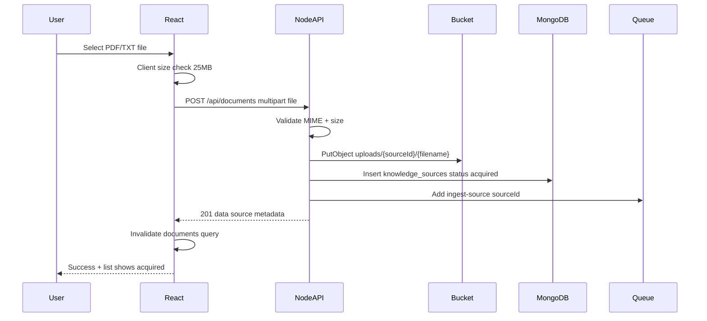

# US-020: Upload a File Knowledge Source — Implementation Plan

## 1. Scenario summary

- **Actor** — Team member
- **Goal** — Upload a PDF or TXT file so it is stored as a knowledge source and can later be indexed for AI Q&A
- **Success criteria**
  - `POST /api/documents` accepts PDF and TXT files up to 25 MB
  - Raw file lands in cloud bucket; `knowledge_sources` record created with `sourceType: file_upload`, `status: acquired`, and `sourceConfig.bucketKey`
  - UI shows upload progress and confirmation; new source appears in list with `acquired` status
  - API returns after acquisition only (no inline parse/chunk/embed)
  - `ingest-source` job with `{ sourceId }` is enqueued after successful acquisition (separate from upload handler body logic)

## 2. Current state

**What exists**

- Week 1 API patterns to mirror: [`apps/api/src/routes/prompt-templates.routes.ts`](apps/api/src/routes/prompt-templates.routes.ts), repository/service/controller layering, `AppError`, `asyncHandler`, `validate`
- MongoDB client + `prompt_templates` repository ([`apps/api/src/repositories/prompt-templates.repository.ts`](apps/api/src/repositories/prompt-templates.repository.ts))
- Redis in [`docker-compose.yml`](docker-compose.yml); `REDIS_URL` in [`apps/api/src/config.ts`](apps/api/src/config.ts) (unused)
- Web route `/documents` → [`apps/web/src/features/documents/DocumentsPage.tsx`](apps/web/src/features/documents/DocumentsPage.tsx) (Coming Soon placeholder)
- TanStack Query + `fetchJson` pattern in [`apps/web/src/features/prompts/`](apps/web/src/features/prompts/)
- Canonical upload orchestration pattern in [`.cursor/skills/nodejs-api-shared/examples.md`](.cursor/skills/nodejs-api-shared/examples.md) (`uploadAndEnqueue`)

**Gaps**

| Area | Gap |
|------|-----|
| API | No documents/sources routes, services, repositories |
| Storage | No bucket client; `BUCKET_*` env vars commented in [`.env.example`](.env.example) |
| Data | No `knowledge_sources` collection, types, or indexes |
| Queue | No BullMQ producer/consumer; no `ingest-source` job type |
| Web | No upload UI, multipart client, source list, or progress |
| Local dev | No S3-compatible bucket service in docker-compose (only Mongo + Redis) |

**Related scenarios (in scope for this build)**

- [US-021](user-scenarios/US-021-view-document-list.md) — `GET /api/documents` + list UI (required so upload success is visible)
- [US-025](user-scenarios/US-025-reject-oversized-upload.md) — 25 MB guardrail (API + client pre-check)

**Out of scope for US-020 (defer)**

- Full ingestion worker (chunking, status `indexing` → `indexed`) — [US-033](user-scenarios/US-033-single-file-ingestion-queue.md), Week 3
- Status polling / live indexing badges — US-030, Week 3
- Chat Q&A against ingested text — US-022, Week 2 sibling
- MCP connectors — Phase 2
- Auth / multi-tenant workspace scoping — not in v1

## 3. End-to-end flow



**User steps**

1. Navigate to `/documents`
2. Click Upload (or drag-drop) and select PDF/TXT (&lt; 25 MB)
3. See progress bar during multipart POST
4. On `201`, see toast/inline confirmation
5. Source appears in list with status `acquired` (indexing happens asynchronously via queue — not blocking upload)

## 4. Implementation breakdown

| Layer | Changes | Key files / modules |
|-------|---------|---------------------|
| **React** (`apps/web`) | Replace Coming Soon with Documents page: upload zone, progress, error display, source list, empty state; mark nav `implemented: true` | `features/documents/DocumentsPage.tsx`, `DocumentUpload.tsx`, `DocumentList.tsx`, `documents.api.ts`, `useDocuments.ts`, `useDocumentUpload.ts`, `types/knowledge-source.types.ts`, `routes/navConfig.ts` |
| **Node API** (`apps/api`) | Acquisition adapter: multer middleware, upload route, list route, bucket client, knowledge sources repo/service, ingestion queue producer, adapter registry stub | `routes/documents.routes.ts`, `controllers/documents.controller.ts`, `services/documents.service.ts`, `services/acquisition/file-upload.adapter.ts`, `repositories/knowledge-sources.repository.ts`, `clients/bucket.client.ts`, `clients/ingestion-queue.client.ts`, `schemas/documents.schema.ts`, `types/knowledge-source.types.ts`, `middleware/upload.ts` |
| **Python worker** | No changes for US-020 | — |
| **Data** | `knowledge_sources` collection + indexes; bucket objects under `uploads/{sourceId}/{filename}`; BullMQ queue `ingestion` job `ingest-source` | MongoDB, S3/MinIO, Redis |
| **Shared** (`packages/`) | Optional: export shared `KnowledgeSource` status/type constants if needed by web | Only if duplicating enums becomes painful |
| **Infra** | Add MinIO to docker-compose for local S3-compatible bucket; wire `BUCKET_*` in config + `.env.example` | `docker-compose.yml`, `.env.example`, `apps/api/src/config.ts` |

### API design decisions

- **Path**: Use `POST /api/documents` and `GET /api/documents` (consistent with `/api/prompt-templates`). Internally persist to `knowledge_sources`; response DTO uses `id` (maps to `sourceId` elsewhere).
- **Status code**: `201 Created` — acquisition (bucket + DB insert) completes synchronously; ingestion is async via queue.
- **Upload transport**: API proxy upload via `multipart/form-data` field `file` (simpler for Week 2; presigned direct-to-bucket can come later).
- **Title**: Default to filename without extension; overridable via optional `title` form field.
- **Adapter registry**: Introduce minimal `acquisition/adapters.ts` with `file_upload` registered; stub entries for future connector types (FR-17).

### Acquisition service boundary (critical)

[`documents.service.ts`](apps/api/src/services/documents.service.ts) `acquireFileUpload()` must only:

1. Validate file (MIME: `application/pdf`, `text/plain`; size ≤ 25 MB)
2. Generate `sourceId`, upload to bucket
3. Insert `knowledge_sources` with `status: 'acquired'`
4. Call `ingestionQueue.enqueueIngestSource(sourceId)` — **one line delegation**, not inline ingestion

If enqueue fails after bucket write + DB insert, mark source `failed` with `errorMessage` and return `503` (pattern from shared `uploadAndEnqueue` example).

### Queue stub for Week 2

US-020 requires the job to be **enqueued**; full worker logic is US-033. For Week 2 tag:

- Implement BullMQ **producer** + minimal **worker** that logs the job and optionally sets `status: 'pending_ingestion'` (or leaves `acquired`)
- Do **not** parse/chunk/embed in the upload handler or in the upload service

## 5. API & data contract

### `POST /api/documents`

- **Request**: `multipart/form-data`
  - `file` (required) — PDF or TXT
  - `title` (optional string)
- **Success `201`**:
```json
{
  "data": {
    "id": "674a...",
    "sourceType": "file_upload",
    "title": "Refund Policy EU",
    "status": "acquired",
    "sourceConfig": {
      "filename": "refund-policy-eu.pdf",
      "bucketKey": "uploads/674a.../refund-policy-eu.pdf",
      "mimeType": "application/pdf",
      "sizeBytes": 1048576
    },
    "createdAt": "2026-07-23T...",
    "acquiredAt": "2026-07-23T..."
  }
}
```
- **Errors**:
  - `400` — missing file, invalid MIME
  - `413` — file &gt; 25 MB (`FILE_TOO_LARGE`)
  - `503` — bucket or enqueue failure

### `GET /api/documents`

- **Success `200`**:
```json
{
  "data": [
    { "id": "...", "sourceType": "file_upload", "title": "...", "status": "acquired", "sourceConfig": { ... }, "createdAt": "...", "acquiredAt": "..." }
  ]
}
```
- Sorted by `createdAt` descending; metadata only (no file bytes)

### `knowledge_sources` document (MongoDB)

Per [ARCHITECTURE.md](ARCHITECTURE.md):

- `sourceType`: `"file_upload"`
- `status`: `"acquired"` on insert
- `sourceConfig`: `{ filename, bucketKey, mimeType, sizeBytes }`
- `title`, `createdAt`, `acquiredAt`, `errorMessage: null`
- Indexes: `{ createdAt: -1 }`, `{ status: 1 }`

### Queue job

- Queue name: `ingestion`
- Job name: `ingest-source`
- Payload: `{ sourceId: string }`

## 6. Suggested build order

1. **Config + local bucket** — Add MinIO to docker-compose; extend `config.ts` with `BUCKET_*`; implement `bucket.client.ts` (S3 SDK, `putObject` / `deleteObject` for rollback)
2. **Types + repository** — `knowledge-source.types.ts`, `knowledge-sources.repository.ts` (`insert`, `findAll`, `updateStatus`, `ensureIndexes`)
3. **Acquisition adapter** — `file-upload.adapter.ts` (build `bucketKey`, map file → domain record)
4. **Queue producer** — `ingestion-queue.client.ts` with BullMQ; minimal worker process entry (can live in `apps/api/src/workers/ingestion.worker.ts`)
5. **Documents service** — `acquireFileUpload()` orchestration (validate → bucket → repo → enqueue)
6. **HTTP layer** — multer config (25 MB limit), routes, controller, Zod schemas, register in [`apps/api/src/index.ts`](apps/api/src/index.ts)
7. **Web types + API client** — `knowledge-source.types.ts`, `documents.api.ts` with `uploadDocument(file, onProgress)` using `XMLHttpRequest` or `fetch` + `FormData`
8. **Web UI** — `DocumentUpload`, `DocumentList`, wire TanStack Query (`useDocuments`, `useDocumentUpload`); client-side 25 MB check before POST
9. **Nav + polish** — Set `implemented: true` in navConfig; empty state; error messages for 413/400
10. **Smoke test** — Upload PDF + TXT via UI; verify bucket object, MongoDB record, Redis job, list refresh

## 7. Testing & verification

**Manual (local)**

1. `npm run docker:up` — confirm Mongo, Redis, MinIO healthy
2. Set `BUCKET_*` pointing at MinIO in `.env`
3. Start API + web dev servers
4. Upload a small `.txt` and `.pdf` — confirm `201`, progress bar, list entry with `acquired`
5. Upload a &gt;25 MB file — UI blocks or API returns `413`; no Mongo record or bucket object
6. Upload invalid type (e.g. `.exe`) — `400` with clear message
7. Inspect Redis/BullMQ dashboard or worker logs — `ingest-source` job present with correct `sourceId`
8. Confirm API response time does not wait for any parsing/embedding

**Automated (worth adding)**

- API integration test: `POST /api/documents` with fixture file → asserts `201`, Mongo insert, mock bucket called, queue `add` called
- Service unit test: rejects oversize / bad MIME without touching bucket

## 8. Roadmap fit

- **Week / phase**: Week 2 (`week-02-llm-qa`), Phase 1 file-upload acquisition
- **Ship now**: Full acquisition path + enqueue + Documents UI (US-020, US-021, US-025)
- **Defer to Week 3 (US-033)**: Ingestion worker that streams from bucket, chunks, updates status `indexing` → `indexed`
- **Defer to Week 2 sibling (US-022)**: Chat against ingested text (depends on minimal ingestion completing)

## Risks and edge cases

- **Partial failure after bucket upload**: Use compensating `deleteObject` on DB/enqueue failure, or mark source `failed` — avoid orphaned bucket keys
- **No bucket in dev**: Startup should fail fast with clear message if `BUCKET_*` missing when upload route is hit (or validate at boot)
- **Nav copy mismatch**: [`navConfig.ts`](apps/web/src/routes/navConfig.ts) mentions DOCX; US-020 is PDF/TXT only — align copy with acceptance criteria
- **Memory**: Use multer `memoryStorage` only for ≤25 MB files (acceptable); for future larger files, switch to disk storage or presigned uploads

## Open questions

None blocking — defaults above align with ARCHITECTURE.md and existing conventions. If you prefer `POST /api/sources/upload` over `/api/documents`, that is a naming-only change.
