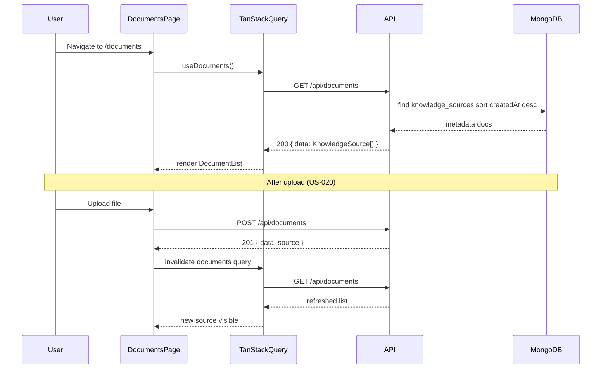

# US-021: View Knowledge Source List — Implementation Plan

## 1. Scenario summary

- **Actor** — Team member
- **Goal** — See all knowledge sources with metadata so they know which content is available for Q&A
- **Success criteria**
  - `GET /api/documents` returns metadata only (no file content or raw text)
  - List shows title, `sourceType`, filename (for uploads), size, acquired date, and indexing status
  - New uploads appear in the list without a full page reload
  - Empty state prompts the user to upload their first source
  - Layout accommodates future connector-backed sources without structural changes

## 2. Current state

**Already implemented (from US-020 overlap)**

| Area | Status |
|------|--------|
| API `GET /api/documents` | Done — [`documents.routes.ts`](apps/api/src/routes/documents.routes.ts) → [`documents.controller.ts`](apps/api/src/controllers/documents.controller.ts) → [`documents.service.ts`](apps/api/src/services/documents.service.ts) → [`knowledge-sources.repository.ts`](apps/api/src/repositories/knowledge-sources.repository.ts) |
| MongoDB `knowledge_sources` | Done — `findAll()` sorted `{ createdAt: -1 }`; indexes on `createdAt` and `status` |
| Web list UI | Done — [`DocumentList.tsx`](apps/web/src/features/documents/DocumentList.tsx) on [`DocumentsPage.tsx`](apps/web/src/features/documents/DocumentsPage.tsx) at `/documents` |
| TanStack Query | Done — [`useDocuments.ts`](apps/web/src/features/documents/useDocuments.ts) + [`documents.api.ts`](apps/web/src/features/documents/documents.api.ts) |
| Post-upload refresh | Done — [`useDocumentUpload.ts`](apps/web/src/features/documents/useDocumentUpload.ts) invalidates `documentsQueryKey` on success |
| Empty / loading / error states | Done — explicit handling in `DocumentList` |
| Status badges | Done — CSS classes for `acquired`, `pending_ingestion`, `indexing`, `indexed`, `failed` in [`DocumentsPage.module.css`](apps/web/src/features/documents/DocumentsPage.module.css) |

**Gaps vs US-021**

| Gap | Severity | Notes |
|-----|----------|-------|
| "Sortable list" semantics | Low | API returns newest-first; no user-controlled column sort. Acceptable for Week 2 — treat as server-sorted list unless product wants interactive sort now |
| Connector-ready metadata | Low | `DocumentList` always renders a Filename row from `sourceConfig.filename`; Phase 2 connectors will use different `sourceConfig` shapes — needs conditional field rendering |
| `hasUploadedRecently` prop | Low | Defined on `DocumentList` but never passed from `DocumentsPage`; empty-state flash possible briefly after upload |
| API response projection | Low | List returns full `KnowledgeSource` including `sourceConfig.bucketKey`; metadata-only AC is met, but `bucketKey` could be omitted from list DTO for hygiene |
| Automated tests | Low | No list endpoint or UI tests yet |
| Live status updates | Out of scope | NFR-08 and [US-030](user-scenarios/US-030-track-document-indexing-status.md) cover polling/SSE for `indexing` → `indexed` in Week 3+ |

## 3. End-to-end flow



**User steps**

1. Navigate to **Documents** (`/documents`) via sidebar — nav item already marked `implemented: true` in [`navConfig.ts`](apps/web/src/routes/navConfig.ts).
2. Page loads `DocumentList`, which fetches `GET /api/documents`.
3. Each source card shows title, status badge, type, filename, size, and acquired date.
4. After upload, TanStack Query refetches; list updates in place (no `window.location` reload).

## 4. Implementation breakdown

| Layer | Changes | Key files / modules |
|-------|---------|---------------------|
| React (`apps/web`) | **Verify** list rendering; **polish** connector-ready metadata display; optionally wire upload→list coordination | [`DocumentList.tsx`](apps/web/src/features/documents/DocumentList.tsx), [`DocumentsPage.tsx`](apps/web/src/features/documents/DocumentsPage.tsx), [`useDocuments.ts`](apps/web/src/features/documents/useDocuments.ts) |
| Node API (`apps/api`) | **Verify** `GET /` handler; optional list DTO that omits `bucketKey` | [`documents.routes.ts`](apps/api/src/routes/documents.routes.ts), [`documents.controller.ts`](apps/api/src/controllers/documents.controller.ts), [`documents.service.ts`](apps/api/src/services/documents.service.ts), [`knowledge-sources.repository.ts`](apps/api/src/repositories/knowledge-sources.repository.ts) |
| Python worker | None for US-021 | — |
| Data (MongoDB) | No schema changes; existing `knowledge_sources` collection and indexes suffice | `knowledge_sources` |
| Shared (`packages/`) | None required; types duplicated in API and web today | [`apps/api/src/types/knowledge-source.types.ts`](apps/api/src/types/knowledge-source.types.ts), [`apps/web/src/types/knowledge-source.types.ts`](apps/web/src/types/knowledge-source.types.ts) |

## 5. API & data contract

**Existing endpoint (no path change needed)**

- `GET /api/documents`
- Response: `200 { data: KnowledgeSource[] }`
- Each item (metadata only — no bucket file bytes, no chunk text):

```typescript
{
  id: string;
  sourceType: 'file_upload' | ...;  // Phase 1: only file_upload
  title: string;
  status: 'acquired' | 'pending_ingestion' | 'indexing' | 'indexed' | 'failed';
  sourceConfig: {
    filename: string;
    bucketKey: string;   // optional to strip in list DTO
    mimeType: string;
    sizeBytes: number;
  };
  errorMessage: string | null;
  chunkCount: number | null;
  createdAt: string;       // ISO date in JSON
  acquiredAt: string | null;
  indexedAt: string | null;
}
```

**Optional enhancement (not blocking Week 2)**

- Query params `sortBy=acquiredAt|title|status` and `sortOrder=asc|desc` on `listDocumentsSchema` — default `acquiredAt desc` to match scenario wording. Current implementation sorts by `createdAt desc`, which is equivalent for file uploads.

**Phase 2 readiness**

- When connectors land, list items with `sourceType !== 'file_upload'` should show adapter-specific labels (e.g. Jira issue key) instead of filename. Introduce a small `formatSourceMeta(source)` helper in `DocumentList` rather than hard-coding filename.

## 6. Suggested build order

Since core functionality exists, treat this as a **close-out pass** rather than greenfield work:

1. **Acceptance verification** — Run manual checklist (section 7) against local dev; confirm all four AC boxes can be checked.
2. **Connector-ready metadata helper** — In `DocumentList`, render metadata fields based on `sourceType`:
   - `file_upload`: show Filename, Size (from `sourceConfig`)
   - future types: show a generic "Source" label from `title` / adapter fields; hide filename/size when absent
3. **Upload→list UX polish** (optional, ~15 min) — Either pass `hasUploadedRecently` from upload success state, or use `queryClient.setQueryData` to prepend the returned source optimistically before invalidation (eliminates brief empty/refresh flash).
4. **List DTO hygiene** (optional) — Add `toListItem(source)` in service layer that omits `bucketKey` from `sourceConfig` in GET responses.
5. **Sort semantics** — Document that Week 2 "sortable list" = server default sort (newest acquired first). Defer interactive column sort unless explicitly requested.
6. **Smoke test script** (optional) — One API integration test: seed `knowledge_sources`, assert `GET /api/documents` returns projected metadata array.

## 7. Testing & verification

**Manual test steps**

1. Start stack (`docker-compose up`, `npm run dev`).
2. Open `/documents` with an empty DB — confirm empty state: *"No knowledge sources yet — upload a PDF or TXT file to get started."*
3. Upload a PDF via `DocumentUpload` — confirm list updates without page reload; new row shows:
   - Title (derived from filename or user title)
   - `sourceType`: file upload
   - Filename from `sourceConfig`
   - Size formatted (B / KB / MB)
   - Acquired date (locale string)
   - Status badge: `acquired`
4. Upload a second file — confirm order (newest first).
5. Inspect network tab: `GET /api/documents` response contains metadata JSON only, no file binary.
6. Break API (stop server) — confirm error alert in list section.

**Automated tests (optional, meaningful only if added)**

- API: `GET /api/documents` returns `200` with array shape and excludes raw content
- Web: `DocumentList` renders empty state and populated list (Testing Library + mocked `useDocuments`)

## 8. Roadmap fit

- **Week 2 / Phase 1** — US-021 is infrastructure alongside US-020; git tag `week-02-llm-qa`
- **Ship now** — List API, UI, empty state, post-upload refresh, `acquired` status display
- **Defer to Week 3+**
  - Live indexing status polling ([US-030](user-scenarios/US-030-track-document-indexing-status.md), NFR-08)
  - Interactive column sorting (only if product requires beyond server default)
  - Connector source types ([US-026](user-scenarios/) and Phase 2 adapters)
  - Auth / workspace scoping on list queries

## Risks and edge cases

- **Brief list flash after upload** — `invalidateQueries` refetches async; mitigated by optimistic cache or `hasUploadedRecently` wiring.
- **Large libraries** — No pagination in US-021; acceptable for Week 2 demo scale; add cursor pagination when source count grows.
- **Mixed source types (Phase 2)** — Unconditional `sourceConfig.filename` access will break for non-file sources; address in step 2 above.
