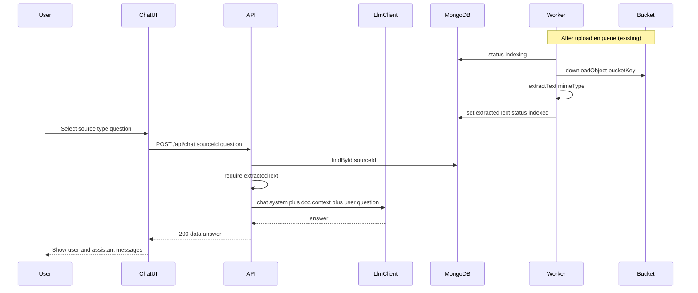

# US-022: Ask a Question About an Uploaded Document

## 1. Scenario summary

- **Actor** — Team member
- **Goal** — Ask a natural-language question about one uploaded document and get an LLM answer grounded in that document’s text
- **Success criteria**
  - Chat endpoint loads full extracted source text and calls `LlmClient.chat()` (never a vendor SDK in controller/service)
  - Answer is grounded in the selected document (small TXT/PDF; full text in context)
  - Chat UI lets the user pick a ready source, submit a question, and see the answer
  - No RAG / chunk retrieval
  - No SSE streaming (US-023) and no MongoDB conversation persistence (US-024)

**Scope default:** Non-streaming only. US-023 adds `LlmClient.stream()` + SSE; US-024 adds `conversations` + multi-turn.

## 2. Current state

| Area | Status |
|------|--------|
| Upload + list (`POST/GET /api/documents`) | Done — [documents.service.ts](apps/api/src/services/documents.service.ts), [DocumentList.tsx](apps/web/src/features/documents/DocumentList.tsx) |
| `ingest-source` BullMQ worker | Stub — logs only; [ingestion.worker.ts](apps/api/src/workers/ingestion.worker.ts) |
| Bucket client | Upload/delete only — **no download** ([types.ts](apps/api/src/clients/bucket/types.ts)) |
| Extracted text on `knowledge_sources` | Missing |
| `LlmClient` / provider SDKs | Missing — config has `llmProvider` / `llmApiKey` only ([config.ts](apps/api/src/config.ts)) |
| Chat API | Missing — [index.ts](apps/api/src/index.ts) mounts health, prompts, documents |
| Chat UI | Coming Soon stub — [ChatPage.tsx](apps/web/src/features/chat/ChatPage.tsx), `implemented: false` in [navConfig.ts](apps/web/src/routes/navConfig.ts) |

**Blocker for chat:** Architecture forbids reading the bucket at query time. Text must be extracted during `ingest-source` and stored in MongoDB before Q&A.

## 3. End-to-end flow



## 4. Implementation breakdown

| Layer | Changes | Key files |
|-------|---------|-----------|
| Data | Add `extractedText: string \| null` on `knowledge_sources`; never expose it on `GET /api/documents` | [knowledge-source.types.ts](apps/api/src/types/knowledge-source.types.ts), [knowledge-sources.repository.ts](apps/api/src/repositories/knowledge-sources.repository.ts), [knowledge-source.mapper.ts](apps/api/src/mappers/knowledge-source.mapper.ts) |
| Bucket | Add `downloadObject(key): Promise<Buffer>` on local + S3 clients | [clients/bucket/types.ts](apps/api/src/clients/bucket/types.ts), local + s3 clients |
| Ingestion | Worker: `acquired` → `indexing` → download → extract → save text → `indexed` (or `failed` + `errorMessage`). TXT = UTF-8; PDF = Node `pdf-parse` (basic Week 2; Python parser stays Week 4) | [ingestion.worker.ts](apps/api/src/workers/ingestion.worker.ts), new `services/ingestion/extract-text.ts` |
| LLM | `LlmClient` interface + `getLlmClient()` + Gemini adapter implementing `chat()` (stub `stream`/`embed`/`chatWithTools` for later weeks). Wire `LLM_CHAT_MODEL` into config; validate `LLM_API_KEY` at chat call or startup | `apps/api/src/clients/llm/*`, [config.ts](apps/api/src/config.ts), [.env.example](.env.example), add `@google/generative-ai` |
| Chat API | Route → controller → service: load source by `sourceId`, reject if no `extractedText`, assemble prompt, call `getLlmClient().chat()`, return answer | New: `routes/chat.routes.ts`, `controllers/chat.controller.ts`, `services/chat.service.ts`, `schemas/chat.schema.ts`; mount in [index.ts](apps/api/src/index.ts) |
| React | Replace Coming Soon with document picker + message list + composer; session-local messages via `useChat`; reuse `useDocuments` for selectable sources (`status === 'indexed'`) | [ChatPage.tsx](apps/web/src/features/chat/ChatPage.tsx), new `chat.api.ts`, `useChat.ts`, message/composer components, CSS module; set `implemented: true` |
| Python worker | None | — |
| Shared packages | None (types live in api/web for now) | — |

**Out of scope:** RAG/chunks, SSE streaming, `conversations` collection, open-from-document-detail (no detail page yet), DOCX, citations, rate limiting / retries (later weeks).

## 5. API and data contract

### `knowledge_sources` (additive)

```ts
extractedText: string | null; // set by ingest-source; omitted from list DTO
```

Status after successful Week-2 ingest: `indexed` with `indexedAt` set; `chunkCount` remains `null` until Week 3.

### `POST /api/chat`

**Request**

```json
{ "sourceId": "<hex id>", "question": "What is the EU refund policy?" }
```

**Response `200`**

```json
{
  "data": {
    "answer": "...",
    "sourceId": "<hex id>",
    "model": "gemini-2.0-flash"
  }
}
```

**Errors:** `400` validation; `404` unknown source; `409` source not ready (`extractedText` missing / not `indexed`); `503` LLM/provider failure via `AppError`.

**Prompt shape (service):** system instruction (“answer only from the document; say if unknown”) + document title/text + user question. Single-turn only for US-022.

## 6. Suggested build order

1. **Bucket download + `extractedText` persistence** — repository update helper; keep list mapper free of `extractedText`
2. **Text extraction in `ingest-source` worker** — TXT + PDF; status transitions; failed path with `errorMessage`
3. **`LlmClient` + Gemini `chat()`** — config/`LLM_CHAT_MODEL`; factory; no SDK imports outside `clients/llm/`
4. **`POST /api/chat`** — schema, route, thin controller, service orchestration + unit test with mocked `LlmClient` / repo
5. **Chat UI** — picker (indexed sources), composer, message list, loading/error; wire `chat.api.ts` + `useChat`
6. **Manual verification** — upload TXT → wait for `indexed` → ask → confirm grounded answer

## 7. Testing and verification

**Manual**

1. Set `LLM_PROVIDER=gemini`, `LLM_API_KEY`, `LLM_CHAT_MODEL` (e.g. `gemini-2.0-flash`)
2. Upload a small TXT with known facts; confirm list status becomes `indexed`
3. Open `/chat`, select that source, ask a fact question → answer matches document
4. Ask something absent from the doc → model declines / says unknown (prompt-dependent)
5. Submit with a non-indexed / missing source → API error surfaced in UI
6. Confirm `GET /api/documents` still has no raw file content / no `extractedText`

**Automated (meaningful)**

- `chat.service` unit test: mocks repo + `LlmClient`; asserts prompt includes document text and answer returned
- Ingestion extract helper test: TXT buffer → string; optional PDF smoke if fixture is cheap
- No E2E against live Gemini required for CI

## 8. Roadmap fit

- **Week 2** — FR-04 / tag `week-02-llm-qa` ([ROADMAP.md](ROADMAP.md))
- **Ship now:** full-text Q&A for one source, Gemini via `LlmClient`, Chat UI
- **Defer:** US-023 streaming, US-024 persistence/multi-turn, Week 3 chunks/RAG, Week 4 Python parse/embed
