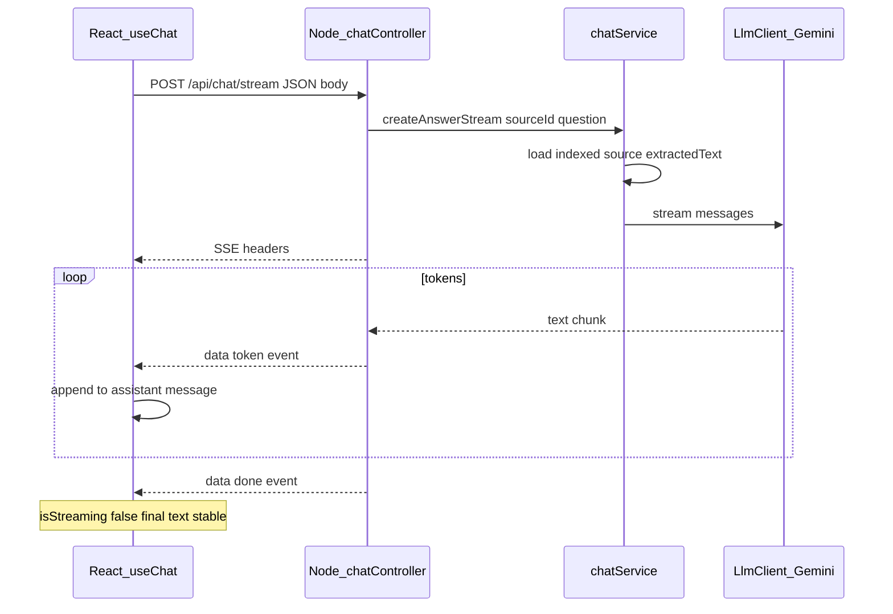

# US-023: Receive Streaming AI Response

### 1. Scenario summary

- **Actor** — Team member
- **Goal** — See the AI answer appear token-by-token instead of waiting for a full JSON response
- **Success criteria**
  - First tokens appear within ~2s of submit
  - Transport is SSE (`text/event-stream`)
  - Client abort / disconnect does not leave a stuck UI or duplicate assistant messages
  - Final rendered text equals the concatenated stream
  - Services/controllers call `LlmClient.stream()` only — no Gemini SDK usage outside the adapter

**Chosen approach:** Add **`POST /api/chat/stream`** for SSE and keep existing **`POST /api/chat`** (US-022 JSON) unchanged. Matches [`.cursor/skills/nodejs-api-shared/examples.md`](.cursor/skills/nodejs-api-shared/examples.md) (`streamChat` / `createAnswerStream`).

**Phase:** Week 2 / Phase 1 (`week-02-llm-qa`). Still full-document context — no RAG, no persistence (US-024), no citations.

---

### 2. Current state

**Exists (US-022):**

- [`apps/api/src/routes/chat.routes.ts`](apps/api/src/routes/chat.routes.ts) — `POST /` → `chatController.ask`
- [`apps/api/src/services/chat.service.ts`](apps/api/src/services/chat.service.ts) — `askAboutSource` → `llm.chat()` with full `extractedText`
- [`apps/api/src/clients/llm/types.ts`](apps/api/src/clients/llm/types.ts) — `LlmClient` has `chat` + `getModelId` only
- [`apps/api/src/clients/llm/gemini.client.ts`](apps/api/src/clients/llm/gemini.client.ts) — `generateContent()` only
- Web: [`useChat.ts`](apps/web/src/features/chat/useChat.ts) + [`chat.api.ts`](apps/web/src/features/chat/chat.api.ts) wait on full JSON; UI shows static “Thinking…”

**Gaps:**

| Layer | Missing |
|-------|---------|
| `LlmClient` | No `stream()` |
| Gemini adapter | No `generateContentStream` |
| API | No SSE route/controller |
| Web | No SSE consumer, no partial assistant buffer, no AbortController |

---

### 3. End-to-end flow



1. User submits question (same Chat UI / source picker as US-022).
2. Web opens `POST /api/chat/stream` with `Accept: text/event-stream` and an `AbortController`.
3. Controller validates body (reuse `askChatSchema`), sets SSE headers, then calls `chatService.createAnswerStream`.
4. Service loads indexed source + builds the same system/user prompt as `askAboutSource`.
5. Service returns an async iterable from `llm.stream(...)`.
6. Controller writes `data: {...}\n\n` per chunk; on `req.close`, aborts the provider stream.
7. UI creates one empty assistant message up front and appends token text; on `done`, marks stream complete.

---

### 4. Implementation breakdown

| Layer | Changes | Key files |
|-------|---------|-----------|
| React (`apps/web`) | `streamChat` fetch+reader; `useChat` partial buffer + abort; replace “Thinking…” with live assistant bubble; `isStreaming` | [`chat.api.ts`](apps/web/src/features/chat/chat.api.ts), [`useChat.ts`](apps/web/src/features/chat/useChat.ts), [`ChatMessageList.tsx`](apps/web/src/features/chat/ChatMessageList.tsx), [`chat.types.ts`](apps/web/src/types/chat.types.ts), [`ChatPage.tsx`](apps/web/src/features/chat/ChatPage.tsx) |
| Node API | `stream()` on `LlmClient`; Gemini stream adapter; `createAnswerStream`; `streamChat` controller; route | [`types.ts`](apps/api/src/clients/llm/types.ts), [`gemini.client.ts`](apps/api/src/clients/llm/gemini.client.ts), [`chat.service.ts`](apps/api/src/services/chat.service.ts), [`chat.controller.ts`](apps/api/src/controllers/chat.controller.ts), [`chat.routes.ts`](apps/api/src/routes/chat.routes.ts) |
| Python worker | None | — |
| Data | None (in-memory messages only) | — |
| Shared packages | None | — |

---

### 5. API & data contract

**Endpoint:** `POST /api/chat/stream`

**Request body** (same as US-022):

```json
{ "sourceId": "<id>", "question": "<1–4000 chars>" }
```

**Response:** `Content-Type: text/event-stream`

SSE payload lines (one JSON object per event):

| `type` | Fields | When |
|--------|--------|------|
| `token` | `text: string` | Each provider chunk (may be multi-token) |
| `done` | `sourceId`, `model` | Stream finished successfully |
| `error` | `code`, `message` | Failure after headers sent |

Example:

```
data: {"type":"token","text":"EU customers"}

data: {"type":"token","text":" can request"}

data: {"type":"done","sourceId":"...","model":"gemini-2.0-flash"}

```

**Pre-stream errors** (source missing / not ready / validation): normal JSON `{ error: { code, message } }` via existing `errorHandler` — do **not** set SSE headers until the source is validated and the stream is ready.

**`LlmClient` extension:**

```ts
stream(messages: LlmMessage[], options?: LlmChatOptions): AsyncIterable<string>;
```

Gemini implements via `model.generateContentStream(...)`, yielding `chunk.text()` strings; map provider failures with the same `toProviderAppError` paths as `chat()`.

**Shared prompt:** Extract a small private helper in `chat.service.ts` (system instruction + document+question user message) used by both `askAboutSource` and `createAnswerStream` so behavior stays identical.

---

### 6. Suggested build order

1. Extend [`LlmClient`](apps/api/src/clients/llm/types.ts) with `stream()`; implement in Gemini with `generateContentStream`.
2. Add `chatService.createAnswerStream` (reuse source checks + prompt assembly); unit-test with a mocked async iterable.
3. Add `chatController.streamChat` (SSE headers, `for await`, `req.on('close')` abort, mid-stream `error` event); wire `POST /stream` on [`chat.routes.ts`](apps/api/src/routes/chat.routes.ts).
4. Add web `streamChat` in [`chat.api.ts`](apps/web/src/features/chat/chat.api.ts): `fetch` + `ReadableStream` reader, parse SSE `data:` lines, callback per event, honor `AbortSignal`.
5. Update [`useChat`](apps/web/src/features/chat/useChat.ts): create assistant message immediately; append tokens; on abort/error remove incomplete bubble or keep partial + show error; expose `isStreaming` / cancel if composer needs it.
6. Update [`ChatMessageList`](apps/web/src/features/chat/ChatMessageList.tsx): drop separate “Thinking…” row; optional subtle streaming indicator on the live assistant message.
7. Manual verify against an indexed source; keep JSON `POST /api/chat` working for US-022.

---

### 7. Testing & verification

**Manual**

1. Index a small TXT source; open `/chat`, select it.
2. Ask a question → tokens appear incrementally (not only after full wait).
3. Confirm final text matches streamed content; no duplicate assistant rows.
4. Abort mid-stream (navigate away or stop) → UI unlocks; no frozen “Thinking…”.
5. Ask against a non-indexed source → JSON 409 before any SSE.
6. Spot-check legacy `POST /api/chat` still returns `{ data: { answer, ... } }`.

**Automated (worth adding)**

- Service test: `createAnswerStream` yields concatenated tokens from mocked `llm.stream`.
- Optional Gemini client unit test with mocked `generateContentStream` (if easy to stub).

---

### 8. Roadmap fit

- **Week 2** / tag `week-02-llm-qa` / **FR-04**; ROADMAP: “Responses stream to the UI in real time”.
- **Ship now:** `LlmClient.stream`, SSE endpoint, React incremental render, interrupt handling.
- **Defer:** conversation persistence (US-024), RAG/citations (Week 3), rate limiting (Week 9/11), Python LLM path.

**Out of scope / risks**

- Proxy buffering (Vite/nginx) can delay first byte — set `X-Accel-Buffering: no` and avoid compressing the SSE response locally.
- Empty stream → emit `error` with `LLM_EMPTY_RESPONSE` rather than a bare `done`.
- Do not call `next(error)` after SSE headers are flushed; write an `error` event and `res.end()`.
