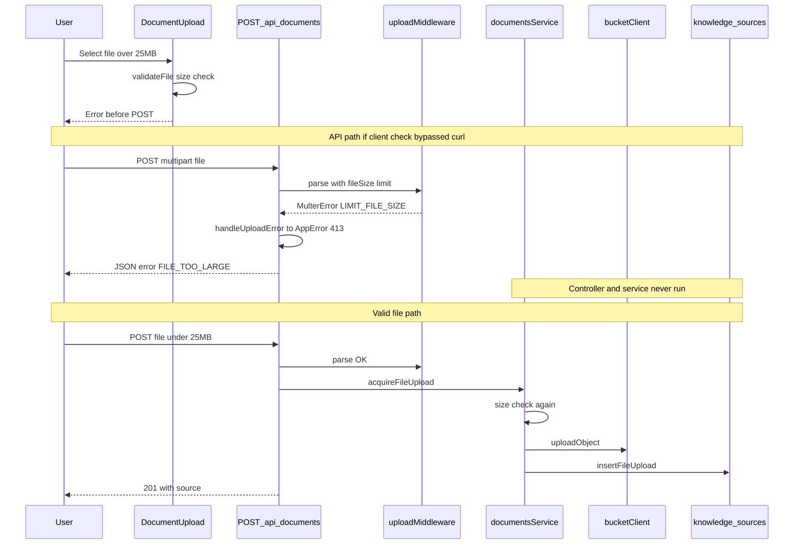

# US-025: Reject Oversized Upload — Implementation Plan

## 1. Scenario summary

- **Actor** — Team member using the Documents / Knowledge Sources UI
- **Goal** — Get a clear, immediate error when attempting to upload a file larger than 25 MB, without wasting bandwidth or leaving orphaned storage/DB artifacts
- **Success criteria**
  - `POST /api/documents` with a file > 25 MB returns HTTP **413** with code `FILE_TOO_LARGE` and a message stating the 25 MB limit
  - React UI shows the same error **before** upload starts when the user selects or drops an oversized file
  - No `knowledge_sources` document is created and no bucket object is written for rejected uploads
  - Valid uploads (&le; 25 MB) continue to work unchanged

**Note:** The scenario references a `documents` record; the codebase stores uploads in the **`knowledge_sources`** MongoDB collection ([`knowledge-sources.repository.ts`](apps/api/src/repositories/knowledge-sources.repository.ts)). Treat “no documents record” as “no `knowledge_sources` row.”

---

## 2. Current state

### Already implemented

| Layer | What exists |
|-------|-------------|
| **Constants** | `MAX_UPLOAD_BYTES = 25 * 1024 * 1024` in [`apps/api/src/constants/documents.constants.ts`](apps/api/src/constants/documents.constants.ts) and [`apps/web/src/types/knowledge-source.types.ts`](apps/web/src/types/knowledge-source.types.ts) |
| **Multer guard** | [`apps/api/src/middleware/upload.ts`](apps/api/src/middleware/upload.ts) — `limits: { fileSize: MAX_UPLOAD_BYTES }`; `LIMIT_FILE_SIZE` → `AppError('FILE_TOO_LARGE', …, 413)` |
| **Route wiring** | [`apps/api/src/routes/documents.routes.ts`](apps/api/src/routes/documents.routes.ts) — multer runs **before** `validate` and controller; errors flow to `handleUploadError` |
| **Service guard** | [`apps/api/src/services/documents.service.ts`](apps/api/src/services/documents.service.ts) — `acquireFileUpload()` rejects `file.size > MAX_UPLOAD_BYTES` with 413 **before** `bucketClient.uploadObject` and `knowledgeSourcesRepository.insertFileUpload` |
| **Error envelope** | [`apps/api/src/middleware/errorHandler.ts`](apps/api/src/middleware/errorHandler.ts) — `{ error: { code, message } }` with correct status |
| **Web pre-check** | [`apps/web/src/features/documents/DocumentUpload.tsx`](apps/web/src/features/documents/DocumentUpload.tsx) — `validateFile()` on select, drop, and upload click; hint text shows limit |
| **API client** | [`apps/web/src/features/documents/documents.api.ts`](apps/web/src/features/documents/documents.api.ts) — maps 413 response to `ApiError` with server message |
| **US-020 linkage** | [US-020](user-scenarios/US-020-upload-document.md) explicitly defers oversized rejection to US-025 |

### Gaps vs desired flow

1. **No automated tests** for oversized rejection — [`documents.service.test.ts`](apps/api/src/services/documents.service.test.ts) only covers `list()`; no tests for `acquireFileUpload`, `handleUploadError`, or UI validation
2. **Duplicated constant** — web and API each define `MAX_UPLOAD_BYTES`; no shared package constant (drift risk if limit changes)
3. **No documented manual verification** — acceptance criteria in [US-025](user-scenarios/US-025-reject-oversized-upload.md) are unchecked
4. **No web tests** — `apps/web` has zero test files today

**Python worker / queue:** Not involved in upload rejection; oversized files never enqueue `ingest-source`.

---

## 3. End-to-end flow

**Numbered user steps**

1. User opens Documents page ([`DocumentsPage.tsx`](apps/web/src/features/documents/DocumentsPage.tsx))
2. User selects or drops a file > 25 MB
3. UI runs client validation → error shown, file not selected for upload, **no network request**
4. (Bypass path) Direct `POST /api/documents` with oversized body → multer rejects → 413 JSON error, **no bucket/Mongo writes**
5. User selects a file &le; 25 MB and uploads → normal acquisition flow

---

## 4. Implementation breakdown

| Layer | Changes | Key files |
|-------|---------|-----------|
| **React (`apps/web`)** | **Verify only** — client validation and error display already present; optional: extract `validateFile` + `formatFileSize` to a small util for unit testing | [`DocumentUpload.tsx`](apps/web/src/features/documents/DocumentUpload.tsx), [`useDocumentUpload.ts`](apps/web/src/features/documents/useDocumentUpload.ts) |
| **Node API (`apps/api`)** | **Add tests** for service oversized path and `handleUploadError`; optional route-level test with mocked multer if desired | [`upload.ts`](apps/api/src/middleware/upload.ts), [`documents.service.ts`](apps/api/src/services/documents.service.ts), [`documents.service.test.ts`](apps/api/src/services/documents.service.test.ts) |
| **Python worker** | None | — |
| **Data** | None — rejection happens before writes | `knowledge_sources`, bucket |
| **Shared (`packages/`)** | **Optional** — export `MAX_UPLOAD_BYTES` from a tiny shared constants module (or extend `@knowflow/prompts` sibling package) so web and API share one source | New `packages/constants` or similar |

**Phase 1 vs Phase 2+:** This guardrail applies only to **file upload** (Phase 1). Future MCP connectors (Phase 2+) will need separate payload/size policies per adapter — out of scope for US-025.

---

## 5. API & data contract

### Existing endpoint (no change required)

- **`POST /api/documents`** — multipart field `file`, optional `title`
- **Success:** `201` `{ data: KnowledgeSource }`
- **Oversized rejection:** `413` `{ error: { code: "FILE_TOO_LARGE", message: "File exceeds the 25 MB upload limit" } }`

### Data documents / fields

- No new collections or status values
- On rejection: **no** insert into `knowledge_sources`; **no** bucket key under `uploads/{sourceId}/…`

---

## 6. Suggested build order

1. **Smoke-verify current behavior** — manual tests below; confirm US-025 acceptance criteria pass without code changes
2. **Service unit test** — `acquireFileUpload` with mocked file buffer where `size > MAX_UPLOAD_BYTES`; assert `AppError` 413 / `FILE_TOO_LARGE`; assert `bucketClient.uploadObject` and `insertFileUpload` are **not** called (mock and verify zero invocations)
3. **Middleware unit test** — `handleUploadError` with `multer.MulterError` code `LIMIT_FILE_SIZE` produces `AppError` with 413
4. **Optional: shared constant** — move `MAX_UPLOAD_BYTES` to `packages/` and import in API + web; update web hint and validation to use shared value
5. **Optional: web unit test** — if `validateFile` is extracted, test oversized / valid MIME paths with Vitest in `apps/web`
6. **Check off US-025** — update scenario acceptance criteria after verification

---

## 7. Testing & verification

### Manual (local)

1. Start API + web + Mongo + bucket (per project README / docker-compose)
2. **UI path:** Create or locate a file &gt; 25 MB (e.g. `dd if=/dev/zero of=big.bin bs=1m count=26` then rename or use any large PDF)
3. Select file in Documents UI → expect immediate error: “File exceeds the 25 MB upload limit.”; Upload button disabled / no progress bar
4. **API path:** `curl -X POST -F "file=@big.bin" http://localhost:3000/api/documents` → expect `413` and `FILE_TOO_LARGE`
5. Confirm Mongo: `db.knowledge_sources.countDocuments()` unchanged (or no new doc with test filename)
6. Confirm bucket: no new object for the rejected attempt
7. Upload a small valid TXT/PDF → still returns `201` and appears in list

### Automated (worth adding)

- `documentsService.acquireFileUpload` — oversized file rejection + no side effects (mocks)
- `handleUploadError` — multer size limit mapping
- Skip supertest/route integration unless the team wants full HTTP coverage (no supertest in [`package.json`](apps/api/package.json) today)

---

## 8. Roadmap fit

- **Week / phase:** Week 2 (`week-02-llm-qa`), Infrastructure / NFR-07 — ships with file-upload acquisition (US-020)
- **Ship now:** Existing multer + service + UI guards; add tests and manual verification
- **Defer:** Shared constants package (nice-to-have), web test suite bootstrap, connector-specific size limits (Phase 2+), presigned upload for larger files (post-v1)

### Risks & edge cases

- **Multer memory storage** buffers the full file up to the limit before rejecting — acceptable for 25 MB per [US-020 plan](.cursor/plans/us-020_upload_document_36035b3b.plan.md); oversized rejection still avoids Mongo/bucket writes
- **Client `file.type` empty** for some OS files — MIME check is separate from size; oversized rejection does not depend on MIME
- **Constant drift** — if only one of web/API limits is changed, UI and API behavior diverge; shared package mitigates

### Out of scope

- Rate limiting on upload (Week 9 / ROADMAP)
- Chunked or presigned uploads for files &gt; 25 MB
- MCP connector payload limits
