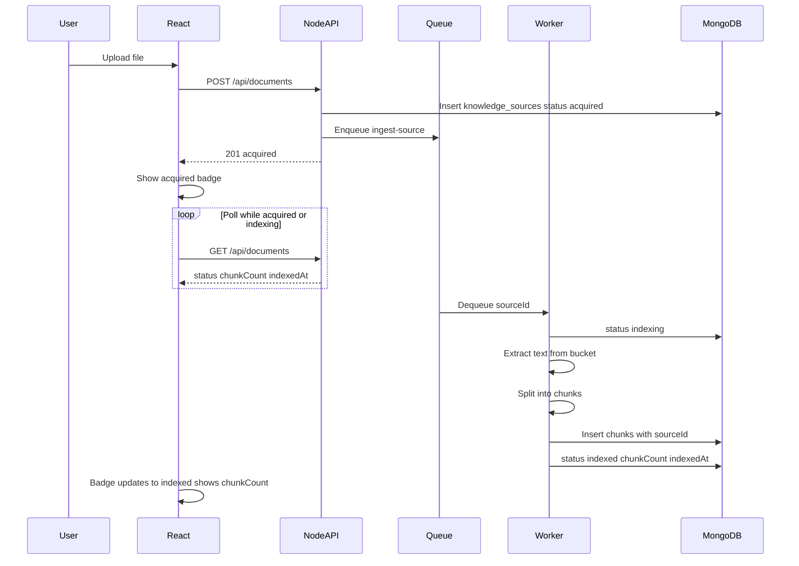

# US-030: Track Knowledge Source Indexing Status

## 1. Scenario summary

- **Actor** — Team member uploading and monitoring file knowledge sources
- **Goal** — See a source move from acquired to indexed and know when it is ready for RAG-powered chat
- **Success criteria**
  - Upload returns immediately with `status: acquired`; ingestion runs asynchronously via `ingest-source` job
  - Status transitions `acquired` → `indexing` → `indexed` are visible in the UI without manual refresh
  - Status badge shown on each source in the knowledge source list
  - `chunkCount` is set after successful ingestion and shown in source metadata
  - Same `knowledge_sources.status` model applies to future connector sources (Phase 2)

## 2. Current state

**Already in place**

| Area | What exists |
|------|-------------|
| Acquisition | [`documents.service.ts`](apps/api/src/services/documents.service.ts) uploads to bucket, inserts `knowledge_sources` with `status: 'acquired'`, enqueues job, returns `201` immediately |
| Queue | BullMQ `ingestion` queue, job `ingest-source`, payload `{ sourceId }` — [`ingestion-queue.client.ts`](apps/api/src/clients/ingestion-queue.client.ts) |
| Worker | [`ingestion.worker.ts`](apps/api/src/workers/ingestion.worker.ts) sets `indexing`, extracts text, calls `markIndexedWithText`, handles `failed` |
| API list | `GET /api/documents` returns `status`, `chunkCount`, `indexedAt` via [`knowledge-source.mapper.ts`](apps/api/src/mappers/knowledge-source.mapper.ts) |
| UI list | [`DocumentList.tsx`](apps/web/src/features/documents/DocumentList.tsx) renders color-coded status badges; [`useDocumentUpload.ts`](apps/web/src/features/documents/useDocumentUpload.ts) optimistically inserts `acquired` on upload |
| Chat guard | [`chat.service.ts`](apps/api/src/services/chat.service.ts) blocks chat until `status === 'indexed'` |

**Gaps vs US-030**

| Gap | Impact |
|-----|--------|
| No `chunks` collection or chunking step | Worker stores `extractedText` only; `chunkCount` stays `null`; step 3 ("indexed when chunks are stored") not met |
| No live UI updates | [`useDocuments.ts`](apps/web/src/features/documents/useDocuments.ts) fetches once — badge stays `acquired` until page reload |
| `chunkCount` / `indexedAt` not rendered | [`sourceMeta.ts`](apps/web/src/features/documents/sourceMeta.ts) shows type, filename, size, acquired date only |
| No dedicated source detail route | Scenario mentions "source detail"; inline list metadata is the pragmatic Phase 1 surface (no `GET /api/documents/:id` today) |
| `pending_ingestion` unused | Type/CSS only; worker jumps `acquired` → `indexing` — leave as reserved for Phase 2 connectors |

**Related scenarios (defer)**

- **US-031** — RAG retrieval in chat (switch chat from `extractedText` to top-k chunks)
- **US-034** — Failed-state `errorMessage` UI and re-ingest endpoint
- **Week 4** — Embeddings and vector search on `chunks`

## 3. End-to-end flow



**User steps**

1. Upload PDF/TXT on Documents page → list item appears with **acquired** badge immediately.
2. Within seconds, badge changes to **indexing** (worker started).
3. When worker finishes, badge becomes **indexed**; metadata shows **chunk count** and **indexed at**.
4. Navigate to Chat — `SourcePicker` (already uses `useDocuments`) shows the newly indexed source without reload.

## 4. Implementation breakdown

| Layer | Changes | Key files / modules |
|-------|---------|---------------------|
| React (`apps/web`) | Conditional polling in `useDocuments`; show `chunkCount` + `indexedAt` in list metadata; optional subtle "indexing…" affordance on in-progress badges | [`useDocuments.ts`](apps/web/src/features/documents/useDocuments.ts), [`sourceMeta.ts`](apps/web/src/features/documents/sourceMeta.ts), [`DocumentList.tsx`](apps/web/src/features/documents/DocumentList.tsx), [`DocumentsPage.module.css`](apps/web/src/features/documents/DocumentsPage.module.css) |
| Node API (`apps/api`) | Chunking service; `chunks` repository; extend `markIndexed` to set `chunkCount`; update ingestion worker pipeline | New: `services/ingestion/chunk-text.ts`, `repositories/chunks.repository.ts`, `types/chunk.types.ts`; update: [`ingestion.worker.ts`](apps/api/src/workers/ingestion.worker.ts), [`knowledge-sources.repository.ts`](apps/api/src/repositories/knowledge-sources.repository.ts) |
| Python worker | **No changes** — text extraction stays in Node for Week 3; Python/embeddings deferred to Week 4 | — |
| Data (MongoDB) | New `chunks` collection; `chunkCount` populated on `knowledge_sources` | Index: `{ sourceId: 1, index: 1 }` unique |
| Shared (`packages/`) | **No changes required** — chunk size targets can live in API constants for now | Optional: move token targets to `@knowflow/constants` later |

### Ingestion worker changes (core backend work)

Replace the current terminal step in [`ingestion.worker.ts`](apps/api/src/workers/ingestion.worker.ts):

```typescript
// Today
await knowledgeSourcesRepository.markIndexedWithText(sourceId, extractedText);

// Target
const chunks = chunkText(extractedText);           // 500–1000 token targets (~chars/4 heuristic)
await chunksRepository.replaceForSource(sourceId, chunks);
await knowledgeSourcesRepository.markIndexed(sourceId, {
  extractedText,   // keep for Week 2 chat until US-031
  chunkCount: chunks.length,
});
```

- `replaceForSource` deletes existing chunks for the source then `insertMany` (idempotent for retries).
- On failure, existing `updateStatus(..., 'failed', message)` path unchanged (US-034 builds on this).

### Chunking approach (Week 3, no embeddings)

- Target **500–1000 tokens** using a character heuristic (`~4 chars/token`) with optional small overlap (e.g. 50 tokens) — sufficient for US-030/US-033; US-031 can refine retrieval over these chunks.
- Split on paragraph/sentence boundaries where possible to avoid mid-word breaks.
- Persist chunk shape per [`ARCHITECTURE.md`](ARCHITECTURE.md):

```json
{
  "sourceId": "ObjectId",
  "index": 0,
  "text": "...",
  "tokenCount": 512,
  "createdAt": "ISODate"
}
```

No `embedding` field until Week 4.

### UI polling strategy

Prefer **polling over SSE** for this scenario ("polls or receives updates") — no new API endpoint, aligns with [US-021 plan deferral](.cursor/plans/us-021_document_list_c45e60be.plan.md).

In [`useDocuments.ts`](apps/web/src/features/documents/useDocuments.ts):

```typescript
refetchInterval: (query) => {
  const docs = query.state.data;
  if (!docs?.some((d) => d.status === 'acquired' || d.status === 'indexing')) {
    return false;
  }
  return 2000; // 2s while any source is in-flight
},
```

- Chat page already calls `useDocuments()` — it benefits automatically when a user uploads then switches tabs.
- Upload mutation's `invalidateQueries` on success remains; polling picks up worker-driven transitions.

### "Source detail" for `chunkCount`

No new route in this scenario — extend the existing per-item `<dl>` metadata in [`DocumentList.tsx`](apps/web/src/features/documents/DocumentList.tsx) via [`sourceMeta.ts`](apps/web/src/features/documents/sourceMeta.ts):

- When `status === 'indexed'` and `chunkCount != null`: show **Chunks** field
- When `indexedAt` is set: show **Indexed** field
- Optional one-line helper under the list heading: *"Upload finishes first; indexing runs in the background."*

## 5. API and data contract

### Endpoints (unchanged)

| Method | Path | Notes |
|--------|------|-------|
| `POST` | `/api/documents` | Still returns full source with `status: 'acquired'` immediately |
| `GET` | `/api/documents` | Already returns `status`, `chunkCount`, `indexedAt`, `errorMessage` |

**Deferred:** `GET /api/documents/:id` — not required if list metadata covers `chunkCount`; add later if a dedicated detail page is built.

### Document / field changes

**`knowledge_sources`** (existing collection)

| Field | Change |
|-------|--------|
| `status` | No schema change; transitions already implemented |
| `chunkCount` | Set to `chunks.length` on successful ingest (today always `null`) |
| `indexedAt` | Already set; now coincides with chunk persistence |
| `extractedText` | Keep populated through US-030 so Week 2 chat keeps working until US-031 |

**`chunks`** (new collection)

| Field | Type | Notes |
|-------|------|-------|
| `sourceId` | ObjectId | FK to `knowledge_sources._id` |
| `index` | number | 0-based order |
| `text` | string | Chunk body |
| `tokenCount` | number | Estimated at insert time |
| `createdAt` | Date | |

## 6. Suggested build order

1. **Chunk types + repository** — `chunks.repository.ts` with `replaceForSource`, `countBySourceId`, indexes
2. **Chunking service** — `chunk-text.ts` with unit tests for empty text, short text, long text boundaries
3. **Repository update** — rename/extend `markIndexedWithText` → `markIndexed({ extractedText, chunkCount })`
4. **Worker integration** — wire extract → chunk → persist → mark indexed; add/update worker tests
5. **UI polling** — `refetchInterval` in `useDocuments.ts`
6. **UI metadata** — `chunkCount`, `indexedAt` in `sourceMeta.ts`; optional indexing spinner CSS on badge
7. **Manual smoke test** — upload file, watch transitions, confirm `chunkCount` in list and Chat picker

## 7. Testing and verification

**Automated**

- `chunk-text.test.ts` — split sizes, overlap, edge cases (empty PDF text)
- `chunks.repository.test.ts` — replace is idempotent
- `ingestion.worker.test.ts` (or service-level test) — mocks bucket/repo; asserts `indexing` → chunk insert → `indexed` with `chunkCount`
- Optional: `useDocuments` test for `refetchInterval` callback logic (extract pure helper)

**Manual (local)**

1. Start API with Redis + MongoDB; confirm ingestion worker logs on boot
2. Upload a small TXT file → badge shows **acquired** immediately
3. Within ~2–10s, badge updates to **indexing** then **indexed** without refresh
4. List metadata shows chunk count and indexed timestamp
5. Open Chat → document appears in picker
6. Upload a second file while first is indexed → only the new item triggers polling; polling stops when all sources are terminal (`indexed` or `failed`)

## 8. Roadmap fit

| Item | Timing |
|------|--------|
| **Week / phase** | Week 3 (`week-03-rag`) — hybrid: queue visibility (infrastructure) + decoupled ingestion (learning) |
| **Ship now (US-030)** | Chunk persistence, `chunkCount`, status polling, list metadata |
| **Defer to US-031** | Chat uses chunks for RAG instead of full `extractedText` |
| **Defer to US-034** | `errorMessage` in UI, re-ingest button, `POST /sources/:id/ingest` |
| **Defer to Week 4** | `embedding` on chunks, vector search, Python `/embed` |
| **Phase 2** | Connector-acquired sources use same status enum and polling UI |

## Risks and edge cases

- **Fast worker** — `indexing` may flash briefly; polling at 2s might miss it on slow machines; acceptable for v1 (status still reaches `indexed`)
- **Redis down** — upload fails at enqueue (already handled); no new risk
- **Empty extract** — treat as failure with actionable `errorMessage` (feeds US-034; minimal handling in US-030: throw in worker)
- **Re-ingest** — `replaceForSource` prepares for US-034 but re-ingest API is out of scope here
