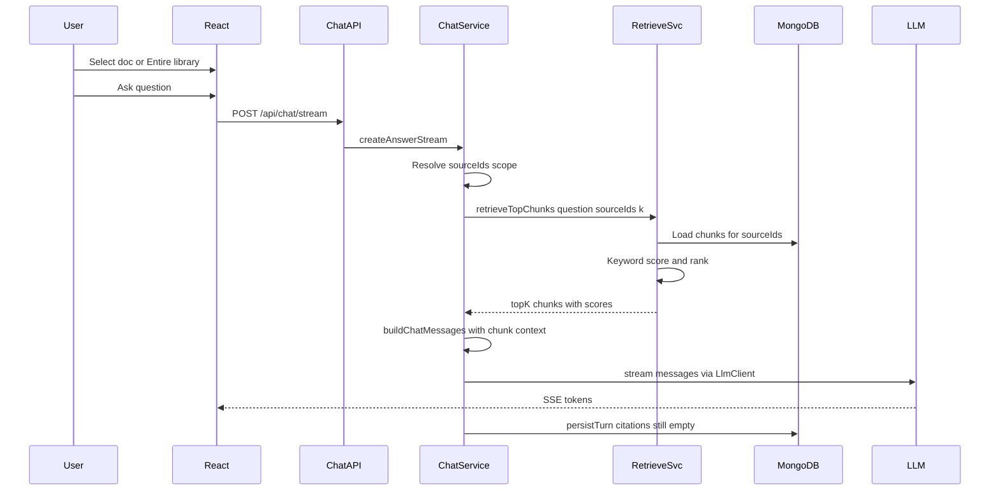

# US-031: RAG Retrieval in Chat

## 1. Scenario summary

- **Actor** — Team member asking questions in Chat
- **Goal** — Receive answers grounded in retrieved document chunks instead of the full source text dump
- **Success criteria**
  - Indexed sources have 500–1000 token chunks in `chunks` (already done in US-030)
  - Chat retrieves top-k relevant chunks per question (keyword match for Week 3)
  - Prompt assembly injects only retrieved chunk text into `LlmClient` messages
  - Retrieval works when multiple documents are indexed (library-wide mode)
  - Retrieval is logged server-side for debugging

## 2. Current state

**Already in place (US-030)**

| Area | Status |
|------|--------|
| Chunking at ingest | [`chunk-text.ts`](apps/api/src/services/ingestion/chunk-text.ts) splits 500–1000 tokens; [`ingest-source.service.ts`](apps/api/src/services/ingestion/ingest-source.service.ts) persists via `chunksRepository.replaceForSource` |
| `chunks` collection | [`chunks.repository.ts`](apps/api/src/repositories/chunks.repository.ts) — `findBySourceId`, `replaceForSource`, index on `{ sourceId, index }` |
| Chat endpoints | `POST /api/chat`, `POST /api/chat/stream` — [`chat.controller.ts`](apps/api/src/controllers/chat.controller.ts) |
| Streaming UI | [`useChat.ts`](apps/web/src/features/chat/useChat.ts) + SSE |
| Citation schema | `conversations.messages[].citations` exists but always `[]` — **US-032**, not US-031 |

**Gaps vs US-031**

| Gap | Location |
|-----|----------|
| Full-document context in prompt | [`chat.service.ts`](apps/api/src/services/chat.service.ts) `buildChatMessages` injects `source.extractedText` |
| No retrieval layer | No `retrieve` / `topK` / ranking code in `apps/api` |
| Readiness gate uses `extractedText` | `loadIndexedSource` checks `extractedText`, not chunks |
| Single-document UX only | [`SourcePicker.tsx`](apps/web/src/features/chat/SourcePicker.tsx) — one `sourceId` select |
| Tests assert full text | [`chat.service.test.ts`](apps/api/src/services/chat.service.test.ts) expects `extractedText` in system prompt |

**Deferred (out of scope for US-031)**

- **US-032** — citation UI and persisting chunk IDs on assistant messages
- **US-041 / Week 4** — vector retrieval and embeddings on chunks
- **US-040** — dedicated semantic search page
- Removing `extractedText` from `knowledge_sources` (keep field for now; stop sending to LLM)

## 3. End-to-end flow



**User steps**

1. Upload and index two+ documents (US-030).
2. Open Chat, pick a single document **or** "Entire library".
3. Ask a targeted question (e.g. password requirements).
4. Server retrieves top-k chunks (keyword overlap), builds a compact context block, streams answer.
5. Developer can inspect API logs for retrieved chunk IDs, source titles, and scores.

## 4. Implementation breakdown

| Layer | Changes | Key files |
|-------|---------|-----------|
| Node API — retrieval | Keyword top-k scorer over chunk text; multi-source query | New: [`services/rag/retrieve-chunks.service.ts`](apps/api/src/services/rag/retrieve-chunks.service.ts), [`constants/rag.constants.ts`](apps/api/src/constants/rag.constants.ts) |
| Node API — repository | Batch chunk load for one or many sources | Extend [`chunks.repository.ts`](apps/api/src/repositories/chunks.repository.ts) with `findBySourceIds(sourceIds: string[])` |
| Node API — chat | Replace `extractedText` prompt with retrieved chunks; resolve library scope; structured retrieval logging | [`chat.service.ts`](apps/api/src/services/chat.service.ts), [`chat.service.test.ts`](apps/api/src/services/chat.service.test.ts) |
| Node API — schema | Optional library scope on chat body | [`schemas/chat.schema.ts`](apps/api/src/schemas/chat.schema.ts) |
| React (`apps/web`) | "Entire library" option in picker; pass `scope` to chat API | [`SourcePicker.tsx`](apps/web/src/features/chat/SourcePicker.tsx), [`useChat.ts`](apps/web/src/features/chat/useChat.ts), [`chat.api.ts`](apps/web/src/features/chat/chat.api.ts), [`chat.types.ts`](apps/web/src/types/chat.types.ts) |
| Python worker | No changes | — |
| Data (MongoDB) | No schema change; reuse `chunks` | Optional text index deferred to Week 4 |
| Shared (`packages/`) | No changes | — |

### Retrieval algorithm (Week 3 keyword match)

Add [`retrieve-chunks.service.ts`](apps/api/src/services/rag/retrieve-chunks.service.ts):

```typescript
export type RetrievedChunk = Chunk & {
  score: number;
  sourceTitle: string;
};

export async function retrieveTopChunks(input: {
  question: string;
  sourceIds: string[];
  limit?: number; // default RAG_TOP_K = 5
}): Promise<RetrievedChunk[]>
```

**Scoring (simple, testable, no embeddings):**

1. Normalize question → terms (lowercase, split on non-alphanumeric, drop terms &lt; 3 chars and a small stopword list).
2. Load chunks via `chunksRepository.findBySourceIds(sourceIds)`.
3. Score each chunk: count of distinct query terms found in chunk text (case-insensitive); tie-break by earlier `index`.
4. Return top `limit` chunks with `score > 0`.
5. If no chunk matches any term, return the first `limit` chunks from the scoped sources (fallback so chat still works on vague questions) and log `retrievalFallback: true`.

**Logging (inspectable retrieval):**

```typescript
console.info('[rag] retrieval', {
  sourceIds,
  questionTerms,
  retrieved: results.map((c) => ({
    chunkId: c.id,
    sourceId: c.sourceId,
    index: c.index,
    score: c.score,
    title: c.sourceTitle,
  })),
});
```

### Prompt assembly change

Replace system content in [`chat.service.ts`](apps/api/src/services/chat.service.ts):

```typescript
// Before
`Document text:\n${source.extractedText}`

// After
`Relevant excerpts:\n` +
retrievedChunks.map((c) =>
  `[${c.sourceTitle} — chunk ${c.index}]\n${c.text}`
).join('\n\n---\n\n')
```

Update system instruction to reference "provided excerpts" instead of "provided document".

### Readiness gate

Change `loadIndexedSource` (or split into `assertSourcesReady`):

- Require `status === 'indexed'`
- Require `chunkCount > 0` (or `chunksRepository.countBySourceId > 0`)
- Drop dependency on `extractedText` for chat readiness (field may remain on document for other uses)

### Multi-document / library scope

**API contract** — extend [`chat.schema.ts`](apps/api/src/schemas/chat.schema.ts):

```typescript
body: z.object({
  question: z.string().trim().min(1).max(4000),
  sourceId: z.string().trim().min(1).optional(),
  scope: z.enum(['source', 'library']).default('source'),
}).refine(
  (b) => b.scope === 'library' || !!b.sourceId,
  { message: 'sourceId is required when scope is source' },
)
```

**Scope resolution in `chatService`:**

| `scope` | Retrieval `sourceIds` | Conversation key |
|---------|----------------------|------------------|
| `source` | `[sourceId]` | `findOrCreateBySourceId(sourceId)` (unchanged) |
| `library` | all indexed `knowledge_sources` IDs | `findOrCreateBySourceId(LIBRARY_CONVERSATION_KEY)` |

Use a fixed sentinel ObjectId string constant (e.g. `000000000000000000000001`) as `LIBRARY_CONVERSATION_KEY` — avoids conversations schema migration while giving library chat its own thread. Document the sentinel in code comments.

**UI** — [`SourcePicker.tsx`](apps/web/src/features/chat/SourcePicker.tsx):

- Add `<option value="__library__">Entire library</option>`
- `useChat` maps `__library__` → `{ scope: 'library' }` without `sourceId`
- Single-document mode unchanged for existing users

### Routes / controllers

No new endpoints. Existing `POST /api/chat` and `POST /api/chat/stream` accept the extended body. Controllers pass `scope` + `sourceId` through to `chatService`.

Optional (nice for debugging, not required): add `retrievedChunkCount` to SSE `done` event — skip if it expands scope.

## 5. API and data contract

### Changed request bodies

**`POST /api/chat`** and **`POST /api/chat/stream`**

```json
{
  "question": "What are the password requirements?",
  "sourceId": "6a61e973d923b6f0e248762a",
  "scope": "source"
}
```

Library mode:

```json
{
  "question": "What are the password requirements?",
  "scope": "library"
}
```

Response shapes unchanged (`answer`, `conversationId`, `sourceId`, `model`). `sourceId` in library mode returns the sentinel conversation key.

### Data

- **`chunks`** — read-only for chat; no new fields
- **`conversations`** — one additional document keyed by library sentinel `sourceId`
- **`knowledge_sources`** — `extractedText` no longer sent to LLM; not deleted in this scenario

## 6. Suggested build order

1. **RAG constants** — `RAG_TOP_K = 5`, stopword list, `LIBRARY_CONVERSATION_KEY`
2. **Repository** — `chunksRepository.findBySourceIds`
3. **Retrieval service** — keyword scorer + tests (single source, multi source, no-match fallback, tie-break)
4. **Chat service** — wire retrieval into `buildChatMessages` for both `askAboutSource` and `createAnswerStream`; update readiness checks
5. **Chat schema + controller** — accept `scope`; pass through to service
6. **Chat service tests** — mock `retrieveTopChunks`; assert system prompt contains chunk excerpts, not `extractedText`
7. **Web** — library option in `SourcePicker`, update `chat.api.ts` / `useChat.ts` request body
8. **Manual verification** — two indexed docs with different topics; confirm single-doc and library questions retrieve the right chunks (via logs)

## 7. Testing and verification

**Automated**

- `retrieve-chunks.service.test.ts` — ranking, multi-source, fallback, empty library
- `chat.service.test.ts` — system prompt uses chunk text; `scope: library` resolves all indexed sources (mock `knowledgeSourcesRepository.findAll` or a dedicated `findIndexedIds` helper)
- `chunks.repository` integration test optional; unit-test retrieval with mocked repo

**Manual**

1. Index two TXT files: one about refunds, one about security/passwords.
2. Single-doc chat: ask password question with security doc selected → answer references security content; API log shows security chunks only.
3. Library chat: select "Entire library", ask password question → security chunks retrieved even if refund doc is larger.
4. Confirm system prompt size stays small vs full `extractedText` (inspect logs or temporary debug endpoint).
5. Streaming chat still persists multi-turn history.

## 8. Roadmap fit

| Item | Timing |
|------|--------|
| **Week / phase** | Week 3 (`week-03-rag`) — core RAG learning scenario (FR-06) |
| **Ship now (US-031)** | Keyword top-k retrieval, chunk-based prompt, library scope |
| **Defer to US-032** | Persist and display chunk-level citations in UI |
| **Defer to US-041** | Swap keyword scorer for vector retrieval behind same `retrieveTopChunks` interface |
| **Defer to Week 4** | Embeddings on chunks, semantic search page (US-040) |

## Risks and edge cases

- **Keyword recall** — paraphrased questions may miss relevant chunks until US-041; fallback-to-first-chunks prevents empty context but may reduce accuracy (acceptable for Week 3; document in article).
- **Library with many sources** — loading all chunks for scoring is O(total chunks); fine for demo scale; Week 4 vector index addresses scale.
- **Conversation model** — library sentinel is a pragmatic shortcut; Phase 2 may introduce explicit `scope` on conversations.
- **No matching terms** — fallback chunks logged explicitly so developers can distinguish true matches vs fallback during testing.
