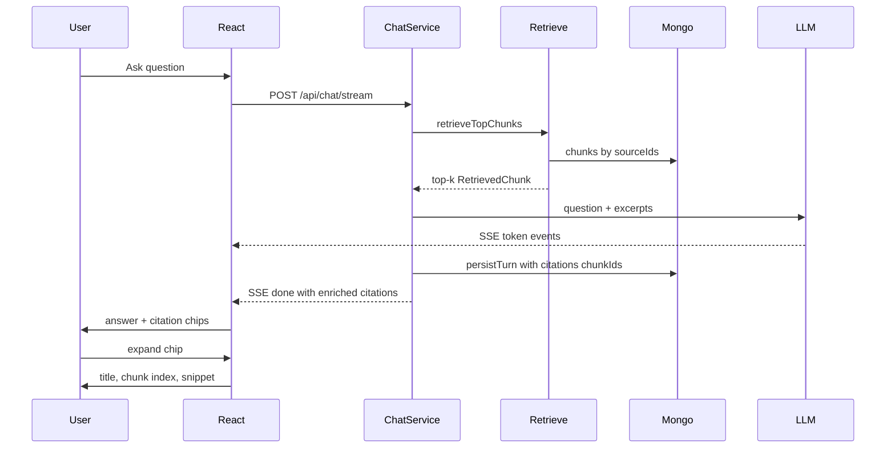

# US-032: View Chunk-Level Citations

### 1. Scenario summary

- **Actor** — Knowledge owner (also usable by team members in chat)
- **Goal** — Verify each AI answer is grounded by seeing which document chunks supported it
- **Success criteria**
  - Assistant turns store `citations` as chunk ID strings in `conversations.messages[]`
  - Chat UI shows each citation as **document title + chunk index**
  - Expanding a citation reveals the cited chunk text snippet
  - Live streaming turns and reloaded conversation history both show the same citations
  - Citations come from the chunks actually retrieved for that turn (not LLM-invented refs)

**UI decision (locked):** Inline expandable chips under the assistant message (no side panel, no document-detail navigation). “View original file” stays deferred to US-121.

**Phase:** Week 3 / Phase 1 (`week-03-rag`). File-upload sources only.

---

### 2. Current state

**Already in place (US-031 / prior weeks)**

- [`retrieveTopChunks`](apps/api/src/services/rag/retrieve-chunks.service.ts) returns `RetrievedChunk` with `id`, `sourceId`, `index`, `text`, `sourceTitle`
- Chat prompt already labels excerpts as `[title — chunk N]`
- Mongo + domain types already allow `citations?: string[]` on assistant messages ([ARCHITECTURE.md](ARCHITECTURE.md) shape)
- Web `ChatMessage` / history mapping already pass through `citations` ([`useChat.ts`](apps/web/src/features/chat/useChat.ts)) but always receive `[]`
- [`ChatMessageList.tsx`](apps/web/src/features/chat/ChatMessageList.tsx) renders role + content only — no citation UI

**Gaps**

| Gap | Today |
|-----|--------|
| Persist citations | [`chat.service.ts`](apps/api/src/services/chat.service.ts) `persistTurn` hardcodes `citations: []` |
| Thread retrieval → persist | `prepareChatTurn` drops `retrievedChunks` after prompt build |
| Stream `done` payload | No citations on SSE `done` — live UI cannot attach them without reload |
| Hydrate for display | Conversation GET returns raw chunk ID strings (empty); UI needs title/index/text |
| Chunk lookup by ID | [`chunks.repository.ts`](apps/api/src/repositories/chunks.repository.ts) has `findBySourceIds` only — no `findByIds` |
| Citation UI | No chips / expand / snippet |

---

### 3. End-to-end flow



1. User asks a question (single source or library scope).
2. API retrieves top-k chunks and builds the LLM prompt (unchanged from US-031).
3. After a successful answer, API persists assistant message with `citations: [chunkId, …]` in order of retrieval.
4. SSE `done` (and non-streaming `POST /api/chat` response) includes **enriched** citation DTOs for immediate UI use.
5. UI renders chips under the assistant bubble; expand shows snippet.
6. On history reload, conversation service hydrates stored chunk IDs → same enriched DTOs.

---

### 4. Implementation breakdown

| Layer | Changes | Key files |
|-------|---------|-----------|
| React (`apps/web`) | Citation types; chips + expand under assistant messages; apply citations from SSE `done`; keep history mapping | [`chat.types.ts`](apps/web/src/types/chat.types.ts), [`useChat.ts`](apps/web/src/features/chat/useChat.ts), [`ChatMessageList.tsx`](apps/web/src/features/chat/ChatMessageList.tsx), new `CitationList.tsx`, [`ChatPage.module.css`](apps/web/src/features/chat/ChatPage.module.css) |
| Node API (`apps/api`) | Thread retrieved chunk IDs into `persistTurn`; enrich citations for responses; `findByIds` on chunks | [`chat.service.ts`](apps/api/src/services/chat.service.ts), [`chat.controller.ts`](apps/api/src/controllers/chat.controller.ts), [`chunks.repository.ts`](apps/api/src/repositories/chunks.repository.ts), conversation GET path (service/mapper), types |
| Python worker | None | — |
| Data | No schema migration — `citations` field already exists as string[] of chunk IDs | `conversations`, `chunks` |
| Shared packages | None | — |

---

### 5. API and data contract

**Mongo (unchanged shape)**

```json
{ "role": "assistant", "content": "...", "citations": ["chunkId1", "chunkId2"], "timestamp": "..." }
```

**Enriched citation DTO (API → web only)**

```ts
type CitationDto = {
  chunkId: string;
  sourceId: string;
  sourceTitle: string;
  chunkIndex: number;
  text: string; // full chunk text as snippet for Week 3
};
```

**Changed responses**

- `POST /api/chat` → `{ data: { answer, sourceId, model, conversationId, citations: CitationDto[] } }`
- `POST /api/chat/stream` SSE `done` → `{ type: "done", sourceId, model, conversationId, citations: CitationDto[] }`
- `GET /api/conversations?sourceId=` → assistant messages use `citations: CitationDto[]` (hydrated from stored IDs). Missing/deleted chunks are omitted (do not fail the whole conversation).

**Service changes**

- `prepareChatTurn` also returns `citationIds: string[]` (and enough fields to build `CitationDto[]` without a second DB round-trip on the live path).
- `persistTurn({ …, citations: string[] })` writes those IDs.
- History path: collect all citation IDs from messages → `chunksRepository.findByIds` → join titles via `knowledgeSourcesRepository` (or title map from sources already loaded) → map into DTOs.

**No new public chunk routes** for US-032 — hydration stays server-side on chat/conversation responses.

---

### 6. Suggested build order

1. **Repository** — add `chunksRepository.findByIds(ids: string[]): Promise<Chunk[]>`
2. **Citation helper** — small pure mapper `toCitationDto(chunk, sourceTitle)` used by chat + conversation enrichment
3. **Chat service** — return retrieved citations from prepare; pass IDs into `persistTurn`; return enriched DTOs from `askAboutSource` / stream handle
4. **Chat controller** — include `citations` on JSON response and SSE `done`
5. **Conversation GET** — hydrate citation IDs → `CitationDto[]` before mapping to client
6. **API tests** — update [`chat.service.test.ts`](apps/api/src/services/chat.service.test.ts): assert non-empty citations on persist; history hydration unit test if conversation service is touched
7. **Web types + stream handling** — `CitationDto` on `ChatMessage` / `done` event; `useChat` sets citations on `done`
8. **UI** — `CitationList` under assistant messages (chip label: `{sourceTitle} · chunk {chunkIndex}`; expand shows `text`); hide while streaming until `done`
9. **Manual verification** — single-doc + library questions; reload page and confirm citations still expand

---

### 7. Testing and verification

**Automated**

- `persistTurn` / `askAboutSource` mocks: assistant message citations equal retrieved chunk IDs
- Retrieval → persist wiring: when `retrieveTopChunks` returns two chunks, both IDs are persisted
- Conversation hydration: messages with unknown chunk IDs drop those entries without throwing

**Manual**

1. Index two docs; ask a question that retrieves known chunks (check `[rag] retrieval` logs for `chunkId` / `index` / `title`).
2. Confirm chips appear under the assistant answer with matching title + index.
3. Expand a chip — snippet matches chunk text used in the prompt.
4. Refresh / reselect source — history still shows the same citations.
5. Library-scope question citing two different docs — chips show both titles.

---

### 8. Roadmap fit

| Item | Timing |
|------|--------|
| **Week / phase** | Week 3 (`week-03-rag`) — ROADMAP acceptance: “Answers include chunk-level citations (source title + chunk index)” / FR-06 |
| **Ship now** | Persist chunk IDs; enrich + display title/index/snippet in chat |
| **Defer** | View original file (US-121); knowledge-owner review workflow (US-123); agent citation format reuse (US-052); vector retrieval swap (US-041); LLM inline `[1]` markers in answer prose |

**Out of scope / risks**

- **Not** asking the LLM to invent citation markers — chips track retrieved chunks (more trustworthy for Week 3).
- Re-indexing a source replaces chunks (`replaceForSource`); old conversation citations may point at deleted IDs → hydrate omits them (acceptable; no soft-delete of chunks yet).
- Large chunk text in expand is fine at 500–1000 tokens; truncate in UI only if layout suffers (e.g. CSS max-height + scroll).
