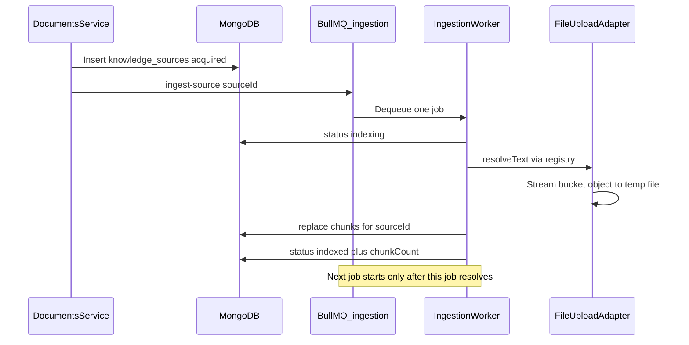

# US-033: Source-agnostic ingestion queue

## 1. Scenario summary

- **Actor** — the system (ingestion worker), after a developer uploads files.
- **Goal** — process one `knowledge_sources` record at a time on the `ingest-source` queue so memory stays bounded no matter how the source was acquired.
- **Success criteria**
  - Three quick uploads each enqueue a separate `ingest-source` job whose payload is only `{ sourceId }`.
  - The worker runs those jobs one at a time (`concurrency: 1`).
  - Each source moves `acquired` → `indexing` → `indexed` on its own, and its chunks are in MongoDB before the next job starts.
  - Text is resolved through the adapter registry (file upload streams from the bucket). Ingestion does not call upload route handlers.
  - The worker does not list or load the bucket at startup.

## 2. Current state

The pipeline this scenario describes is already in the API. Do not rebuild it.

- **Enqueue** — [`documents.service.ts`](apps/api/src/services/documents.service.ts) stores the file, inserts `knowledge_sources` with `status: 'acquired'`, then calls `ingestionQueueClient.enqueueIngestSource(source.id)`. Chunking is not in the upload handler.
- **Job contract** — [`ingestion-queue.client.ts`](apps/api/src/clients/ingestion-queue.client.ts) adds BullMQ job `ingest-source` on queue `ingestion` with `{ sourceId }` only. Retries are already `attempts: 3` with exponential backoff (retry policy itself is US-092 / Week 9).
- **One-at-a-time worker** — [`ingestion.worker.ts`](apps/api/src/workers/ingestion.worker.ts) uses `INGESTION_WORKER_CONCURRENCY = 1` from [`documents.constants.ts`](apps/api/src/constants/documents.constants.ts). The processor `await`s `ingestSource(sourceId)` before the job completes, so BullMQ will not start the next job until chunks are written.
- **Source-agnostic ingest** — [`ingest-source.service.ts`](apps/api/src/services/ingestion/ingest-source.service.ts) loads the source, sets `indexing`, calls `getContentAdapter(source.sourceType).resolveText(source)`, chunks, `chunksRepository.replaceForSource`, then `markIndexed` with `chunkCount`. It does not import document routes or the upload service.
- **File adapter** — [`file-upload.adapter.ts`](apps/api/src/services/acquisition/file-upload.adapter.ts) streams the bucket object to a temp file, extracts text, and deletes the temp dir. Connector types in [`adapters.ts`](apps/api/src/services/acquisition/adapters.ts) stay `implemented: false`.
- **Startup** — [`index.ts`](apps/api/src/index.ts) connects Mongo, ensures indexes, then `startIngestionWorker()`. No bucket listing.

**Gaps vs the scenario**

- The worker unit test only checks that `Worker` is constructed with `concurrency: 1`. It never runs the processor, so a future change could drop the `await` on `ingestSource` without a failing test.
- Sequential behavior in [`ingest-source.service.test.ts`](apps/api/src/services/ingestion/ingest-source.service.test.ts) is the test awaiting three calls. The real serializer is BullMQ concurrency, which that test does not cover.

**Accepted bound (no code change)**

- After the temp-file stream, [`extract-text.ts`](apps/api/src/services/ingestion/extract-text.ts) reads that one file into memory. Peak use is one source (upload cap 25 MB) plus its chunks. That matches NFR-01 for Week 3. Page-by-page PDF parsing and embedding batches stay deferred.

## 3. End-to-end flow

1. User uploads a PDF or TXT. `POST /api/documents` returns as soon as the bucket object and `knowledge_sources` row exist (`status: acquired`).
2. Acquisition enqueues `ingest-source` with `{ sourceId }`.
3. Repeat for two more files. Jobs wait in Redis.
4. The in-process worker dequeues one job, sets `indexing`, streams that object to a temp file, chunks, writes `chunks`, sets `indexed` and `chunkCount`.
5. Only then does it dequeue the next `sourceId`. Each source reaches `indexed` on its own.

## 4. Implementation breakdown

- **React (`apps/web`)** — no change. Status badges and polling belong to US-030.
- **Node API** — no new routes, services, or queue types. Extend [`ingestion.worker.test.ts`](apps/api/src/workers/ingestion.worker.test.ts) so the registered processor is invoked.
- **Python worker** — no change. Chunking stays in Node for Week 3. Embeddings are Week 4.
- **Data** — keep queue `ingestion`, job `ingest-source`, payload `{ sourceId: string }`. Keep `knowledge_sources.status` and `chunks` (`sourceId`, `index`, `text`, `tokenCount`). No new indexes.
- **Shared (`packages/`)** — no change.

## 5. API and data contract

No new or changed HTTP endpoints.

Existing job, unchanged:

- Queue: `ingestion`
- Job name: `ingest-source`
- Payload: `{ sourceId: string }`
- Worker option: `concurrency: 1`

Per source, unchanged:

- `acquired` after upload
- `indexing` when the job starts
- `indexed` with `chunkCount` after `chunks` replace for that `sourceId`
- `failed` with `errorMessage` if resolve or chunking throws (job rethrows so BullMQ can retry)

## 6. Suggested build order

1. In [`ingestion.worker.test.ts`](apps/api/src/workers/ingestion.worker.test.ts), capture the processor passed to the mocked `Worker` and assert:
   - a non-`ingest-source` job does not call `ingestSource`
   - an `ingest-source` job calls `ingestSource` with `job.data.sourceId` and the processor promise resolves only after that call resolves
   - a thrown `ingestSource` error rejects the processor (so the next job is not treated as success)
2. Keep the existing assertion that `concurrency` is `1`.
3. Run the API unit tests for the worker, `ingestSource`, and `resolveFileUploadText`.
4. Manually upload three files in succession and confirm the log and Mongo order below.

## 7. Testing and verification

**Automated**

- Existing: concurrency constant, `{ sourceId }` payload type, adapter resolve → chunk persist → `markIndexed`, temp-file stream and cleanup, upload service enqueues only after insert and does not chunk inline.
- Add: processor awaits `ingestSource` and ignores other job names.

**Manual** (API, Redis, Mongo running)

1. Upload three small PDF or TXT files back to back.
2. Each `POST /api/documents` returns while status is still `acquired`.
3. Worker logs show `processing source` / `completed source` for one id, then the next. They do not interleave.
4. In Mongo, each source has its own `chunks` rows with that `sourceId` before the next source is `indexed`.
5. Worker boot logs do not include a bucket list or a load of every object.

## 8. Roadmap fit

- **Week 3** (`week-03-rag`), learning scenario for FR-03b, FR-05, NFR-01, NFR-03.
- **Ship now** — the queue, concurrency, adapter resolution, temp-file read, and chunk persist path.
- **Defer**
  - Embeddings and “one embedding batch” (Week 4)
  - Page-by-page PDF parsing beyond the 25 MB single-source cap
  - A separate worker process (in-process worker plus Redis already provides backpressure)
  - MCP connectors (Phase 2); they should call the same `enqueueIngestSource(sourceId)` after creating a `knowledge_sources` row
  - Retry UX (US-092)
