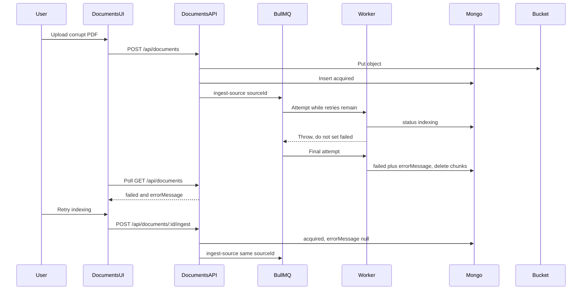

# US-034: Handle Failed Knowledge Source Indexing

## 1. Scenario summary

- **Actor** — Team member who uploaded a file that cannot be indexed.
- **Goal** — See a clear failure, keep the raw file, and either retry ingestion or remove the source and upload a corrected file.
- **Success criteria**
  - After ingestion exhausts its attempts, the source stays `failed` with a short `errorMessage`.
  - The Documents list shows that error separately from `acquired` and `indexing`.
  - Chat and the source picker do not use chunks from that source.
  - `POST /api/documents/:id/ingest` re-queues the existing bucket object. Delete removes the source, its chunks, and the bucket object. Re-upload uses the existing upload form.

Phase 1 only (file upload). No MCP connectors. Automatic retry policy stays as it is; Week 9 [US-092](user-scenarios/US-092-retry-failed-ingestion-jobs.md) owns retry-in-progress UI.

## 2. Current state

Already in place:

- [ingest-source.service.ts](apps/api/src/services/ingestion/ingest-source.service.ts) sets `indexing`, and on throw sets `failed` plus `errorMessage`, then rethrows. It does not write chunks when chunking or the adapter fails.
- [knowledge-source.mapper.ts](apps/api/src/mappers/knowledge-source.mapper.ts) already returns `status` and `errorMessage` from `GET /api/documents`.
- [DocumentsPage.module.css](apps/web/src/features/documents/DocumentsPage.module.css) already styles `.status_failed`. [useDocuments.ts](apps/web/src/features/documents/useDocuments.ts) polls only while status is `acquired` or `indexing`, so `failed` is terminal.
- [chat.service.ts](apps/api/src/services/chat.service.ts) allows chat only when `status === 'indexed'` and `chunkCount > 0`. Library scope uses `findIndexedWithChunks`. [SourcePicker.tsx](apps/web/src/features/chat/SourcePicker.tsx) lists only `indexed` sources.
- The bucket object is not deleted when ingestion fails. [ingestion-queue.client.ts](apps/api/src/clients/ingestion-queue.client.ts) already uses `attempts: 3` and exponential backoff. Do not change that config.

Gaps:

- The list never renders `errorMessage`. There is no re-ingest or delete endpoint. `deleteById` exists only as upload rollback.
- `failed` is written on every attempt, then the next attempt sets `indexing` again (and clears `errorMessage`). A 2s poll can flash `failed` before the job is actually done.
- Upload rejects unsupported MIME types with `400` before a source exists. A corrupt PDF or a PDF/TXT with no extractable text is the failure path this scenario can observe. `pdf-parse` errors are not shortened before they are stored.

## 3. End-to-end flow

1. User uploads a PDF or TXT. `POST /api/documents` stores the object and inserts `knowledge_sources` with `acquired`, then enqueues `ingest-source` `{ sourceId }`.
2. The worker sets `indexing` and resolves text through the file adapter. Parse or empty-text errors throw.
3. While BullMQ will retry, status stays `indexing`. On the last attempt, status becomes `failed`, `errorMessage` is a short sentence, and any chunks for that `sourceId` are deleted. The bucket object stays.
4. Polling stops. The list shows the red badge and the message, with Retry indexing and Remove.
5. Retry calls `POST /api/documents/:id/ingest`, which is allowed only from `failed`. It sets `acquired`, clears `errorMessage`, and enqueues the same `{ sourceId }`. No second upload.
6. Remove calls `DELETE /api/documents/:id` (not while `indexing`). Re-upload uses the existing form and creates a new source.

## 4. Implementation breakdown

- **React (`apps/web`)** — In [DocumentList.tsx](apps/web/src/features/documents/DocumentList.tsx), when `status === 'failed'`, show `errorMessage` in an alert and two buttons: Retry indexing and Remove. Keep the existing upload form as the re-upload path. Add `reingestDocument` and `deleteDocument` in [documents.api.ts](apps/web/src/features/documents/documents.api.ts), and a small mutation hook that invalidates `['documents']`. No new route and no source-detail page; the list card is the Phase 1 detail surface ([US-030](.cursor/plans/us-030_indexing_status_03f50d2b.plan.md) already chose that).
- **Node API** — Extend [documents.routes.ts](apps/api/src/routes/documents.routes.ts), [documents.controller.ts](apps/api/src/controllers/documents.controller.ts), and [documents.service.ts](apps/api/src/services/documents.service.ts). Routes only validate and bind. Controller reads `id` and returns the envelope. Service decides status rules, enqueues, and deletes. In [ingestion.worker.ts](apps/api/src/workers/ingestion.worker.ts), pass a final-attempt flag into `ingestSource`. In [ingest-source.service.ts](apps/api/src/services/ingestion/ingest-source.service.ts), write `failed` only on that final attempt, store a sanitized message, and delete chunks for that source. In [chat.service.ts](apps/api/src/services/chat.service.ts), if status is `failed`, return `409` `SOURCE_NOT_READY` with copy that indexing failed (do not say to wait).
- **Python worker** — No change. Parsing stays in Node for Week 3.
- **Data** — No new fields. `knowledge_sources.status` and `errorMessage` already exist. On final failure, `chunksRepository` deletes by `sourceId` (add `deleteBySourceId`; `replaceForSource` already deletes before insert). User delete also deletes the bucket key via `bucketClient.deleteObject`. Do not delete the bucket object on ingest failure.
- **Shared (`packages/`)** — No change.

## 5. API and data contract

Mount on the existing Phase 1 router (`/api/documents`), not a new `/sources` router. The scenario’s `POST /sources/:id/ingest` is this endpoint.

- `POST /api/documents/:id/ingest`
  - Params: 24-hex `id` (same ObjectId check as prompt-template routes).
  - `202` `{ data: KnowledgeSourceListItem }` with `status: "acquired"` and `errorMessage: null`.
  - `404` `SOURCE_NOT_FOUND` when the id is missing.
  - `409` `SOURCE_NOT_FAILED` when status is not `failed` (including `indexing`, so a click cannot stack a second job).
  - Does not read or rewrite the bucket. Enqueues `{ sourceId }` only.
- `DELETE /api/documents/:id`
  - `204` empty body.
  - `404` when missing.
  - `409` `SOURCE_INDEXING` when status is `indexing`, so the worker cannot recreate rows after delete. `ingestSource` already returns immediately when the source is gone; the 409 covers the in-flight window.
  - Order: delete chunks, delete the `knowledge_sources` row, then `deleteObject` for `sourceConfig.bucketKey`. Leave conversations keyed by that id; they are unused once the source is gone.

Status write rule in the worker (BullMQ 5 increments `attemptsMade` when the job becomes active):

- Final attempt when `job.attemptsMade >= (job.opts.attempts ?? 1)`.
- Earlier attempts: leave `indexing`, do not set `errorMessage`, rethrow.
- Final attempt: `failed`, sanitized `errorMessage`, delete chunks, rethrow so the job still ends failed.

Sanitize before save (cap around 200 characters, no stacks):

- Empty TXT, empty PDF, or no chunks: keep the existing sentences (`TXT file is empty`, `PDF contained no extractable text`, `No text content available to index`).
- Other parse failures: `Could not read this file. Retry indexing, or upload a corrected PDF or TXT file.`
- Log the raw error in the worker; do not store it.

## 6. Suggested build order

1. Add `isFinalAttempt` to `ingestSource`. Non-final failures rethrow without `updateStatus('failed')`. Final failures set `failed`, a sanitized message, and `deleteBySourceId`.
2. Thread that flag from the worker. Keep `attempts` and backoff unchanged.
3. Add `POST /:id/ingest` and `DELETE /:id` through schema, route, controller, and `documentsService`.
4. Distinguish failed vs not-ready in `loadIndexedSource`.
5. Show the error and the two actions on a failed list card; invalidate the documents query after either action.
6. Unit tests, then a local corrupt-PDF run in the browser.

## 7. Testing and verification

Automated (API):

- Non-final `ingestSource` does not set `failed` and does not delete chunks. Final call sets `failed` with the sanitized message, deletes chunks, and still rejects.
- Re-ingest of a `failed` source enqueues `{ sourceId }` and does not call the bucket upload. Non-failed returns 409. Missing id returns 404.
- Delete removes the source, chunks, and bucket object. `indexing` returns 409.
- `askAboutSource` on a `failed` source returns 409 and does not call retrieval.

Manual:

- Upload a corrupt PDF (or a PDF with no text). It becomes `acquired`, stays `indexing` across retries, then stays `failed` with the message. The file is still in the bucket.
- Chat source picker does not list it. A direct chat call with that id returns 409.
- Retry indexing without choosing a file again. A still-bad file returns to `failed`. Replace the file by uploading a valid PDF or TXT (new source) and remove the failed one.
- Remove is disabled or rejected while a source is `indexing`.

## 8. Roadmap fit

- Week 3 (`week-03-rag`), NFR-08. Ships with the RAG status work.
- Ship now: stable `failed` plus `errorMessage`, list error UI, manual re-ingest, delete, and the chat exclusion check.
- Defer: retry-in-progress vs permanent-failure UI and any change to attempt count or backoff (US-092); embeddings (Week 4); a dedicated source detail page; MCP re-ingest (same `enqueueIngestSource(sourceId)` later).
