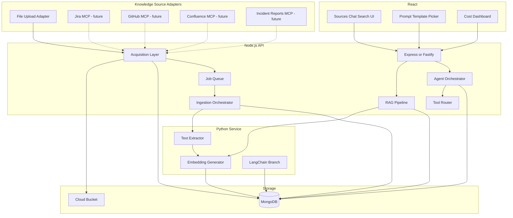
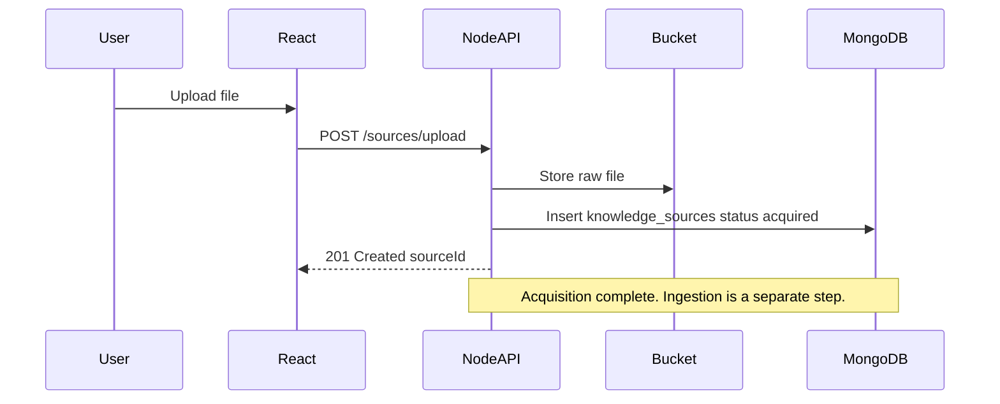
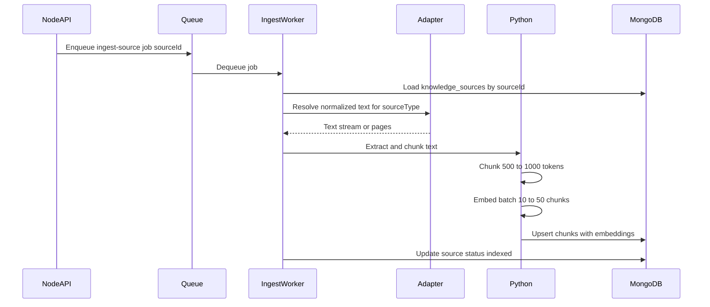
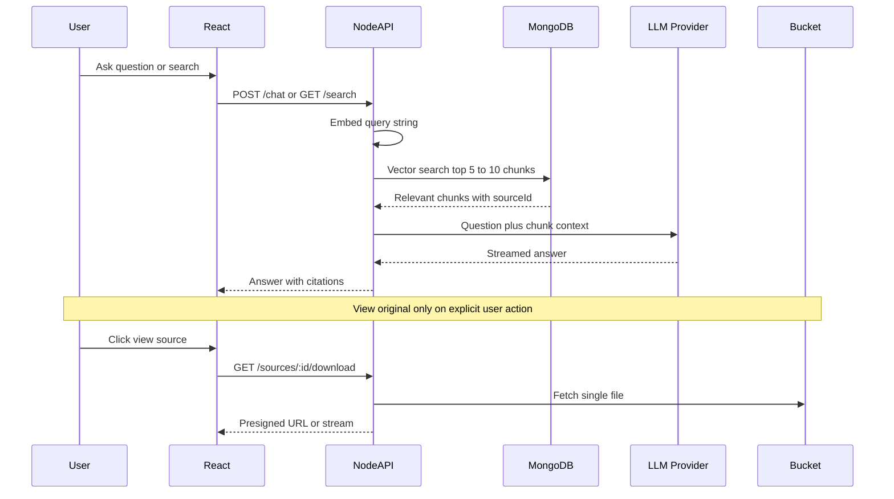
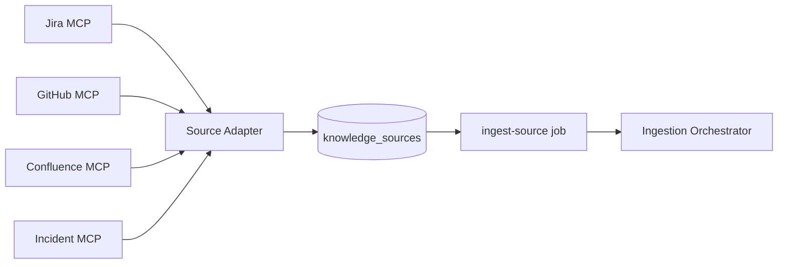

# KnowFlow — Architecture

## System Overview

KnowFlow separates **how knowledge enters the system** (acquisition) from **how it becomes searchable** (ingestion and RAG). Any supported channel — file upload today; Jira, GitHub, Confluence, or incident reports via MCP later — produces a **knowledge source** record. A single, source-agnostic ingestion pipeline turns that content into chunks and embeddings.

| Layer | Stores | Used at query time? |
|-------|--------|---------------------|
| Cloud bucket | Raw files from file-upload sources only | Only for "view original" (single file) |
| MongoDB | Knowledge source metadata, chunks, embeddings, chats, logs | Yes — primary search index |
| App memory | Current request context | Only top-k chunks + question |



## Monorepo Layout (Planned)

```
knowflow/
├── apps/
│   ├── web/                  # React (Vite) — upload, chat, search, dashboards
│   └── api/                  # Node.js — REST API, RAG, agents, job enqueue
├── services/
│   └── python-worker/        # FastAPI — parsing, embeddings, LangChain path
├── packages/
│   └── prompts/              # Shared TypeScript prompt templates (Week 1)
├── docker-compose.yml        # Local MongoDB + services
├── README.md
├── REQUIREMENTS.md
├── ARCHITECTURE.md
└── ROADMAP.md
```

## Responsibility Split

### React (`apps/web`)

- Knowledge source UI — file upload in Phase 1; connector settings for external sources later
- Source list with acquisition and indexing status
- Chat interface with streaming responses and citations
- Semantic search bar with ranked snippet results
- Prompt template picker and variable form (Week 1)
- Cost and usage dashboard (Week 10)
- Agent run log viewer (Week 5+)

### Node.js (`apps/api`)

- REST API for all frontend operations
- **Acquisition layer** — source adapters that persist raw content and create `knowledge_sources` records (file upload in Phase 1)
- **Ingestion orchestrator** — source-agnostic job producer; enqueues `ingest-source` jobs independent of how content was acquired
- Cloud bucket upload/download for file-upload sources (presigned URLs or proxy)
- **LLM provider layer** — chat, streaming, and function calling via a swappable provider adapter (Gemini, OpenAI, Anthropic, etc.)
- RAG pipeline: chunk retrieval, prompt assembly, response generation
- Agent orchestrator: single-agent and multi-agent loops
- Tool router for function calling (Week 7)
- MongoDB access for all collections
- Retry middleware, rate limiting, cost logging (Weeks 9–11)

### Python (`services/python-worker`)

- PDF/DOCX parsing with streaming (page-by-page)
- Embedding generation in batches (10–50 chunks)
- LangChain-based RAG path for comparison (Week 8)
- Invoked via HTTP from Node job worker or queue consumer

### MongoDB

- All searchable content, conversation history, and operational logs
- Atlas Vector Search for semantic retrieval (Week 4+)
- Not a substitute for the cloud bucket — raw files stay in object storage

### Cloud Bucket (S3 / GCS / R2)

- Raw file storage for **file-upload** knowledge sources only
- Not queried during search or chat
- Accessed on demand for download/view and during ingestion of file-based sources
- External connectors (Jira, GitHub, etc.) store fetched text in MongoDB or a connector-specific cache — not in the bucket

## Knowledge Sources and Decoupled Ingestion

### Design principle

**Acquisition** (getting content into KnowFlow) and **ingestion** (chunking, embedding, indexing) are separate concerns connected only by a `knowledge_sources` record and an `ingest-source` job.

| Phase | Acquisition | Ingestion |
|-------|-------------|-----------|
| **Phase 1 (now)** | File upload adapter — store raw file, create source record | Same pipeline as today; triggered after upload via queue |
| **Phase 2 (later)** | MCP connectors for Jira, GitHub, Confluence, incident reports | Reuses ingestion orchestrator; adapter supplies normalized text |

### Source adapter contract

Each adapter implements the same outcome: a `knowledge_sources` document with:

- `sourceType` — `file_upload` \| `jira` \| `github` \| `confluence` \| `incident_report`
- `title`, `status`, `sourceConfig` (adapter-specific metadata)
- Optional raw payload reference (`bucketKey` for files; `externalId` + `fetchedAt` for connectors)

Ingestion never calls upload endpoints or MCP directly — it reads the source record and resolves content through the adapter registry.

### Phase 1: File upload adapter



### Ingestion flow (source-agnostic, memory-efficient)

Triggered when a source is ready to index — automatically after upload in Phase 1, or on schedule/webhook when connectors arrive.



For `file_upload` sources, the adapter streams from the bucket. For future MCP sources, the adapter returns fetched issue/PR/page text already stored or fetched on demand.

### Ingestion rules

1. **One source at a time** per worker — never load all bucket objects or all connector payloads.
2. **Stream or temp-file** for file sources — do not buffer entire large files in RAM.
3. **Page-by-page parsing** for PDFs to cap memory on huge documents.
4. **Batch embeddings** — 10–50 chunks per API call, not the full corpus.
5. **Persist then release** — write chunks to MongoDB, clear in-memory state, proceed to next source.
6. **Job queue** — BullMQ (Node) or Celery (Python) between acquisition and ingestion; supports retries, re-index, and backpressure.
7. **Source-agnostic jobs** — job payload is `{ sourceId }`, not file paths or MCP credentials.

### Anti-Patterns

| Anti-pattern | Why it fails |
|--------------|--------------|
| Load all bucket files at startup | Memory exhaustion with large libraries |
| Embed entire corpus in one API call | Token limits, cost, timeouts |
| Send full PDFs to LLM without chunking | Context window overflow, poor retrieval |
| Store only in bucket and search by reading files | O(n) file reads per query, no semantic ranking |
| Load all document text from MongoDB at query time | Same memory problem, different storage |

## LLM Provider Abstraction

KnowFlow does **not** hard-code a single AI vendor. Chat, streaming, embeddings (when routed through Node), and function calling go through a **provider adapter** selected at runtime via configuration.

### Design principle

Application code (RAG, agents, chat) depends on a stable **`LlmClient` interface**, not on a specific SDK. Swapping providers means adding or selecting an adapter — not rewriting business logic.

| Concern | Provider-agnostic layer | Provider adapter |
|---------|-------------------------|------------------|
| Chat / streaming | `llmClient.chat()`, `llmClient.stream()` | Gemini, OpenAI, Anthropic, … |
| Embeddings (Node path) | `llmClient.embed()` | Same or dedicated embedding provider |
| Function calling | `llmClient.chatWithTools()` | Provider-specific tool schema mapping |
| Retries / fallback | Middleware on `LlmClient` | Primary + secondary model per provider config |
| Cost logging | Middleware records `model`, tokens, provider | Provider-specific pricing tables |

### Configuration (`.env`)

| Variable | Purpose |
|----------|---------|
| `LLM_PROVIDER` | Active provider id (e.g. `gemini`, `openai`, `anthropic`) |
| `LLM_API_KEY` | API key for the active provider |
| `LLM_CHAT_MODEL` | Chat/completion model name (provider-specific) |
| `LLM_EMBEDDING_MODEL` | Embedding model name (optional; may differ by provider) |
| `LLM_FALLBACK_MODEL` | Secondary model when primary is unavailable (Week 9+) |

Week 2 may ship with one default provider (e.g. Gemini) for the learning article, but all call sites use `LlmClient` — never direct SDK imports in services.

### Provider adapter contract

Each adapter implements:

- `chat(messages, options)` — non-streaming completion
- `stream(messages, options)` — token/chunk stream for SSE to React
- `embed(texts)` — batch embeddings (when not delegated to Python worker)
- `chatWithTools(messages, tools, options)` — function calling (Week 7+)
- `getModelId()` — returns configured model string for `usage_logs`

Services and controllers call the registry (`getLlmClient()`), not `GoogleGenerativeAI` or `OpenAI` directly.

## Query Flow (Search and Chat)



### Query Rules

1. Embed the **question only** — one small vector per request.
2. Retrieve **top-k chunks** from MongoDB — typically 5–10, a few KB of text.
3. Never read the bucket during search or chat.
4. Fetch a single source file from the bucket only when the user requests "view original."

## MongoDB Collections

Introduced incrementally per the roadmap.

### `prompt_templates` (Week 1)

```json
{
  "_id": "ObjectId",
  "name": "summarize",
  "pattern": "zero-shot | few-shot | chain-of-thought | role-based | structured-json",
  "template": "Summarize the following text:\n\n{{text}}",
  "variables": ["text"],
  "createdAt": "ISODate",
  "updatedAt": "ISODate"
}
```

### `knowledge_sources` (Week 2)

Unified record for every input channel. Phase 1 implements `sourceType: "file_upload"` only; connector types are reserved for later.

```json
{
  "_id": "ObjectId",
  "sourceType": "file_upload | jira | github | confluence | incident_report",
  "title": "Refund Policy EU",
  "status": "acquired | pending_ingestion | indexing | indexed | failed",
  "sourceConfig": {
    "filename": "refund-policy-eu.pdf",
    "bucketKey": "uploads/abc123/refund-policy-eu.pdf",
    "mimeType": "application/pdf",
    "sizeBytes": 1048576
  },
  "errorMessage": null,
  "chunkCount": 47,
  "createdAt": "ISODate",
  "acquiredAt": "ISODate",
  "indexedAt": "ISODate"
}
```

`sourceConfig` is adapter-specific. File upload uses `bucketKey`; Jira might use `{ "projectKey": "ENG", "issueKey": "ENG-42" }`; GitHub might use `{ "repo": "org/repo", "prNumber": 101 }`.

> **API note:** Phase 1 may expose `POST /documents` and `GET /documents` as aliases for file-upload sources. Internally, all ingestion and RAG code references `knowledge_sources` and `sourceId`.

### `chunks` (Week 3, embeddings Week 4)

```json
{
  "_id": "ObjectId",
  "sourceId": "ObjectId",
  "index": 0,
  "text": "Our EU refund policy states...",
  "tokenCount": 512,
  "embedding": [0.012, -0.034, "..."],
  "createdAt": "ISODate"
}
```

Vector index on `embedding` field (MongoDB Atlas Vector Search, or application-level cosine similarity as fallback).

### `conversations` (Week 2+)

```json
{
  "_id": "ObjectId",
  "messages": [
    { "role": "user", "content": "What is the EU refund policy?", "timestamp": "ISODate" },
    { "role": "assistant", "content": "...", "citations": ["chunkId1", "chunkId2"], "timestamp": "ISODate" }
  ],
  "createdAt": "ISODate",
  "updatedAt": "ISODate"
}
```

### `agent_runs` (Week 5+)

```json
{
  "_id": "ObjectId",
  "task": "Summarize all security policies",
  "status": "running | completed | failed",
  "steps": [
    { "agent": "researcher", "action": "searchDocuments", "input": "...", "output": "...", "timestamp": "ISODate" },
    { "agent": "writer", "action": "formatAnswer", "input": "...", "output": "...", "timestamp": "ISODate" }
  ],
  "createdAt": "ISODate"
}
```

### `usage_logs` (Week 10)

```json
{
  "_id": "ObjectId",
  "endpoint": "/chat",
  "provider": "gemini",
  "model": "gemini-1.5-flash",
  "promptTokens": 1200,
  "completionTokens": 350,
  "estimatedCostUsd": 0.0023,
  "createdAt": "ISODate"
}
```

## External Services

| Service | Purpose |
|---------|---------|
| LLM provider API (configurable) | Chat, embeddings, function calling — via `LlmClient` adapter (Gemini, OpenAI, Anthropic, etc.) |
| MongoDB Atlas | Database + Vector Search index |
| S3 / GCS / R2 | Raw file storage for file-upload sources |
| Redis (optional) | BullMQ job queue backend |
| MCP servers (Phase 2+) | Jira, GitHub, Confluence, incident-report connectors — fetch content into knowledge sources |

## Future: MCP Knowledge Connectors (Phase 2+)

Not implemented in Phase 1. Architecture reserves:

- **Connector registry** in Node — register MCP-backed adapters by `sourceType`
- **OAuth / API token storage** per connector (encrypted, not in job payloads)
- **Sync modes** — manual pull, webhook, or scheduled refresh
- **Same ingestion path** — connector writes or updates `knowledge_sources`, then enqueues `ingest-source`



## Local Development (Future)

`docker-compose.yml` will provide:

- MongoDB (with vector search enabled or fallback mode)
- Redis for job queue
- Node API on port 3000
- Python worker on port 8000
- React dev server on port 5173

## Security Considerations (Week 11)

- Separate system prompts from user input in API calls
- Sanitize and validate user input before injection into prompts
- Rate limit chat and upload endpoints
- Demo endpoint showing injection attack vs. defended path
- Do not expose bucket credentials to the frontend — use presigned URLs
